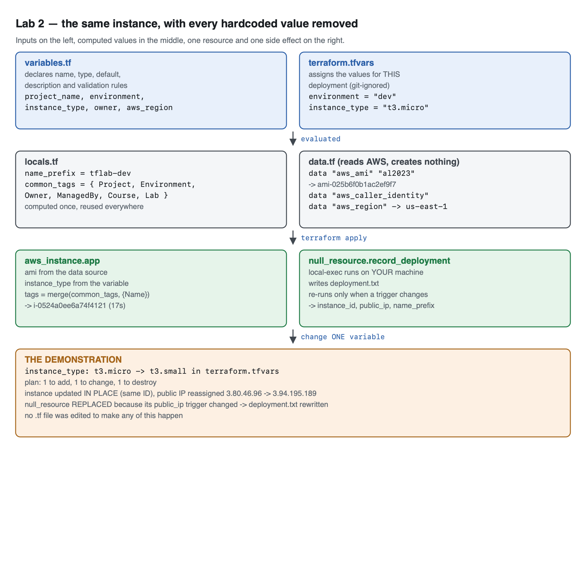
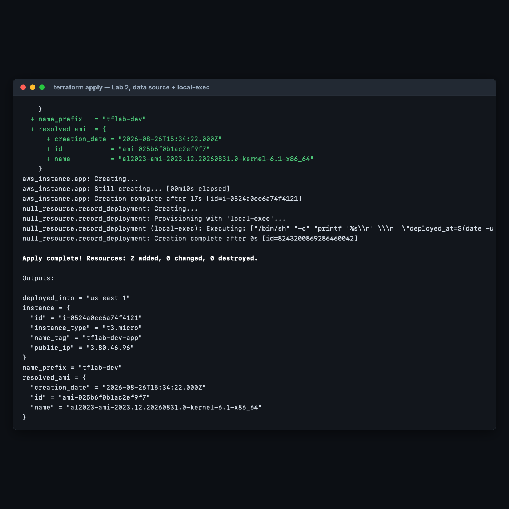
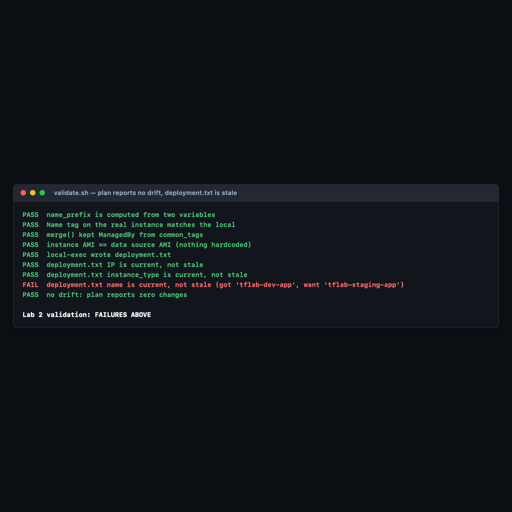

# Lab 2 — Input Variables, Locals & Data Sources

**Maps to:** *Extending Your Project (Input Variables, Locals, Data Sources, Local-Exec / Local-Remote / Null)*
**Duration:** ~60 minutes
**Status:** Tested end-to-end on 2026-09-05 (Terraform v1.15.7, AWS provider v6.63.0, null provider
v3.3.1) against a live AWS account in `us-east-1`. Every command output, AMI ID, instance ID and
error message below came from a real run — including the one that failed.

Prerequisites: [`00-shared-setup.md`](00-shared-setup.md), and [Lab 1](lab-1-first-terraform-project.md).

---

## 1. Lab Overview & Objectives

Lab 1's config had a flaw you were told to notice: a hardcoded AMI ID that is wrong in every other
region and goes stale within weeks. This lab removes every hardcoded value from it — and in doing
so introduces the three mechanisms that make Terraform configurations reusable rather than
disposable:

- **variables** — values a human supplies
- **locals** — values Terraform computes from them
- **data sources** — values AWS supplies at plan time

You will finish by changing **one line in one file** and watching a running EC2 instance resize
itself, a public IP get reassigned, and a file on your laptop rewrite itself — without editing a
single `.tf` file.

**Learning objectives — by the end of this lab you will be able to:**

1. Split a monolithic config into `variables.tf`, `locals.tf`, `data.tf`, `main.tf` and
   `outputs.tf`, and explain what belongs in each.
2. Write `validation` blocks that reject bad input with a useful message, and state accurately
   *when* in the run those blocks are evaluated.
3. Replace a hardcoded AMI with an `aws_ami` data source, and explain why the "latest" AMI is not
   a single well-defined thing.
4. Use `null_resource` with `local-exec` and `triggers` to run a post-deploy action, and identify
   the trigger gap that makes its output silently go stale.

> **The most surprising measured result in this lab:** the `aws_ami` data source resolved to
> **`ami-025b6f0b1ac2ef9f7`** — a *different image* from the `ami-081b0a6eac00b4f53` hardcoded in
> Lab 1. Neither is wrong. They are the same Amazon Linux 2023 release, published the same second,
> differing only in kernel version (6.1 vs 6.18). "Get the latest AMI" turns out to be a policy
> decision your filter string encodes, not a fact you look up. §4 Step 3 has the evidence.

---

## 2. Prerequisites & Environment Setup

### 2.1 Software

| Requirement | Tested with |
|---|---|
| Terraform CLI | v1.15.7 |
| AWS provider | v6.63.0 (resolved from `~> 6.0`) |
| null provider | v3.3.1 (resolved from `~> 3.2`) |
| AWS CLI v2 | 2.35.11 |
| Python 3 | 3.14.x — the validation script uses it to parse JSON outputs |

### 2.2 Cost and time

| | |
|---|---|
| Resources created | 1 × EC2 instance (`t3.micro`, briefly `t3.small`) + 1 × `null_resource` (free) |
| Measured price | `t3.micro` **$0.0104/hr**; `t3.small` **$0.0208/hr** (2× micro) |
| Measured create time | **17 seconds** |
| Measured resize time | **31 seconds** (stop → modify → start, in place) |
| Measured destroy time | **32 seconds** |
| Realistic cost | **under $0.05** |
| Hands-on time | ~60 minutes |

### 2.3 Speed up provider downloads before you start

Each new lab directory downloads its own copy of the AWS provider. Measured size of a single
`.terraform/` directory in Lab 1: **789 MB**. Across nine labs that is both slow and fragile —
during authoring, one download died mid-transfer:

```
Error while installing hashicorp/aws v6.63.0: releases.hashicorp.com: read
tcp ...:443: read: connection reset by peer
```

Set a shared plugin cache once, and every subsequent `terraform init` reuses one copy:

```bash
mkdir -p ~/.terraform.d/plugin-cache
export TF_PLUGIN_CACHE_DIR="$HOME/.terraform.d/plugin-cache"
```

Add that `export` to your shell profile alongside `AWS_REGION`. Measured cache size after this
course's providers: **809 MB total**, shared, instead of 789 MB per directory.

### 2.4 Create the working directory

```bash
mkdir -p ~/terraform-course/lab-2-variables && cd ~/terraform-course/lab-2-variables
export AWS_REGION=us-east-1 AWS_DEFAULT_REGION=us-east-1
```

---

## 3. Architecture



*Vector version: [`lab-2-architecture.svg`](artifacts/lab-2/diagrams/lab-2-architecture.svg)*

The same structure in text:

```
INPUTS (a human sets these)
  variables.tf ....... declares: name, type, default, description, validation
  terraform.tfvars ... assigns:  environment="dev", instance_type="t3.micro"
        │
        ▼
COMPUTED (Terraform derives these)
  locals.tf .......... name_prefix  = "tflab-dev"          ← from 2 variables
                       common_tags  = { Project, Environment, Owner,
                                        ManagedBy, Course, Lab }
  data.tf ............ aws_ami.al2023      → ami-025b6f0b1ac2ef9f7   (reads AWS,
                       aws_caller_identity → <ACCOUNT_ID>             creates
                       aws_region          → us-east-1                nothing)
        │
        ▼
REAL RESOURCES
  aws_instance.app ............... i-0524a0ee6a74f4121   (17s)
      ami           ← data source
      instance_type ← variable
      tags          ← merge(local.common_tags, { Name = "${name_prefix}-app" })
        │
        ▼ (depends on the instance's id and ip)
  null_resource.record_deployment
      local-exec runs on YOUR machine, not the instance
      writes deployment.txt
      re-runs only when one of its `triggers` changes
        │
        ▼
THE DEMONSTRATION — edit terraform.tfvars, nothing else
  instance_type "t3.micro" → "t3.small"
    → instance updated IN PLACE, same ID, public IP 3.80.46.96 → 3.94.195.189
    → null_resource REPLACED (its public_ip trigger moved) → deployment.txt rewritten
```

**The distinction that matters most:** a `resource` block *creates and owns* something. A `data`
block *only reads*. `terraform destroy` will never delete anything a data source found. If you are
ever unsure whether a config will damage an existing resource, check whether it is referenced as
`data.` or as `resource.` — that prefix is the whole answer.

---

## 4. Step-by-Step Instructions

### Step 1 — Split the configuration into files

**Why:** Terraform merges every `.tf` file in the directory into one configuration, so the split is
purely for humans. It is worth doing anyway: it means a reviewer can read `variables.tf` to learn
the interface without reading the implementation, which is exactly what they will want when this
becomes a module in Lab 5.

```bash
cat > versions.tf << 'EOF'
terraform {
  required_version = ">= 1.5.0"

  required_providers {
    aws = {
      source  = "hashicorp/aws"
      version = "~> 6.0"
    }
    null = {
      source  = "hashicorp/null"
      version = "~> 3.2"
    }
  }
}

provider "aws" {
  region = var.aws_region
}
EOF
```

Note `region = var.aws_region` — the provider itself is now parameterised, which is what makes the
Lab 1 practice task (deploy to another region) a one-line change rather than an edit.

### Step 2 — Declare the inputs

**Why:** A variable without a `description` and a `type` is a trap for the next person. A variable
without `validation` is a trap for you: it lets a typo reach the AWS API, where the error message
is about an API contract rather than about your intent.

```bash
cat > variables.tf << 'EOF'
variable "aws_region" {
  description = "AWS region to deploy into. AMI lookup is region-aware, so this is now safe to change."
  type        = string
  default     = "us-east-1"
}

variable "project_name" {
  description = "Short project identifier used to build every resource name."
  type        = string
  default     = "tflab"

  validation {
    condition     = can(regex("^[a-z0-9-]{2,16}$", var.project_name))
    error_message = "project_name must be 2-16 characters of lowercase letters, digits or hyphens."
  }
}

variable "environment" {
  description = "Deployment environment. Drives naming and the instance size map."
  type        = string
  default     = "dev"

  validation {
    condition     = contains(["dev", "staging", "prod"], var.environment)
    error_message = "environment must be one of: dev, staging, prod."
  }
}

variable "instance_type" {
  description = "EC2 instance type. Set explicitly to override the per-environment default."
  type        = string
  default     = "t3.micro"
}

variable "owner" {
  description = "Team or person accountable for these resources. Applied as a tag."
  type        = string
  default     = "platform-team"
}
EOF

cat > terraform.tfvars << 'EOF'
project_name  = "tflab"
environment   = "dev"
instance_type = "t3.micro"
owner         = "platform-team"
EOF
```

**`variables.tf` declares; `terraform.tfvars` assigns.** That separation is the point. The
declaration file is committed and reviewed; the assignment file is environment-specific and, in the
shared setup's `.gitignore`, deliberately untracked.

**Variable precedence, highest wins:**

| Source | Wins over |
|---|---|
| `-var` on the command line | everything below |
| `-var-file=…` | `terraform.tfvars` |
| `terraform.tfvars` / `*.auto.tfvars` | environment variables |
| `TF_VAR_name` environment variable | the `default` |
| `default` in the declaration | nothing |

Verified during authoring — with `instance_type = "t3.small"` in `terraform.tfvars`:

```bash
terraform plan -var 'instance_type=t3.medium' | grep instance_type
```

```
      ~ instance_type                        = "t3.small" -> "t3.medium"
```

The command-line flag won, as documented.

### Step 3 — Replace the hardcoded AMI with a data source

**Why:** This is the fix for Lab 1's deliberate flaw. A data source asks AWS a question at plan
time and uses the answer, so the config stays correct as AWS publishes new images and works
unchanged in any region.

```bash
cat > data.tf << 'EOF'
# Ask AWS for the current Amazon Linux 2023 image instead of hardcoding an ID
# that is wrong in every other region and goes stale within weeks.
data "aws_ami" "al2023" {
  most_recent = true
  owners      = ["amazon"]

  filter {
    name   = "name"
    values = ["al2023-ami-2023.*-kernel-6.1-x86_64"]
  }

  filter {
    name   = "state"
    values = ["available"]
  }
}

# Who am I, and where am I? Useful in outputs and for building ARNs.
data "aws_caller_identity" "current" {}
data "aws_region" "current" {}
EOF
```

> **`owners = ["amazon"]` is a security control, not a formality.** Without it, `most_recent = true`
> will happily select an image published by any AWS account whose AMI name matches your filter.
> Always constrain `owners`.

#### The measured result: "latest" is not one thing

The data source resolved to this:

```
resolved_ami = {
  "creation_date" = "2026-08-26T15:34:22.000Z"
  "id" = "ami-025b6f0b1ac2ef9f7"
  "name" = "al2023-ami-2023.12.20260831.0-kernel-6.1-x86_64"
}
```

That is **not** the AMI Lab 1 hardcoded (`ami-081b0a6eac00b4f53`). Both were checked against AWS on
the same day:

```bash
aws ec2 describe-images --image-ids ami-081b0a6eac00b4f53 ami-025b6f0b1ac2ef9f7 \
  --query 'sort_by(Images,&CreationDate)[].{ID:ImageId,Name:Name,Created:CreationDate}' --output table
```

```
-----------------------------------------------------------------------------------------------------------
|                                             DescribeImages                                              |
+---------------------------+------------------------+----------------------------------------------------+
|          Created          |          ID            |                       Name                         |
+---------------------------+------------------------+----------------------------------------------------+
|  2026-08-26T15:34:22.000Z |  ami-025b6f0b1ac2ef9f7 |  al2023-ami-2023.12.20260831.0-kernel-6.1-x86_64   |
|  2026-08-26T15:34:22.000Z |  ami-081b0a6eac00b4f53 |  al2023-ami-2023.12.20260831.0-kernel-6.18-x86_64  |
+---------------------------+------------------------+----------------------------------------------------+
```

Same Amazon Linux 2023 build (`2023.12.20260831.0`), published in the same second, differing only
in **kernel line**: 6.1 versus 6.18. Lab 1's ID came from AWS's `kernel-default` SSM pointer, which
now means 6.18. This lab's filter explicitly asks for `kernel-6.1`.

**Neither is "the latest AMI". There is no such thing.** `most_recent = true` returns the newest
image *matching your filter*, and your filter is a policy statement about which image family you
want. Confirm the two pointers differ for yourself:

```bash
for p in al2023-ami-kernel-default-x86_64 al2023-ami-kernel-6.1-x86_64; do
  printf "%-34s " "$p"
  aws ssm get-parameters --names /aws/service/ami-amazon-linux-latest/$p --query 'Parameters[0].Value' --output text
done
```

```
al2023-ami-kernel-default-x86_64   ami-081b0a6eac00b4f53
al2023-ami-kernel-6.1-x86_64       ami-025b6f0b1ac2ef9f7
```

> **A filter-precision trap worth internalising:** the glob `al2023-ami-2023.*-kernel-6.1-x86_64`
> matches *only* the 6.1 line, because `-x86_64` immediately follows `6.1`. Write
> `…-kernel-6.1*-x86_64` instead — one extra asterisk — and it matches `kernel-6.18` too, so
> `most_recent` silently starts picking a different kernel. That is a one-character change with a
> production-kernel-upgrade blast radius.

> **`most_recent = true` makes your config non-deterministic on purpose.** The AMI can change under
> you between a `plan` and a later `apply`, which will show up as a proposed instance replacement.
> For production, many teams pin the AMI ID in a variable and bump it deliberately. Know which
> trade-off you are choosing.

### Step 4 — Compute values with locals

**Why:** A local is a value you name once and reuse. Where a variable is an *input from outside*, a
local is a *conclusion drawn inside*. The test for which to use: could a caller reasonably want to
override it? If yes, variable. If it is always derived from other values, local.

```bash
cat > locals.tf << 'EOF'
locals {
  # A naming convention computed once and used everywhere. Change the convention
  # here and every resource name in the project follows.
  name_prefix = "${var.project_name}-${var.environment}"

  # Tags every resource should carry, merged with per-resource tags at use site.
  common_tags = {
    Project     = var.project_name
    Environment = var.environment
    Owner       = var.owner
    ManagedBy   = "terraform"
    Course      = "intermediate-terraform"
    Lab         = "2"
  }

  # A derived value that is not just string concatenation: locals can hold logic.
  is_production = var.environment == "prod"
}
EOF
```

`local.common_tags` is the pattern to take away from this lab. Defining a tag map once and merging
it at every use site is how you make the cleanup query in
[`00-shared-setup.md` §6](00-shared-setup.md) reliable — every resource is findable because every
resource was tagged from the same source.

### Step 5 — The resource and the post-deploy hook

**Why:** `null_resource` is Terraform's escape hatch: a resource that creates nothing in any cloud
but can hang provisioners and `triggers` off the lifecycle of things that do. Here it records the
deployment to a local file.

```bash
cat > main.tf << 'EOF'
resource "aws_instance" "app" {
  ami           = data.aws_ami.al2023.id
  instance_type = var.instance_type

  tags = merge(local.common_tags, {
    Name = "${local.name_prefix}-app"
  })
}

# Post-deploy hook: write the deployed instance's details to a local file.
# triggers force the provisioner to re-run whenever the instance changes.
resource "null_resource" "record_deployment" {
  triggers = {
    instance_id = aws_instance.app.id
    public_ip   = aws_instance.app.public_ip
  }

  provisioner "local-exec" {
    command = <<-CMD
      printf '%s\n' \
        "deployed_at=$(date -u +%Y-%m-%dT%H:%M:%SZ)" \
        "name=${local.name_prefix}-app" \
        "instance_id=${aws_instance.app.id}" \
        "public_ip=${aws_instance.app.public_ip}" \
        "instance_type=${aws_instance.app.instance_type}" \
        "ami=${aws_instance.app.ami}" \
        > deployment.txt
    CMD
  }
}
EOF
```

Three things to understand here:

- **`merge()` composes the tag maps.** The per-resource `Name` is added to the shared
  `common_tags` without either one being retyped. If both defined the same key, the later argument
  wins.
- **`local-exec` runs on the machine running Terraform** — your laptop or your CI runner — *not*
  on the EC2 instance. The provisioner that runs commands on the instance is `remote-exec`, which
  needs SSH connectivity, a key pair and a reachable security group. `local-exec` needs none of
  that, which is why it is the right choice for recording an outcome.
- **`triggers` is the only thing that makes a `null_resource` re-run.** Without it, the resource is
  created once and never touched again no matter what happens around it. **This config's trigger
  list is deliberately incomplete** — §5 measures exactly what that costs.

> **`null_resource` versus `terraform_data`:** since Terraform 1.4 there is a built-in
> `terraform_data` resource that does the same job with no external provider. This lab uses
> `null_resource` because the course outline names it and because you will meet it in every
> existing codebase. For new code, `terraform_data` is preferable — it drops the `hashicorp/null`
> dependency entirely.

> **Provisioners are a last resort, and HashiCorp says so in its own docs.** They run outside
> Terraform's dependency graph, they cannot be planned (Terraform cannot know what a shell command
> will do), and a failed provisioner taints the resource. Recording an output to a file is a
> legitimate use. Configuring software on an instance is not — that is what `user_data` (Lab 4) or
> a configuration-management tool is for.

### Step 6 — Outputs, then apply

**Why:** Outputs are the config's public surface. Anything a human or a calling module needs after
apply should be an output, not something you go digging in state for.

```bash
cat > outputs.tf << 'EOF'
output "name_prefix" {
  description = "The computed naming convention every resource in this project uses."
  value       = local.name_prefix
}

output "resolved_ami" {
  description = "The AMI the data source selected, and its publication date."
  value = {
    id            = data.aws_ami.al2023.id
    name          = data.aws_ami.al2023.name
    creation_date = data.aws_ami.al2023.creation_date
  }
}

output "instance" {
  description = "Key facts about the deployed instance."
  value = {
    id            = aws_instance.app.id
    public_ip     = aws_instance.app.public_ip
    instance_type = aws_instance.app.instance_type
    name_tag      = aws_instance.app.tags["Name"]
  }
}

output "deployed_into" {
  description = "Region the provider actually used."
  value       = data.aws_region.current.region
}
EOF

terraform init
terraform validate
terraform apply -auto-approve
```

**Expected output** — `terraform validate` first:

```
Success! The configuration is valid.
```

Then the tail of the real apply:

```
aws_instance.app: Creating...
aws_instance.app: Still creating... [00m10s elapsed]
aws_instance.app: Creation complete after 17s [id=i-0524a0ee6a74f4121]
null_resource.record_deployment: Creating...
null_resource.record_deployment: Provisioning with 'local-exec'...
null_resource.record_deployment (local-exec): Executing: ["/bin/sh" "-c" "printf '%s\n' ...]
null_resource.record_deployment: Creation complete after 0s [id=8243200869286460042]

Apply complete! Resources: 2 added, 0 changed, 0 destroyed.

Outputs:

deployed_into = "us-east-1"
instance = {
  "id" = "i-0524a0ee6a74f4121"
  "instance_type" = "t3.micro"
  "name_tag" = "tflab-dev-app"
  "public_ip" = "3.80.46.96"
}
name_prefix = "tflab-dev"
resolved_ami = {
  "creation_date" = "2026-08-26T15:34:22.000Z"
  "id" = "ami-025b6f0b1ac2ef9f7"
  "name" = "al2023-ami-2023.12.20260831.0-kernel-6.1-x86_64"
}
```



**The local-exec proof file** — this is on *your* machine, written by the provisioner:

```bash
cat deployment.txt
```

```
deployed_at=2026-09-05T13:22:17Z
name=tflab-dev-app
instance_id=i-0524a0ee6a74f4121
public_ip=3.80.46.96
instance_type=t3.micro
ami=ami-025b6f0b1ac2ef9f7
```

Note `name=tflab-dev-app` — that string exists nowhere in any file you wrote. It was computed from
`project_name` and `environment` by the local, and it reached both the AWS tag and this file.

### Step 7 — Prove the validation rules work

**Why:** A validation rule you have never seen fire is a rule you do not know is correct.

```bash
terraform plan -var 'environment=production'
```

**Expected output:**

```
Error: Invalid value for variable

  on variables.tf line 18:
  18: variable "environment" {
    ├────────────────
    │ var.environment is "production"

environment must be one of: dev, staging, prod.

This was checked by the validation rule at variables.tf:23,3-13.
```

The rule caught `production` where the allowed value is `prod` — a plausible typo that would
otherwise have produced a mis-tagged instance rather than an error. The regex rule behaves the same
way:

```bash
terraform plan -var 'project_name=My_Project'
```

```
Error: Invalid value for variable

  on variables.tf line 7:
   7: variable "project_name" {
    ├────────────────
    │ var.project_name is "My_Project"
```

> **A correction to the intuition, measured during authoring.** It is tempting to say validation
> "fails fast, before Terraform talks to AWS". That is **not what happens.** The full output of the
> failing plan begins:
>
> ```
> data.aws_ami.al2023: Reading...
> data.aws_caller_identity.current: Reading...
> data.aws_region.current: Reading...
> data.aws_region.current: Read complete after 0s [id=us-east-1]
> data.aws_caller_identity.current: Read complete after 0s [id=<ACCOUNT_ID>]
> data.aws_ami.al2023: Read complete after 2s [id=ami-025b6f0b1ac2ef9f7]
>
> Planning failed. Terraform encountered an error while generating this plan.
> ```
>
> The three data sources were read *first*, and only then did the variable validation fail. Variable
> validation protects you from creating **resources** with bad input; it does not prevent **data
> source reads**, which are still real, billable-in-principle AWS API calls. If a data source has a
> side effect or a cost you care about, validation is not the gate you think it is.

### Step 8 — The payoff: change one value, change the infrastructure

**Why:** This is the whole argument for the refactor. If parameterising the config did not make
change cheap, it would just be extra files.

Edit **one line** in `terraform.tfvars`:

```bash
sed -i '' 's/instance_type = "t3.micro"/instance_type = "t3.small"/' terraform.tfvars
terraform plan
```

**Expected output** (filtered to the interesting lines):

```
  ~ update in-place
  # aws_instance.app will be updated in-place
  ~ resource "aws_instance" "app" {
      ~ instance_type                        = "t3.micro" -> "t3.small"
      ~ public_dns                           = "ec2-3-80-46-96.compute-1.amazonaws.com" -> (known after apply)
      ~ public_ip                            = "3.80.46.96" -> (known after apply)
  # null_resource.record_deployment must be replaced
      ~ id       = "8243200869286460042" -> (known after apply)
      ~ triggers = { # forces replacement
          ~ "public_ip"   = "3.80.46.96" -> (known after apply)
Plan: 1 to add, 1 to change, 1 to destroy.
```

**Read the cascade — three separate things are happening:**

1. The instance is **updated in place**, not replaced. `instance_type` is a modifiable attribute;
   AWS stops the instance, changes the type and starts it again. The instance ID survives.
2. `public_ip` becomes `(known after apply)` because a stop/start **releases the public IPv4 and
   assigns a new one**. Nobody asked for this; it is a consequence of the resize. This is exactly
   why production services sit behind an Elastic IP or a load balancer.
3. `null_resource.record_deployment` **must be replaced** — not because you changed it, but because
   its `public_ip` trigger is about to change. `# forces replacement` names the culprit precisely.

Apply it:

```bash
terraform apply -auto-approve
```

```
aws_instance.app: Still modifying... [id=i-0524a0ee6a74f4121, 00m30s elapsed]
aws_instance.app: Modifications complete after 31s [id=i-0524a0ee6a74f4121]
null_resource.record_deployment: Creating...
null_resource.record_deployment: Provisioning with 'local-exec'...
null_resource.record_deployment: Creation complete after 0s [id=6631334042495409418]

Apply complete! Resources: 1 added, 1 changed, 1 destroyed.

Outputs:

instance = {
  "id" = "i-0524a0ee6a74f4121"
  "instance_type" = "t3.small"
  "name_tag" = "tflab-dev-app"
  "public_ip" = "3.94.195.189"
}
```

**Same instance ID. New size. New public IP.** And `deployment.txt` rewrote itself:

```
deployed_at=2026-09-05T13:23:55Z
name=tflab-dev-app
instance_id=i-0524a0ee6a74f4121
public_ip=3.94.195.189
instance_type=t3.small
ami=ami-025b6f0b1ac2ef9f7
```

You edited one value in one file. Confirm in the AWS Console: the instance is now `t3.small`.

### Step 9 — Do it again yourself, a per-environment size map, unassisted

**Why:** You have now parameterised *values*. The next step — and the thing that makes Lab 5's
modules work — is parameterising *policy*: letting one input decide several others.

**Your task.** Right now `environment` and `instance_type` are independent, so nothing stops
someone deploying `environment = "prod"` on a `t3.micro`, or `dev` on something expensive. Make
`environment` drive the instance size, while still allowing a deliberate override.

Implement it so that:

- A `local` map holds the size policy: `dev` → `t3.micro`, `staging` → `t3.small`,
  `prod` → `t3.medium`.
- Setting **only** `environment = "staging"` in `terraform.tfvars` produces a `t3.small`, with no
  `instance_type` line present at all.
- Explicitly setting `instance_type` still wins, so an engineer can override the policy for a
  one-off without editing the map.
- The unused `local.is_production` you wrote in Step 4 either earns its place or gets deleted.

**You get the acceptance criteria and nothing else:**

- `terraform apply` with `environment = "staging"` and no `instance_type` set yields a running
  `t3.small`, confirmed with `aws ec2 describe-instances`.
- `terraform plan -var 'instance_type=t3.micro'` on that same config proposes a change to
  `t3.micro`, proving the override still works.
- `terraform plan -var 'environment=qa'` still fails on the existing validation rule.
- `terraform plan -detailed-exitcode` exits `0` after the apply.
- `deployment.txt` shows the environment-derived type, not a stale one.

**Done when** you can explain *why* your override mechanism produces the right answer for both
"user set nothing" and "user set something", and say which Terraform value — `null`, `""`, or the
absence of a key — you used to tell those two cases apart.

No commands are given here. Steps 1–8 have every pattern you need; the exercise is combining a
`lookup`/map local with a conditional so that one input safely governs another.

---

## 5. Validation / Verification

Save as `validate.sh` and run after `terraform apply`. Also committed at
[`lab-2-variables/validate.sh`](lab-2-variables/validate.sh).

```bash
#!/usr/bin/env bash
# Lab 2 validation. Run from lab-2-variables/ after `terraform apply`.
set -uo pipefail
fail=0
check() { if [ "$2" = "$3" ]; then echo "PASS  $1"; else echo "FAIL  $1 (got '$2', want '$3')"; fail=1; fi }

PREFIX=$(terraform output -raw name_prefix)
ID=$(terraform output -json instance | python3 -c 'import json,sys;print(json.load(sys.stdin)["id"])')
IP=$(terraform output -json instance | python3 -c 'import json,sys;print(json.load(sys.stdin)["public_ip"])')
TYPE=$(terraform output -json instance | python3 -c 'import json,sys;print(json.load(sys.stdin)["instance_type"])')
AMI=$(terraform output -json resolved_ami | python3 -c 'import json,sys;print(json.load(sys.stdin)["id"])')

# 1. The local computed the naming convention from the two variables in tfvars.
WANT_PREFIX="$(grep '^project_name' terraform.tfvars | cut -d'"' -f2)-$(grep '^environment' terraform.tfvars | cut -d'"' -f2)"
check "name_prefix is computed from two variables" "$PREFIX" "$WANT_PREFIX"

# 2. That computed name actually reached AWS as a tag.
check "Name tag on the real instance matches the local" \
  "$(aws ec2 describe-instances --instance-ids "$ID" --query "Reservations[0].Instances[0].Tags[?Key=='Name']|[0].Value" --output text)" \
  "${PREFIX}-app"

# 3. common_tags were merged, not overwritten by the per-resource Name tag.
check "merge() kept ManagedBy from common_tags" \
  "$(aws ec2 describe-instances --instance-ids "$ID" --query "Reservations[0].Instances[0].Tags[?Key=='ManagedBy']|[0].Value" --output text)" \
  "terraform"

# 4. The instance really is running the AMI the data source chose.
check "instance AMI == data source AMI (nothing hardcoded)" \
  "$(aws ec2 describe-instances --instance-ids "$ID" --query 'Reservations[0].Instances[0].ImageId' --output text)" \
  "$AMI"

# 5. The provisioner produced its file.
if [ -f deployment.txt ]; then echo "PASS  local-exec wrote deployment.txt"; else echo "FAIL  deployment.txt missing"; fail=1; fi

# 6. THE ONES THE HAPPY PATH MISSES: is deployment.txt actually CURRENT?
FILE_IP=$(grep '^public_ip=' deployment.txt | cut -d= -f2)
FILE_TYPE=$(grep '^instance_type=' deployment.txt | cut -d= -f2)
check "deployment.txt IP is current, not stale" "$FILE_IP" "$IP"
check "deployment.txt instance_type is current, not stale" "$FILE_TYPE" "$TYPE"
FILE_NAME=$(grep '^name=' deployment.txt | cut -d= -f2)
check "deployment.txt name is current, not stale" "$FILE_NAME" "${PREFIX}-app"

# 7. Config and reality agree.
terraform plan -detailed-exitcode -no-color > /dev/null 2>&1
case $? in
  0) echo "PASS  no drift: plan reports zero changes" ;;
  2) echo "FAIL  DRIFT: plan wants to change something"; fail=1 ;;
  *) echo "FAIL  plan errored"; fail=1 ;;
esac

echo
[ $fail -eq 0 ] && echo "Lab 2 validation: ALL CHECKS PASSED" || echo "Lab 2 validation: FAILURES ABOVE"
exit $fail
```

**Actual output after Step 8, exit code `0`:**

```
PASS  name_prefix is computed from two variables
PASS  Name tag on the real instance matches the local
PASS  merge() kept ManagedBy from common_tags
PASS  instance AMI == data source AMI (nothing hardcoded)
PASS  local-exec wrote deployment.txt
PASS  deployment.txt IP is current, not stale
PASS  deployment.txt instance_type is current, not stale
PASS  deployment.txt name is current, not stale
PASS  no drift: plan reports zero changes

Lab 2 validation: ALL CHECKS PASSED
```

### The staleness checks are not padding — they caught a real bug in this lab's own config

Checks 6–8 exist because `terraform plan` **cannot** tell you whether a provisioner's side effects
are current. Here is the measurement that proves it.

Change only the environment — which alters the instance's tags but touches neither its ID nor its
IP, and therefore trips none of the original `triggers`:

```bash
sed -i '' 's/environment   = "dev"/environment   = "staging"/' terraform.tfvars
terraform apply -auto-approve
./validate.sh
```

The apply succeeded and updated the instance:

```
  # aws_instance.app will be updated in-place
Apply complete! Resources: 0 added, 1 changed, 0 destroyed.
```

**Then eight checks passed and one failed — exit code `1`:**

```
PASS  name_prefix is computed from two variables
PASS  Name tag on the real instance matches the local
PASS  merge() kept ManagedBy from common_tags
PASS  instance AMI == data source AMI (nothing hardcoded)
PASS  local-exec wrote deployment.txt
PASS  deployment.txt IP is current, not stale
PASS  deployment.txt instance_type is current, not stale
FAIL  deployment.txt name is current, not stale (got 'tflab-dev-app', want 'tflab-staging-app')
PASS  no drift: plan reports zero changes

Lab 2 validation: FAILURES ABOVE
```


Read the last two lines together, because that combination is the entire lesson:

> **`deployment.txt` was lying, and `terraform plan` reported no drift.**

Terraform was correct. Its state matched AWS exactly. But the file the provisioner produced still
said `tflab-dev-app` while the instance in AWS was tagged `tflab-staging-app`. The `null_resource`
did not re-run because `local.name_prefix` was not in its `triggers`.

**This is the general failure mode of provisioners:** their outputs live outside Terraform's model
of the world, so Terraform cannot tell you when they go stale. Anything a provisioner *consumes*
must be listed in `triggers`, and nothing checks that you did it.

The fix is one line:

```hcl
  triggers = {
    instance_id = aws_instance.app.id
    public_ip   = aws_instance.app.public_ip
    # Without this line the provisioner does not re-run when only the naming
    # changes, and deployment.txt silently goes stale while `terraform plan`
    # still reports no drift.
    name_prefix = local.name_prefix
  }
```

After re-applying, the `null_resource` was replaced and every check passed:

```
  # null_resource.record_deployment must be replaced
Apply complete! Resources: 1 added, 0 changed, 1 destroyed.

PASS  name_prefix is computed from two variables
...
PASS  deployment.txt name is current, not stale
PASS  no drift: plan reports zero changes

Lab 2 validation: ALL CHECKS PASSED
```

The shipped `lab-2-variables/main.tf` includes the fix. The bug is described rather than left in
place so you can reproduce it deliberately by deleting that one line.

---

## 6. Troubleshooting Tips

All hit for real while building this lab.

**`Error while installing hashicorp/aws v6.63.0: ... read: connection reset by peer`**

A genuine mid-download network failure, not a config problem. The AWS provider is ~789 MB per
directory. Re-run `terraform init`; if it recurs, set `TF_PLUGIN_CACHE_DIR` (§2.3) so you download
it once for the whole course.

**`terraform validate` reports `Missing required provider` even though `main.tf` is fine**

```
Error: Missing required provider
This configuration requires provider registry.terraform.io/hashicorp/aws, but
that provider isn't available. You may be able to install it automatically by
running: terraform init
```

This is what a *failed* `init` looks like one command later. `validate` is a local, offline check
and cannot run without the provider schema. Fix the `init`, not the config.

**Your `resolved_ami` differs from this document's**

Expected, and correct. `most_recent = true` returns whatever is newest on the day you run it. If it
differs by more than the date — a different kernel line, say — check your `filter` glob against the
precision trap in Step 3.

**`local-exec` command works in your shell but fails inside Terraform**

The provisioner runs through `/bin/sh -c`, not your interactive shell — no aliases, no functions, no
`zsh`-only syntax. The full command Terraform executed is echoed in the apply output; copy that
exact string into `sh -c '...'` to reproduce it outside Terraform.

**`deployment.txt` does not update after a change**

Almost always the trigger gap in §5: whatever changed is not listed in `triggers`. Confirm by
running `terraform plan` — if it reports no changes to the `null_resource`, Terraform is behaving
correctly and your trigger list is incomplete.

**Validation rule does not fire when you expect it to**

Check *where* the bad value is set. A `default` in `variables.tf` is validated too, so an invalid
default breaks every plan. And note from Step 7: validation does not run before data sources are
read, so a failing plan can still have made AWS API calls.

---

## 7. Cleanup Steps

```bash
terraform destroy -auto-approve
```

**Expected output:**

```
aws_instance.app: Still destroying... [id=i-0524a0ee6a74f4121, 00m30s elapsed]
aws_instance.app: Destruction complete after 32s

Destroy complete! Resources: 2 destroyed.
```

`Resources: 2 destroyed` — the instance and the `null_resource`. Destroying a `null_resource` costs
nothing and does not undo its side effects: **`deployment.txt` is still on your disk after destroy.**
That is worth seeing, because it is the same reason a provisioner that creates a DNS record or
writes to a database leaves that behind too. Remove it yourself:

```bash
rm -f deployment.txt
```

Confirm nothing survived:

```bash
aws ec2 describe-instances \
  --filters Name=tag:Course,Values=intermediate-terraform \
            Name=instance-state-name,Values=running,pending,stopped \
  --query 'Reservations[].Instances[].InstanceId' --output text
```

**Expected output: nothing at all.**

**Keep these, and here is why:**

| Keep | Why |
|---|---|
| All five `.tf` files | Lab 5 turns exactly this config into a reusable module. |
| `terraform.tfvars` | Reset to `dev` / `t3.micro` so the lab starts clean if you repeat it. |
| `validate.sh` | Labs 3–8 extend this pattern. |
| `.terraform.lock.hcl` | Records aws v6.63.0 + null v3.3.1 — your reproducibility record. |

---

## Optional extensions

1. **Swap `null_resource` for `terraform_data`.** Replace the resource with the built-in
   `terraform_data`, drop `hashicorp/null` from `required_providers`, re-run `terraform init` and
   confirm the null provider disappears from `.terraform.lock.hcl`. One less third-party dependency
   for identical behaviour.

2. **Reproduce the kernel trap.** Change the AMI filter to `al2023-ami-2023.*-kernel-6.1*-x86_64`
   (one added asterisk) and run `terraform plan`. Note which AMI `most_recent` now selects, and
   whether Terraform proposes to replace your instance. This is a one-character change that in a
   production config would silently move you to a different kernel line.

3. **Pin the AMI and feel the difference.** Move the resolved AMI ID into a variable with the data
   source removed. Run `plan` a week later. The non-determinism is gone, and so is the automatic
   patching — decide which you actually want for a production workload.

4. **Make `owner` mandatory.** Remove its `default` and run `terraform plan`. Terraform will prompt
   interactively; in CI, with `-input=false`, it fails instead. That is how you make a variable
   genuinely required, and how you find out which of your pipelines were relying on a default.

5. **Read the data source's full output.** Run `terraform console`, then
   `data.aws_ami.al2023` — the console prints every attribute the data source exposes, including
   `block_device_mappings` and `architecture`. Most people never discover these exist.
