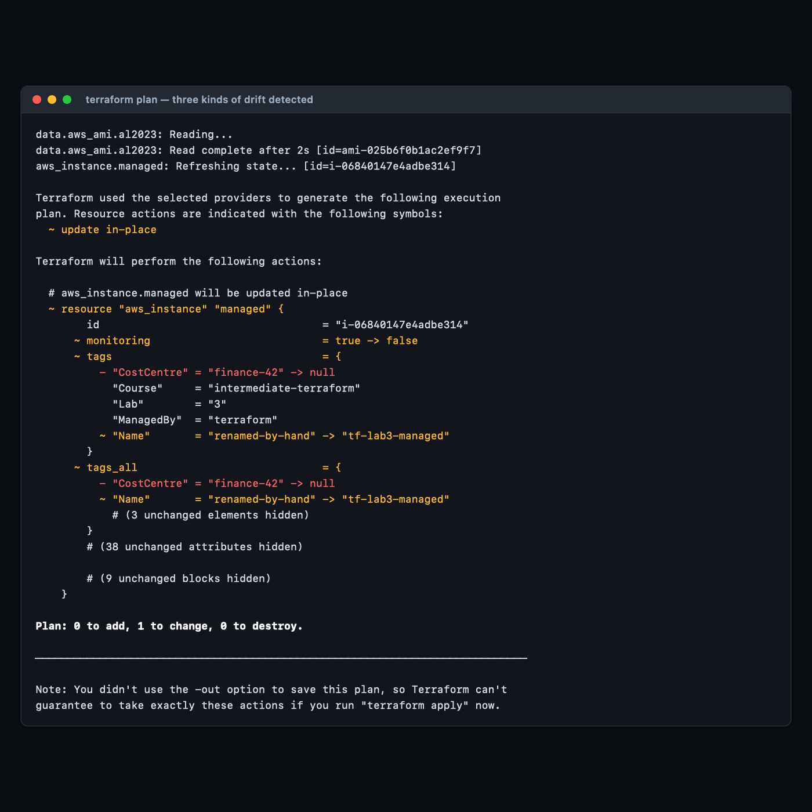
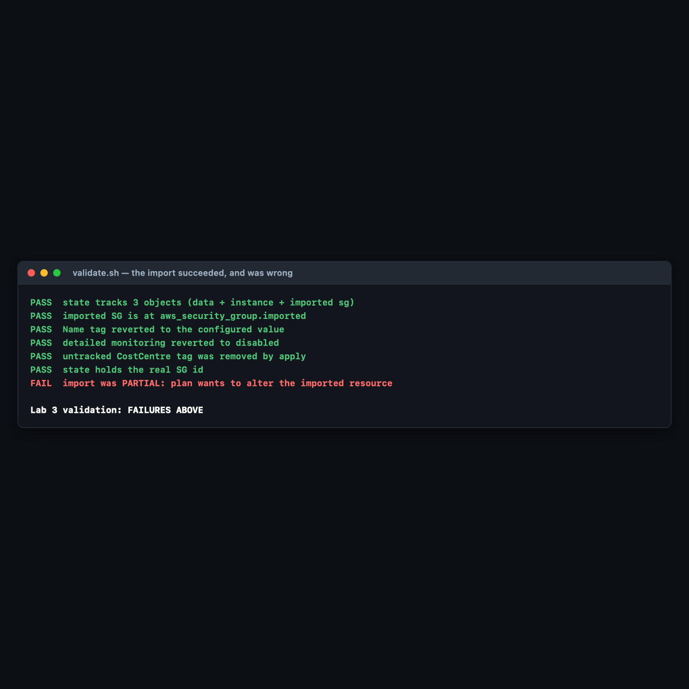

# Lab 3 — State Deep-Dive, Drift & Import

**Maps to:** *How Terraform Works (State, Extracting Data from Statefile, Computing/Executing Plans); Configuration Drift, Drift Use Cases, Refresh Command, Importing Existing Resources*
**Duration:** ~75 minutes
**Status:** Tested end-to-end on 2026-09-05 (Terraform v1.15.7, AWS provider v6.63.0) against a live
AWS account in `us-east-1`. Every plan diff, error and instance ID below came from a real run.

Prerequisites: [`00-shared-setup.md`](00-shared-setup.md), Labs [1](lab-1-first-terraform-project.md)
and [2](lab-2-variables-locals-data-sources.md).

---

## 1. Lab Overview & Objectives

Terraform's model has **three** parties, not two: the configuration you wrote, the state Terraform
recorded, and the infrastructure AWS actually has. Most Terraform problems that feel mysterious are
a disagreement between two of the three.

In this lab you will deliberately break that agreement — changing a running instance from outside
Terraform, three different ways — then use `plan` and `apply -refresh-only` to see the disagreement
from both directions. Then you will do the reverse: take a resource Terraform did not create and
bring it under management with `import`.

**Learning objectives — by the end of this lab you will be able to:**

1. Read a state file directly and with `terraform state` subcommands, and explain `serial`,
   `lineage`, and why data sources appear in state.
2. Induce configuration drift and predict, before running anything, what `terraform plan` will
   propose to do about it.
3. Distinguish `terraform plan` from `terraform apply -refresh-only` — they show the *same* drift
   with the arrows pointing in *opposite* directions.
4. Import an existing resource using both the 1.5+ `import` block (with automatic config
   generation) and the legacy `terraform import` command, and prove the import was complete rather
   than merely successful.

> **The most surprising measured result in this lab:** a security group was imported, and
> `terraform state list` showed it correctly. But with **one ingress rule missing from the
> config**, the very next `terraform plan` proposed to **delete a live `tcp/443` rule from a real
> security group** — and every check short of running `plan` still passed. An import that
> "succeeded" and an import that is *correct* are different things, and the gap between them is
> firewall-shaped. §5 has the evidence.

---

## 2. Prerequisites & Environment Setup

### 2.1 Software

| Requirement | Tested with | Note |
|---|---|---|
| Terraform CLI | v1.15.7 | **1.5+ is required** for `import` blocks and `-generate-config-out` |
| AWS provider | v6.63.0 | |
| AWS CLI v2 | 2.35.11 | used to create drift and the orphan resource |
| Python 3 | 3.14.x | used to read the state file as JSON |

### 2.2 Cost and time

| | |
|---|---|
| Resources created | 1 × `t3.micro` EC2 + 1 × security group (free) |
| Measured price | **$0.0104/hr** for the instance; security groups cost nothing |
| Measured create / destroy | 17s / 21s (instance), 2s (security group) |
| Realistic cost | **under $0.03** |
| Hands-on time | ~75 minutes |

### 2.3 Setup

```bash
mkdir -p ~/terraform-course/lab-3-state-drift && cd ~/terraform-course/lab-3-state-drift
export AWS_REGION=us-east-1 AWS_DEFAULT_REGION=us-east-1
export TF_PLUGIN_CACHE_DIR="$HOME/.terraform.d/plugin-cache"
```

---

## 3. Architecture


*Vector version: [`lab-3-architecture.svg`](artifacts/lab-3/diagrams/lab-3-architecture.svg)*

The same idea in text:

```
        CONFIG (.tf)              STATE (.tfstate)             AWS (reality)
   what you declared        what Terraform recorded       what actually exists
   monitoring = false       serial: 2                     i-06840147e4adbe314
   Name = tf-lab3-managed   63 stored attributes          anyone with console
   ── source of truth ──    ── a cache, not truth ──      access can change it
          │                         │                            │
          └─────────────────────────┴────────────────────────────┘
                                    │
                    someone opens the AWS Console
                                    │
                                    ▼
   DRIFT, three kinds at once:
     + CostCentre=finance-42     a tag Terraform never knew about
     ~ Name=renamed-by-hand      a tag Terraform DOES manage
     ~ monitoring: false→true    not a tag at all — a real attribute
                                    │
              ┌─────────────────────┴─────────────────────┐
              ▼                                           ▼
   terraform plan                            terraform apply -refresh-only
   "what SHOULD change?"                     "what DID change?"
     ~ monitoring  true  → false               ~ monitoring  false → true
     - CostCentre  finance-42 → null           + CostCentre  finance-42
     ~ Name  renamed → tf-lab3-managed         ~ Name  tf-lab3 → renamed
   proposes reverting REALITY                updates STATE to match reality
                                    │
                                    ▼
   IMPORT — the opposite direction: a resource Terraform did not create
     aws ec2 create-security-group   →  sg-0ab343605a031e76c   (outside Terraform)
     import { to = aws_security_group.imported, id = "sg-0ab..." }
     terraform plan -generate-config-out=generated.tf   → Terraform writes the HCL
     terraform apply → "Resources: 1 imported, 0 added, 0 changed, 0 destroyed"
                                    │
                                    ▼
   THE PROOF: terraform plan → "No changes."
     state list alone proves nothing — a wrong config imports just as happily
```

**The sentence to carry out of this lab:** *the configuration is always the source of truth; state
is only Terraform's memory of what it last saw.* Every behaviour below follows from that.

---

## 4. Step-by-Step Instructions

### Step 1 — Deploy something worth inspecting

**Why:** You need a real resource with a real ID before state means anything.

```bash
cat > versions.tf << 'EOF'
terraform {
  required_version = ">= 1.5.0"

  required_providers {
    aws = {
      source  = "hashicorp/aws"
      version = "~> 6.0"
    }
  }
}

provider "aws" {
  region = var.aws_region
}
EOF

cat > variables.tf << 'EOF'
variable "aws_region" {
  description = "Region for all resources in this lab."
  type        = string
  default     = "us-east-1"
}

variable "monitoring_enabled" {
  description = "Whether detailed CloudWatch monitoring is on. Used to demonstrate drift on a non-tag attribute."
  type        = bool
  default     = false
}
EOF

cat > main.tf << 'EOF'
data "aws_ami" "al2023" {
  most_recent = true
  owners      = ["amazon"]

  filter {
    name   = "name"
    values = ["al2023-ami-2023.*-kernel-6.1-x86_64"]
  }
}

locals {
  common_tags = {
    Course    = "intermediate-terraform"
    Lab       = "3"
    ManagedBy = "terraform"
  }
}

# The resource we will deliberately drift.
resource "aws_instance" "managed" {
  ami           = data.aws_ami.al2023.id
  instance_type = "t3.micro"
  monitoring    = var.monitoring_enabled

  tags = merge(local.common_tags, {
    Name = "tf-lab3-managed"
  })
}

output "managed_instance_id" {
  value       = aws_instance.managed.id
  description = "ID of the Terraform-managed instance."
}
EOF

terraform init
terraform apply -auto-approve
```

**Expected output:**

```
Apply complete! Resources: 1 added, 0 changed, 0 destroyed.

Outputs:

managed_instance_id = "i-06840147e4adbe314"
```

### Step 2 — Read the state file

**Why:** State is the concept people most often treat as magic. It is a JSON file. Read it.

```bash
terraform state list
```

**Expected output:**

```
data.aws_ami.al2023
aws_instance.managed
```

> **Notice the data source is in state.** Terraform caches data source results so it can detect
> when they change between runs. It does **not** own that AMI and will never destroy it — the
> `data.` prefix is what distinguishes "recorded" from "owned".

```bash
terraform state show aws_instance.managed | head -18
```

**Expected output:**

```
# aws_instance.managed:
resource "aws_instance" "managed" {
    ami                                  = "ami-025b6f0b1ac2ef9f7"
    arn                                  = "arn:aws:ec2:us-east-1:<ACCOUNT_ID>:instance/i-06840147e4adbe314"
    associate_public_ip_address          = true
    availability_zone                    = "us-east-1d"
    disable_api_stop                     = false
    disable_api_termination              = false
    ebs_optimized                        = false
    force_destroy                        = false
    get_password_data                    = false
    hibernation                          = false
    host_id                              = null
    iam_instance_profile                 = null
    id                                   = "i-06840147e4adbe314"
    instance_initiated_shutdown_behavior = "stop"
    instance_lifecycle                   = null
    instance_state                       = "running"
```

**Extracting data from state properly.** Do not grep the human-readable output — it is a display
format and it changes between versions. `terraform show -json` is the stable, machine-readable
interface:

```bash
terraform show -json | python3 -c "
import json,sys
d=json.load(sys.stdin)
for r in d['values']['root_module']['resources']:
    if r['mode'] != 'managed':
        print(f\"(skipping {r['address']} - mode={r['mode']}, Terraform does not own it)\")
        continue
    a=r['values']
    print(f\"address      : {r['address']}\")
    print(f\"real id      : {a['id']}\")
    print(f\"monitoring   : {a['monitoring']}\")
    print(f\"tags         : {a['tags']}\")
"
```

**Expected output:**

```
(skipping data.aws_ami.al2023 - mode=data, Terraform does not own it)
address      : aws_instance.managed
real id      : i-06840147e4adbe314
monitoring   : False
tags         : {'Course': 'intermediate-terraform', 'Lab': '3', 'ManagedBy': 'terraform', 'Name': 'tf-lab3-managed'}
```

**The state file's own metadata:**

```bash
python3 -c "
import json;d=json.load(open('terraform.tfstate'))
print('version          :',d['version'])
print('terraform_version:',d['terraform_version'])
print('serial           :',d['serial'])
print('lineage          :',d['lineage'])
for r in d['resources']:
    print(f\"  - {r['mode']:8} {r['type']}.{r['name']}  ({len(r['instances'][0]['attributes'])} attributes stored)\")
"
```

**Expected output:**

```
version          : 4
terraform_version: 1.15.7
serial           : 2
lineage          : 16cae29c-39f9-202a-8c73-c415c697b37c
  - data     aws_ami.al2023  (44 attributes stored)
  - managed  aws_instance.managed  (63 attributes stored)
```

| Field | What it is for |
|---|---|
| `version` | state *format* version (4), not your Terraform version |
| `serial` | incremented on every state write; how remote backends detect a concurrent write |
| `lineage` | a UUID for this state's history — two states with different lineages are not the same infrastructure, and Terraform refuses to mix them |
| attributes stored | **63 attributes** recorded for one EC2 instance, all in plaintext |

That last row is the argument for Lab 8's remote backend: 63 plaintext attributes here is harmless,
but the same mechanism stores an RDS password exactly as readably.

### Step 3 — Induce drift, three different ways

**Why:** Real drift is not one phenomenon. A tag Terraform manages, a tag it does not, and a
non-tag attribute all behave differently, and the differences matter.

```bash
ID=$(terraform output -raw managed_instance_id)

# 1. A tag Terraform has never heard of.
aws ec2 create-tags --resources "$ID" --tags Key=CostCentre,Value=finance-42

# 2. A tag Terraform DOES manage.
aws ec2 create-tags --resources "$ID" --tags Key=Name,Value=renamed-by-hand

# 3. Not a tag at all — a real instance attribute.
aws ec2 monitor-instances --instance-ids "$ID" \
  --query 'InstanceMonitorings[0].Monitoring.State' --output text
```

**Expected output** from the third command: `pending` (it becomes `enabled` within a minute).

Confirm AWS's view:

```bash
aws ec2 describe-instances --instance-ids "$ID" \
  --query 'Reservations[0].Instances[0].{Monitoring:Monitoring.State,Tags:Tags}' --output json
```

```json
{
    "Monitoring": "enabled",
    "Tags": [
        { "Key": "CostCentre", "Value": "finance-42" },
        { "Key": "Course", "Value": "intermediate-terraform" },
        { "Key": "ManagedBy", "Value": "terraform" },
        { "Key": "Name", "Value": "renamed-by-hand" },
        { "Key": "Lab", "Value": "3" }
    ]
}
```

**Before you run the next command, predict the answer:** which of those three changes will
`terraform plan` propose to undo?

### Step 4 — `terraform plan` detects the drift

```bash
terraform plan
```

**Expected output:**

```
aws_instance.managed: Refreshing state... [id=i-06840147e4adbe314]

Terraform used the selected providers to generate the following execution
plan. Resource actions are indicated with the following symbols:
  ~ update in-place

Terraform will perform the following actions:

  # aws_instance.managed will be updated in-place
  ~ resource "aws_instance" "managed" {
        id                                   = "i-06840147e4adbe314"
      ~ monitoring                           = true -> false
      ~ tags                                 = {
          - "CostCentre" = "finance-42" -> null
            "Course"     = "intermediate-terraform"
            "Lab"        = "3"
            "ManagedBy"  = "terraform"
          ~ "Name"       = "renamed-by-hand" -> "tf-lab3-managed"
        }
      ~ tags_all                             = {
          - "CostCentre" = "finance-42" -> null
          ~ "Name"       = "renamed-by-hand" -> "tf-lab3-managed"
            # (3 unchanged elements hidden)
        }
        # (38 unchanged attributes hidden)
    }

Plan: 0 to add, 1 to change, 0 to destroy.
```


**The answer to the prediction: all three.** And note *what* Terraform proposes for each:

| Drift | Plan's proposal | Why |
|---|---|---|
| `CostCentre` added | **delete it** (`-> null`) | the config's `tags` map does not contain it, and `tags` is declared exhaustively |
| `Name` changed | **revert it** | the config says what `Name` must be |
| `monitoring` enabled | **turn it back off** | the config says `monitoring = var.monitoring_enabled`, which is `false` |

The `CostCentre` row is the one that surprises people: **Terraform deletes tags it did not create**,
because `tags = { ... }` declares the complete desired set. If you need to allow out-of-band tags,
that is what `lifecycle { ignore_changes = [tags["CostCentre"]] }` or provider-level `default_tags`
are for.

For automation, get the answer as an exit code rather than by reading prose:

```bash
terraform plan -detailed-exitcode > /dev/null 2>&1; echo "exit: $?"
```

**Expected output:** `exit: 2` — meaning "changes pending". That is a drift detector.

### Step 5 — The same drift, seen the other way round

**Why:** `plan` answers *"what should change?"*. Sometimes you need *"what did change?"* — an
audit question, not a remediation one. That is `apply -refresh-only`.

```bash
terraform apply -refresh-only
```

**Expected output:**

```
Note: Objects have changed outside of Terraform

Terraform detected the following changes made outside of Terraform since the
last "terraform apply" which may have affected this plan:

  # aws_instance.managed has changed
  ~ resource "aws_instance" "managed" {
        id                                   = "i-06840147e4adbe314"
      ~ monitoring                           = false -> true
      ~ tags                                 = {
          + "CostCentre" = "finance-42"
            "Course"     = "intermediate-terraform"
            "Lab"        = "3"
            "ManagedBy"  = "terraform"
          ~ "Name"       = "tf-lab3-managed" -> "renamed-by-hand"
        }
    }

This is a refresh-only plan, so Terraform will not take any actions to undo
these. If you were expecting these changes then you can apply this plan to
record the updated values in the Terraform state without changing any remote
objects.
```

**Put the two outputs side by side. The arrows are reversed:**

| | `terraform plan` | `apply -refresh-only` |
|---|---|---|
| Question | what *should* change? | what *did* change? |
| `monitoring` | `true -> false` | `false -> true` |
| `CostCentre` | `- finance-42 -> null` | `+ finance-42` |
| Changes AWS? | yes, if you apply | **never** |
| Changes state? | yes, if you apply | yes, that is its only effect |

Same drift. Opposite directions. `plan` shows reality being dragged back to the config;
`refresh-only` shows state being dragged forward to reality.

> **Tested gotcha, and a genuine trap:** the deprecated `terraform refresh` command **silently
> writes state** with no confirmation prompt. During authoring it was run before
> `apply -refresh-only`, and the refresh-only run then reported *"No changes. Your infrastructure
> still matches the configuration"* — not because there was no drift, but because `refresh` had
> already absorbed it. State's `serial` had gone `2 → 3`. Use `apply -refresh-only`, which shows
> you the diff and asks before writing.

**Critically, refreshing does not change what `plan` wants to do.** After the refresh, state
recorded `monitoring: true` and `Name: renamed-by-hand`, and `plan` still proposed:

```
      ~ monitoring                           = true -> false
          - "CostCentre" = "finance-42" -> null
          ~ "Name"       = "renamed-by-hand" -> "tf-lab3-managed"
Plan: 0 to add, 1 to change, 0 to destroy.
```

**The configuration is the source of truth.** Updating state changes what Terraform *knows*, never
what it *wants*.

Now put reality back:

```bash
terraform apply -auto-approve
```

### Step 6 — Create a resource Terraform does not know about

**Why:** Real accounts are full of infrastructure created before Terraform, or beside it. Import is
how you adopt it without recreating it — which for a database or a load balancer is the difference
between a migration and an outage.

```bash
VPC=$(aws ec2 describe-vpcs --filters Name=isDefault,Values=true --query 'Vpcs[0].VpcId' --output text)

SG=$(aws ec2 create-security-group --group-name tf-lab3-orphan-sg \
  --description "Created outside Terraform, to be imported" --vpc-id "$VPC" \
  --tag-specifications 'ResourceType=security-group,Tags=[{Key=Name,Value=tf-lab3-orphan-sg},{Key=Course,Value=intermediate-terraform},{Key=Lab,Value=3}]' \
  --query 'GroupId' --output text)
echo "created: $SG"

aws ec2 authorize-security-group-ingress --group-id "$SG" \
  --ip-permissions 'IpProtocol=tcp,FromPort=443,ToPort=443,IpRanges=[{CidrIp=10.0.0.0/8,Description="internal https"}]' \
  --query 'SecurityGroupRules[0].SecurityGroupRuleId' --output text

terraform state list
```

**Expected output:**

```
created: sg-0ab343605a031e76c
sgr-01c3a08a585c0a89d

data.aws_ami.al2023
aws_instance.managed
```

The security group exists and has a real `tcp/443` ingress rule. Terraform's state does not mention
it. **Remember that ingress rule — it becomes the point of the lab in §5.**

### Step 7 — Import it, and let Terraform write the config

**Why:** Before Terraform 1.5 you had to hand-write the resource block, run `terraform import`, then
iterate on `plan` until the diff was empty — tedious and error-prone for anything with many
attributes. The `import` block plus `-generate-config-out` does the first draft for you.

```bash
cat > import.tf << EOF
# Declarative import (Terraform 1.5+). This block says: "the resource I am about
# to describe as aws_security_group.imported already exists in AWS with this ID."
import {
  to = aws_security_group.imported
  id = "$SG"
}
EOF

terraform plan -generate-config-out=generated.tf
```

**Expected output ends with:**

```
Plan: 1 to import, 0 to add, 0 to change, 0 to destroy.
```

And Terraform has written `generated.tf` for you:

```hcl
# __generated__ by Terraform
# Please review these resources and move them into your main configuration files.

# __generated__ by Terraform from "sg-0ab343605a031e76c"
resource "aws_security_group" "imported" {
  description = "Created outside Terraform, to be imported"
  egress = [{
    cidr_blocks      = ["0.0.0.0/0"]
    description      = ""
    from_port        = 0
    ipv6_cidr_blocks = []
    prefix_list_ids  = []
    protocol         = "-1"
    security_groups  = []
    self             = false
    to_port          = 0
  }]
  ingress = [{
    cidr_blocks      = ["10.0.0.0/8"]
    description      = "internal https"
    from_port        = 443
    ipv6_cidr_blocks = []
    prefix_list_ids  = []
    protocol         = "tcp"
    security_groups  = []
    self             = false
    to_port          = 443
  }]
  name                   = "tf-lab3-orphan-sg"
  region                 = "us-east-1"
  revoke_rules_on_delete = null
  tags = {
    Course = "intermediate-terraform"
    Lab    = "3"
    Name   = "tf-lab3-orphan-sg"
  }
  tags_all = { ... }
  vpc_id = "vpc-<REDACTED>"
}
```

> **Generated config is a first draft, not a finished artifact.** Note what it produced: an
> `egress` block you never wrote (AWS adds a default allow-all egress rule to every new security
> group), a `tags_all` block that duplicates `tags` — `tags_all` is a computed attribute and should
> normally be deleted — and hardcoded values like `vpc_id` that you would want to reference or
> parameterise. The header comment says "Please review"; it means it.

Now perform the import:

```bash
terraform apply -auto-approve
```

**Expected output:**

```
Plan: 1 to import, 0 to add, 0 to change, 0 to destroy.
aws_security_group.imported: Importing... [id=sg-0ab343605a031e76c]
aws_security_group.imported: Import complete [id=sg-0ab343605a031e76c]

Apply complete! Resources: 1 imported, 0 added, 0 changed, 0 destroyed.
```

`0 added, 0 changed` is the important part: **nothing about the real security group was
modified.** It was adopted, not recreated.

Verify:

```bash
terraform state list
terraform plan
```

```
data.aws_ami.al2023
aws_instance.managed
aws_security_group.imported

No changes. Your infrastructure matches the configuration.
```

### Step 8 — `state rm` and the legacy import command

**Why:** `state rm` is import's inverse: it makes Terraform forget a resource **without destroying
it**. It is the correct tool when you are splitting one configuration into two, and a catastrophic
one if you reach for it thinking it deletes something.

```bash
terraform state rm aws_security_group.imported
aws ec2 describe-security-groups --group-ids "$SG" \
  --query 'SecurityGroups[0].{ID:GroupId,Name:GroupName}' --output text
```

**Expected output:**

```
Removed aws_security_group.imported
Successfully removed 1 resource instance(s).

sg-0ab343605a031e76c	tf-lab3-orphan-sg
```

**Terraform forgot it; AWS did not.** The security group is untouched and now unmanaged again.

Re-adopt it with the pre-1.5 command form, which you will still meet in older runbooks. Remove the
`import` block first, or Terraform will try to import a resource that is about to be imported:

```bash
rm -f import.tf
terraform import aws_security_group.imported "$SG"
terraform state list
```

**Expected output:**

```
Import successful!

The resources that were imported are shown above. These resources are now in
your Terraform state and will henceforth be managed by Terraform.

data.aws_ami.al2023
aws_instance.managed
aws_security_group.imported
```

| | `import` block (1.5+) | `terraform import` command |
|---|---|---|
| Lives in | version-controlled `.tf` file | shell history |
| Reviewable in a PR | yes | no |
| Can generate config | yes, `-generate-config-out` | no |
| Runs during | `plan` and `apply` | its own command, immediately |
| Removable after use | yes — delete the block | n/a |

Prefer the block. The command still exists and still works.

### Step 9 — Do it again yourself, adopt a resource with a real dependency, unassisted

**Why:** The security group you imported had no relationships. Real adoption is harder precisely
because resources reference each other, and a config that hardcodes an ID it should have referenced
looks correct until the day the referenced thing is replaced.

**Your task.** Using the AWS CLI only, create **an EC2 instance that uses a new security group** —
both outside Terraform. Then bring **both** under Terraform management in this same directory, with
the instance's `vpc_security_group_ids` **referencing the imported security group resource**, not
its literal `sg-…` string.

**You get the acceptance criteria and nothing else:**

- Both resources appear in `terraform state list`.
- `terraform plan` reports `No changes. Your infrastructure matches the configuration.`
- `grep -c 'sg-0' *.tf` returns `0` for the instance's security group argument — the reference is
  a Terraform expression, not a pasted ID.
- Deleting the imported security group resource from your config and running `terraform plan` shows
  Terraform understands the dependency (it will refuse, or propose changes to the instance too).
- `terraform destroy` removes both cleanly, in the right order, with no `DependencyViolation`.

**Done when** you can state *why* referencing the resource rather than the literal ID matters here,
and describe what would go wrong on a future `apply` if you had pasted the ID instead.

No commands are given here. Steps 6–8 have every mechanism you need; the exercise is that
`-generate-config-out` will hardcode the ID for you, and correcting that is the actual work of an
import.

---

## 5. Validation / Verification

Save as `validate.sh`, run after Step 8. Also at
[`lab-3-state-drift/validate.sh`](lab-3-state-drift/validate.sh).

```bash
#!/usr/bin/env bash
# Lab 3 validation. Run from lab-3-state-drift/ after the import step.
set -uo pipefail
fail=0
check() { if [ "$2" = "$3" ]; then echo "PASS  $1"; else echo "FAIL  $1 (got '$2', want '$3')"; fail=1; fi }

ID=$(terraform output -raw managed_instance_id)
SG=$(terraform state show -no-color aws_security_group.imported | awk '/^ +id +=/{gsub(/"/,"",$3); print $3; exit}')

check "state tracks 3 objects (data + instance + imported sg)" \
  "$(terraform state list | wc -l | tr -d ' ')" "3"

check "imported SG is at aws_security_group.imported" \
  "$(terraform state list | grep -c '^aws_security_group.imported$')" "1"

check "Name tag reverted to the configured value" \
  "$(aws ec2 describe-instances --instance-ids "$ID" --query "Reservations[0].Instances[0].Tags[?Key=='Name']|[0].Value" --output text)" \
  "tf-lab3-managed"

check "detailed monitoring reverted to disabled" \
  "$(aws ec2 describe-instances --instance-ids "$ID" --query 'Reservations[0].Instances[0].Monitoring.State' --output text)" \
  "disabled"

check "untracked CostCentre tag was removed by apply" \
  "$(aws ec2 describe-instances --instance-ids "$ID" --query "length(Reservations[0].Instances[0].Tags[?Key=='CostCentre'])" --output text)" \
  "0"

check "state holds the real SG id" \
  "$(aws ec2 describe-security-groups --group-ids "$SG" --query 'SecurityGroups[0].GroupId' --output text 2>/dev/null)" \
  "$SG"

# THE ONE THE HAPPY PATH MISSES: was the import COMPLETE, or only successful?
terraform plan -detailed-exitcode -no-color > /dev/null 2>&1
case $? in
  0) echo "PASS  import was COMPLETE: plan proposes no changes" ;;
  2) echo "FAIL  import was PARTIAL: plan wants to alter the imported resource"; fail=1 ;;
  *) echo "FAIL  plan errored"; fail=1 ;;
esac

echo
[ $fail -eq 0 ] && echo "Lab 3 validation: ALL CHECKS PASSED" || echo "Lab 3 validation: FAILURES ABOVE"
exit $fail
```

**Actual output, exit code `0`:**

```
PASS  state tracks 3 objects (data + instance + imported sg)
PASS  imported SG is at aws_security_group.imported
PASS  Name tag reverted to the configured value
PASS  detailed monitoring reverted to disabled
PASS  untracked CostCentre tag was removed by apply
PASS  state holds the real SG id
PASS  import was COMPLETE: plan proposes no changes

Lab 3 validation: ALL CHECKS PASSED
```

### Why check 7 is the only one that matters

Checks 1–6 all confirm the import *happened*. None of them confirm it was *right*. Here is the
measurement.

The generated config was edited to remove the ingress rule — simulating the very common case of a
hand-written import config that missed an attribute:

```bash
# in generated.tf, replace the ingress block with:
  ingress = []
./validate.sh
```

**Six checks passed. One failed. Exit code `1`:**

```
PASS  state tracks 3 objects (data + instance + imported sg)
PASS  imported SG is at aws_security_group.imported
PASS  Name tag reverted to the configured value
PASS  detailed monitoring reverted to disabled
PASS  untracked CostCentre tag was removed by apply
PASS  state holds the real SG id
FAIL  import was PARTIAL: plan wants to alter the imported resource

Lab 3 validation: FAILURES ABOVE
```


And this is what `terraform plan` was proposing to do to a **live security group**:

```
  # aws_security_group.imported will be updated in-place
              - cidr_blocks      = [
              - from_port        = 443
              - to_port          = 443
Plan: 0 to add, 1 to change, 0 to destroy.
```

**Terraform was about to delete a `tcp/443` ingress rule from a real firewall** — silently, as part
of an ordinary apply, because the configuration did not mention it and the configuration is the
source of truth.

`terraform state list` looked perfect throughout. The resource was imported. The import was also
wrong. **The only proof that an import is correct is an empty plan**, and that is why every import
runbook should end with `terraform plan -detailed-exitcode` rather than with "import successful".

---

## 6. Troubleshooting Tips

All encountered for real while building this lab.

**`terraform show -json | ...` fails with `KeyError`**

Hit during authoring: iterating over `root_module.resources` includes **data sources**, which do not
have the attributes a managed resource has (`monitoring`, in that case). Filter on
`r['mode'] == 'managed'` before touching attributes.

**`terraform state show` output contains escape codes when redirected**

`terraform state show` colourises even into a pipe. Pass `-no-color` explicitly — unlike `plan`, it
is not inferred from the absence of a TTY in every version.

**`apply -refresh-only` says "No changes" when you know there is drift**

Something already refreshed the state — most likely the deprecated `terraform refresh`, which
writes state with no prompt. Check whether `serial` in `terraform.tfstate` has advanced. This
happened during authoring and is documented in Step 5.

**`Error: Duplicate import configuration for ...`**

You left `import.tf` in place and also ran `terraform import` on the command line. Terraform will
not import the same address twice. Delete the block once the import is applied — that is the
intended lifecycle for an `import` block.

**Import succeeds but `plan` immediately wants to change everything**

The normal state of affairs on a first attempt, and the reason `-generate-config-out` exists. Work
through the diff attribute by attribute until the plan is empty. Do **not** apply to "make the diff
go away" — that changes real infrastructure to match an incomplete config, which is precisely the
§5 failure.

**`terraform state rm` did not delete anything in AWS**

Correct, and by design. `state rm` makes Terraform forget; `destroy` deletes. If you meant to
delete, you now have an unmanaged resource still costing money — find it with the tag-based query in
[`00-shared-setup.md` §6](00-shared-setup.md).

---

## 7. Cleanup Steps

```bash
terraform destroy -auto-approve
```

**Expected output:**

```
aws_security_group.imported: Destruction complete after 2s
aws_instance.managed: Still destroying... [id=i-06840147e4adbe314, 00m20s elapsed]
aws_instance.managed: Destruction complete after 21s

Destroy complete! Resources: 2 destroyed.
```

> **Note what just happened.** The security group was created by the AWS CLI, not by Terraform — but
> once imported, Terraform owns it, and `destroy` deleted it. Confirmed:
>
> ```
> aws: [ERROR]: An error occurred (InvalidGroup.NotFound) when calling the
> DescribeSecurityGroups operation: The security group 'sg-0ab343605a031e76c' does not exist
> ```
>
> **Import is not read-only.** Importing a production database you did not intend to manage puts it
> one `terraform destroy` away from deletion. Import deliberately, and consider
> `lifecycle { prevent_destroy = true }` on anything irreplaceable.

Confirm nothing survived:

```bash
aws ec2 describe-instances \
  --filters Name=tag:Course,Values=intermediate-terraform \
            Name=instance-state-name,Values=running,pending,stopped \
  --query 'Reservations[].Instances[].InstanceId' --output text
aws ec2 describe-security-groups \
  --filters Name=tag:Course,Values=intermediate-terraform \
  --query 'SecurityGroups[].GroupId' --output text
```

**Expected output: nothing from either command.**

**Keep these, and here is why:**

| Keep | Why |
|---|---|
| `terraform.tfstate` | Post-destroy it holds `serial` and `lineage` with zero resources — worth reading once more to see what an empty state looks like. |
| `generated.tf` | A reference example of what `-generate-config-out` actually produces, including the `egress` and `tags_all` blocks you have to clean up. |
| `validate.sh` | The partial-import check is worth copying into your real import runbooks. |

---

## Optional extensions

1. **Protect against the destroy you just saw.** Re-run the import, add
   `lifecycle { prevent_destroy = true }` to the imported security group, then try
   `terraform destroy`. Read the error. That one line is the difference between an adopted
   production resource and a deleted one.

2. **Tolerate out-of-band tags.** Add `lifecycle { ignore_changes = [tags["CostCentre"]] }` to the
   instance, re-add the `CostCentre` tag with the CLI, and run `plan`. Terraform now leaves it
   alone — the mechanism for coexisting with a cost-allocation system that tags your resources.

3. **Try provider-level `default_tags`.** Move `common_tags` into the `provider "aws"` block as
   `default_tags`. Observe how `tags` and `tags_all` diverge in the plan output, and decide which
   you prefer for a real project.

4. **Break the lineage on purpose.** Copy `terraform.tfstate` aside, run
   `terraform apply -auto-approve`, then restore the copy and run `plan`. The `serial` mismatch is
   exactly what a remote backend uses to stop two engineers writing state simultaneously — which is
   Lab 8.

5. **Build a real drift report.** Script `terraform plan -detailed-exitcode` across several
   directories, collecting which ones return `2`. That is a functioning drift-detection system, and
   it is about fifteen lines of shell.
