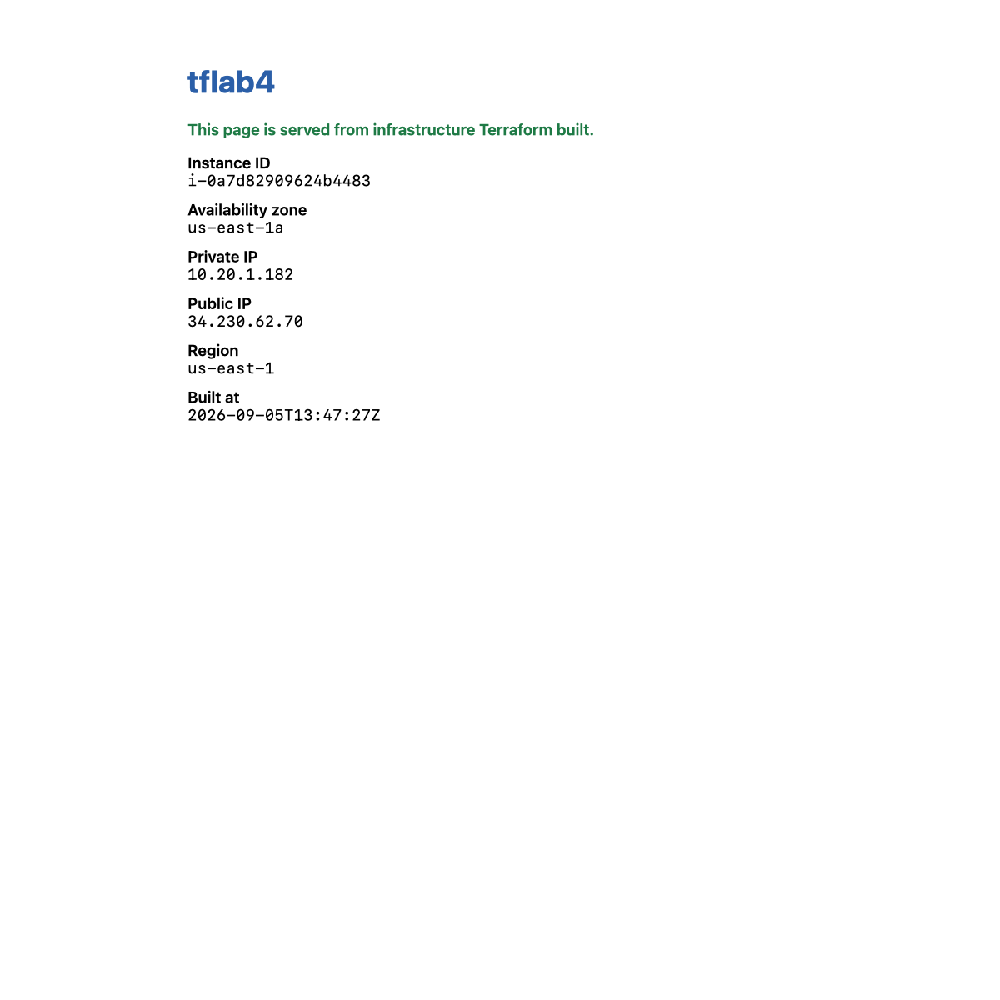

# Lab 4 — AWS Provider Deep-Dive: Multi-Resource Mini-App

**Maps to:** *Providers and the AWS Provider (Provider Overview, The AWS Provider)*
**Duration:** ~90 minutes
**Status:** Tested end-to-end on 2026-09-05 (Terraform v1.15.7, AWS provider v6.63.0) against a live
AWS account in `us-east-1`. The web page below was served by a real EC2 instance and fetched with a
real HTTP request; every ID, timing and status code came from that run.

Prerequisites: [`00-shared-setup.md`](00-shared-setup.md), Labs 1–3.

---

## 1. Lab Overview & Objectives

Labs 1–3 created one resource at a time in the account's default VPC. That is not what real
infrastructure looks like. This lab builds a **complete, self-contained mini-application**: its own
network, its own routing, its own firewall, and a web server that serves a page describing itself.

Nine AWS objects, one `terraform apply`, and at the end you open a browser and look at it.

The deeper subject is the **provider**: what a provider actually is, how you constrain its version,
how `default_tags` saves you from repeating yourself, and why the AWS provider models some things
as arguments and others as separate resources.

**Learning objectives — by the end of this lab you will be able to:**

1. Build a working public network from first principles — VPC, internet gateway, subnet, route
   table, association — and name the one resource that actually makes a subnet public.
2. Choose sensible provider version constraints, and use `default_tags` to tag every resource in a
   configuration from one place.
3. Use `templatefile()` and `user_data` to configure an instance at boot, and control replacement
   behaviour with `user_data_replace_on_change`.
4. Debug the most common AWS reachability failure by reasoning about the network path rather than
   guessing.

> **The most surprising measured result in this lab:** deleting a **single route** — one row in one
> route table — made the site completely unreachable while the instance stayed `running`, port 80
> stayed open, and the security group stayed untouched. `curl` returned `000 TIMEOUT`. Everything a
> monitoring dashboard would show was green. §5 has the full before/after.

---

## 2. Prerequisites & Environment Setup

### 2.1 Software

| Requirement | Tested with |
|---|---|
| Terraform CLI | v1.15.7 |
| AWS provider | v6.63.0 |
| AWS CLI v2 | 2.35.11 |
| `curl` | system (used for verification) |

### 2.2 AWS permissions

Beyond EC2, this lab needs VPC write permissions: `ec2:CreateVpc`, `CreateSubnet`,
`CreateInternetGateway`, `CreateRouteTable`, `CreateRoute`, `AssociateRouteTable`,
`CreateSecurityGroup`, `AuthorizeSecurityGroupIngress`, and the matching `Delete*`/`Revoke*` calls.
`AdministratorAccess` covers it. A locked-down account may not.

### 2.3 Cost and time

| | |
|---|---|
| Resources created | **9**: VPC, IGW, subnet, route table, association, security group, 2 SG rules, 1 EC2 instance |
| Billable | only the `t3.micro` — VPC, subnets, IGWs, route tables and security groups are free |
| Measured price | **$0.0104/hr** |
| Measured apply time | **~40 seconds** end to end |
| Measured time to first HTTP 200 | **16 seconds** after apply completed |
| Measured destroy time | **~30 seconds** for all 9 |
| Realistic cost | **under $0.02** |
| Hands-on time | ~90 minutes |

> **One caveat about NAT gateways:** this lab deliberately uses only a *public* subnet. A private
> subnet with outbound internet needs a NAT gateway, which costs roughly **$0.045/hour plus data
> processing** — around $32/month, running whether you use it or not. It is the single most common
> surprise on a first AWS bill. This lab avoids one on purpose.

### 2.4 Security note about port 80

This lab opens `tcp/80` to `0.0.0.0/0`, because its stated visible result is a public web page you
can open in a browser. That is appropriate for a throwaway lab instance serving static content and
nothing else. It is **not** a pattern to copy into a real environment — there, put the instance in
a private subnet behind a load balancer, and terminate TLS. The `allowed_http_cidr` variable exists
so you can narrow it to your own IP:

```bash
terraform apply -var "allowed_http_cidr=$(curl -s ifconfig.me)/32"
```

### 2.5 Setup

```bash
mkdir -p ~/terraform-course/lab-4-mini-app && cd ~/terraform-course/lab-4-mini-app
export AWS_REGION=us-east-1 AWS_DEFAULT_REGION=us-east-1
export TF_PLUGIN_CACHE_DIR="$HOME/.terraform.d/plugin-cache"
```

---

## 3. Architecture


*Vector version: [`lab-4-architecture.svg`](artifacts/lab-4/diagrams/lab-4-architecture.svg)*

The network path, in text — read it top to bottom, because that is the order a packet travels:

```
                          the internet
                                │
                                ▼
              aws_internet_gateway.main          (igw-03cf90ccac99d96de)
                                │
                    ┌───────────┴────────────┐
                    │  aws_route_table.public │
                    │  0.0.0.0/0 → igw        │  ◄── DELETE THIS ROW AND
                    └───────────┬─────────────┘      EVERYTHING BELOW GOES DARK
                                │
              aws_route_table_association.public
                                │
                                ▼
  ┌──────────────── aws_vpc.main  10.20.0.0/16 ─────────────────┐
  │                                                             │
  │   aws_subnet.public   10.20.1.0/24   (us-east-1a)           │
  │      = cidrsubnet(var.vpc_cidr, 8, 1)                       │
  │      map_public_ip_on_launch = true                         │
  │                          │                                  │
  │                          ▼                                  │
  │   aws_security_group.web                                    │
  │      ingress rule: tcp/80  ← 0.0.0.0/0                      │
  │      egress  rule: all     → 0.0.0.0/0   (to dnf install)   │
  │                          │                                  │
  │                          ▼                                  │
  │   aws_instance.web   i-0a7d82909624b4483                    │
  │      ami ← data.aws_ami.al2023                              │
  │      user_data ← templatefile("user-data.sh.tftpl", {...})  │
  │      private 10.20.1.182   public 34.230.62.70              │
  │                                                             │
  └─────────────────────────────────────────────────────────────┘
                                │
                                ▼
      http://34.230.62.70  →  HTTP/1.1 200 OK, Server: nginx/1.30.4
```

**Two design points worth pausing on:**

- **`map_public_ip_on_launch` does not make a subnet public.** It only assigns an address. A subnet
  is public if — and only if — its associated route table has a route to an internet gateway. §5
  proves this by deleting the route and leaving everything else intact.
- **Terraform derives the creation order from the graph, not the file.** The VPC is created first
  because everything references it; the instance last because it references the subnet and the
  security group. You never write an ordering. Watch the apply output and you can see resources
  being created in parallel wherever the graph allows it.

---

## 4. Step-by-Step Instructions

### Step 1 — Configure the provider properly

**Why:** A provider is a plugin that translates HCL into API calls. Everything in this lab depends
on which *version* of that plugin you get and how it is configured — which is why this is the file
to get right first.

```bash
cat > versions.tf << 'EOF'
terraform {
  required_version = ">= 1.5.0"

  required_providers {
    aws = {
      # Pinned to a major version. A bare `version = "6.63.0"` would be
      # reproducible but unpatchable; ">= 6.0" would accept a breaking v7.
      source  = "hashicorp/aws"
      version = "~> 6.0"
    }
  }
}

provider "aws" {
  region = var.aws_region

  # Applied to every resource this provider creates, without repeating them.
  default_tags {
    tags = {
      Course    = "intermediate-terraform"
      Lab       = "4"
      ManagedBy = "terraform"
    }
  }
}
EOF
```

**Version constraint operators, and when each is right:**

| Constraint | Means | Use when |
|---|---|---|
| `= 6.63.0` | exactly this | you need byte-identical builds and accept manual patching |
| `~> 6.63` | `>= 6.63, < 7.0` | you want minor + patch updates within a major |
| `~> 6.63.0` | `>= 6.63.0, < 6.64.0` | you want patch updates only |
| `~> 6.0` | `>= 6.0, < 7.0` | **this lab** — a stable major, automatic improvements |
| `>= 6.0` | anything newer | almost never: a future v7 will break you silently |

> **The lock file is the real pin.** `.terraform.lock.hcl` records the exact version resolved
> (v6.63.0 here) plus checksums. Commit it. The `version` constraint says what is *acceptable*; the
> lock file says what you *got*. `terraform init -upgrade` is what deliberately moves it.

**`default_tags` is the feature most people discover too late.** Every resource this provider
creates gets those three tags automatically. Compare with Lab 2, where `merge(local.common_tags,
...)` had to be repeated at every resource — and would have been forgotten at least once across
nine resources.

### Step 2 — Declare the inputs

```bash
cat > variables.tf << 'EOF'
variable "aws_region" {
  description = "Region for the mini-app."
  type        = string
  default     = "us-east-1"
}

variable "project_name" {
  description = "Prefix for every resource name."
  type        = string
  default     = "tflab4"
}

variable "vpc_cidr" {
  description = "CIDR block for the purpose-built VPC."
  type        = string
  default     = "10.20.0.0/16"

  validation {
    condition     = can(cidrhost(var.vpc_cidr, 0))
    error_message = "vpc_cidr must be a valid IPv4 CIDR block, e.g. 10.20.0.0/16."
  }
}

variable "instance_type" {
  description = "Instance type for the web server."
  type        = string
  default     = "t3.micro"
}

variable "allowed_http_cidr" {
  description = "CIDR permitted to reach port 80. Defaults to the whole internet because this lab's visible result is a public web page."
  type        = string
  default     = "0.0.0.0/0"
}
EOF
```

Note the validation trick: `can(cidrhost(var.vpc_cidr, 0))` validates a CIDR by *trying to use it*
and catching failure, rather than by writing a regex for IPv4 CIDRs — which is much harder to get
right than it looks.

### Step 3 — Build the network

**Why:** This is the part people skip with "just use the default VPC", and then cannot debug when
something is unreachable. Five resources, each with exactly one job.

```bash
cat > network.tf << 'EOF'
# A purpose-built VPC. Labs 1-3 used the default VPC; a real project does not.
resource "aws_vpc" "main" {
  cidr_block           = var.vpc_cidr
  enable_dns_support   = true
  enable_dns_hostnames = true # required for public DNS names on instances

  tags = { Name = "${var.project_name}-vpc" }
}

# Without an internet gateway the subnet is private no matter what else you do.
resource "aws_internet_gateway" "main" {
  vpc_id = aws_vpc.main.id
  tags   = { Name = "${var.project_name}-igw" }
}

data "aws_availability_zones" "available" {
  state = "available"
}

resource "aws_subnet" "public" {
  vpc_id            = aws_vpc.main.id
  cidr_block        = cidrsubnet(var.vpc_cidr, 8, 1) # 10.20.1.0/24 from a /16
  availability_zone = data.aws_availability_zones.available.names[0]

  # What actually makes this subnet "public" is the route table below; this
  # only saves you from attaching an EIP by hand.
  map_public_ip_on_launch = true

  tags = { Name = "${var.project_name}-public-subnet" }
}

# THE line that makes the subnet public: a default route to the IGW.
resource "aws_route_table" "public" {
  vpc_id = aws_vpc.main.id

  route {
    cidr_block = "0.0.0.0/0"
    gateway_id = aws_internet_gateway.main.id
  }

  tags = { Name = "${var.project_name}-public-rt" }
}

resource "aws_route_table_association" "public" {
  subnet_id      = aws_subnet.public.id
  route_table_id = aws_route_table.public.id
}
EOF
```

**`cidrsubnet(var.vpc_cidr, 8, 1)` is worth understanding rather than copying.** It takes the `/16`,
adds 8 bits of prefix to make a `/24`, and returns network number 1 — so `10.20.0.0/16` becomes
`10.20.1.0/24`. Change the VPC CIDR to `10.99.0.0/16` and the subnet follows to `10.99.1.0/24`
automatically. Hardcoding `10.20.1.0/24` would silently break that.

**`data.aws_availability_zones`** avoids hardcoding `us-east-1a`, which does not exist in other
regions and is not even the same physical datacentre between AWS accounts.

### Step 4 — The security group, with rules as separate resources

**Why:** The AWS provider offers two ways to write security group rules, and the choice has real
consequences.

```bash
cat > security.tf << 'EOF'
resource "aws_security_group" "web" {
  name        = "${var.project_name}-web-sg"
  description = "Allow inbound HTTP and all outbound traffic"
  vpc_id      = aws_vpc.main.id

  tags = { Name = "${var.project_name}-web-sg" }
}

# Rules as separate resources rather than inline blocks: inline `ingress`/`egress`
# blocks are exhaustive and fight with anything that edits rules out of band.
resource "aws_vpc_security_group_ingress_rule" "http" {
  security_group_id = aws_security_group.web.id
  description       = "HTTP from the allowed CIDR"
  cidr_ipv4         = var.allowed_http_cidr
  from_port         = 80
  to_port           = 80
  ip_protocol       = "tcp"
}

resource "aws_vpc_security_group_egress_rule" "all" {
  security_group_id = aws_security_group.web.id
  description       = "All outbound - needed to install the web server"
  cidr_ipv4         = "0.0.0.0/0"
  ip_protocol       = "-1"
}
EOF
```

| Approach | Behaviour |
|---|---|
| Inline `ingress {}` / `egress {}` blocks in the SG | Terraform owns the **complete rule set**. Any rule added out of band is deleted on the next apply. Fewer resources, more conflict. |
| Separate `aws_vpc_security_group_*_rule` resources | Terraform owns **only the rules you declare**. Other rules coexist. Each rule gets its own ID and can be referenced and replaced individually. |

The separate-resource form is the modern recommendation, and it is what the Lab 3 import generated
config would have looked like had that SG been built this way. Note that the newer
`aws_vpc_security_group_ingress_rule` resources supersede the older `aws_security_group_rule` — they
take a single CIDR each rather than a list, which is what makes per-rule IDs possible.

**Egress is not optional here.** AL2023 ships without nginx; `user_data` runs `dnf install`, which
needs outbound internet. Omit the egress rule and the instance boots fine, serves nothing, and gives
you no obvious clue why.

### Step 5 — The instance and its boot script

**Why:** `user_data` is how you turn a bare AMI into a working service without SSH, key pairs, or a
configuration-management tool. `templatefile()` keeps the script readable.

```bash
cat > compute.tf << 'EOF'
data "aws_ami" "al2023" {
  most_recent = true
  owners      = ["amazon"]

  filter {
    name   = "name"
    values = ["al2023-ami-2023.*-kernel-6.1-x86_64"]
  }
}

locals {
  # templatefile() keeps the shell script in its own file instead of buried in
  # a heredoc, so an editor can syntax-highlight it and a reviewer can read it.
  user_data = templatefile("${path.module}/user-data.sh.tftpl", {
    project_name = var.project_name
    region       = var.aws_region
  })
}

resource "aws_instance" "web" {
  ami                    = data.aws_ami.al2023.id
  instance_type          = var.instance_type
  subnet_id              = aws_subnet.public.id
  vpc_security_group_ids = [aws_security_group.web.id]

  user_data = local.user_data

  # Replace the instance when the script changes, rather than leaving a running
  # box with stale content and no way to tell.
  user_data_replace_on_change = true

  tags = { Name = "${var.project_name}-web" }
}
EOF
```

And the template itself:

```bash
cat > user-data.sh.tftpl << 'EOF'
#!/bin/bash
set -euxo pipefail

dnf install -y nginx

# Instance metadata service v2 requires a token — IMDSv1 is disabled by default
# on new AL2023 AMIs, so a bare curl to 169.254.169.254 returns 401.
TOKEN=$(curl -sX PUT "http://169.254.169.254/latest/api/token" \
  -H "X-aws-ec2-metadata-token-ttl-seconds: 300")
meta() {
  curl -s -H "X-aws-ec2-metadata-token: $TOKEN" \
    "http://169.254.169.254/latest/meta-data/$1"
}

cat > /usr/share/nginx/html/index.html << HTML
<!doctype html>
<title>${project_name} — built with Terraform</title>
<style>
  body { font-family: system-ui, sans-serif; max-width: 40rem; margin: 4rem auto; padding: 0 1rem; }
  h1 { color: #2b5fa8; }
  dt { font-weight: 600; margin-top: .75rem; }
  dd { margin: 0; font-family: ui-monospace, Menlo, monospace; }
  .ok { color: #1e7a45; font-weight: 600; }
</style>
<h1>${project_name}</h1>
<p class="ok">This page is served from infrastructure Terraform built.</p>
<dl>
  <dt>Instance ID</dt><dd>$(meta instance-id)</dd>
  <dt>Availability zone</dt><dd>$(meta placement/availability-zone)</dd>
  <dt>Private IP</dt><dd>$(meta local-ipv4)</dd>
  <dt>Public IP</dt><dd>$(meta public-ipv4)</dd>
  <dt>Region</dt><dd>${region}</dd>
  <dt>Built at</dt><dd>$(date -u +%Y-%m-%dT%H:%M:%SZ)</dd>
</dl>
HTML

systemctl enable --now nginx
EOF
```

**Three things in that template will bite you if you do not know them:**

1. **`${...}` is Terraform; `$(...)` and `$VAR` are shell.** `templatefile()` substitutes
   `${project_name}` and `${region}` *before* the script ever runs. `$(meta instance-id)` is left
   alone and runs on the instance. If you need a literal `${` in the output, escape it as `$${`.
2. **IMDSv2 requires a token.** On current AL2023 AMIs, IMDSv1 is disabled, so the once-universal
   `curl http://169.254.169.254/latest/meta-data/instance-id` returns **401 Unauthorized**. You must
   `PUT` for a token first. Most tutorials predate this.
3. **`user_data_replace_on_change = true` changes the blast radius.** Without it, editing this
   script updates the `user_data` attribute in state and does nothing to the running instance —
   because `user_data` only executes at first boot. You get a config that claims one thing and a
   server doing another. With it, editing the script destroys and recreates the instance. Verified:

   ```
     # aws_instance.web must be replaced
         ~ user_data                            = <<-EOT # forces replacement
     Plan: 1 to add, 0 to change, 1 to destroy.
   ```

   That is the honest behaviour, and for a stateless web server it is the right trade. For a
   stateful instance it is a hazard — which is the argument for immutable images rather than boot
   scripts.

### Step 6 — Outputs and apply

```bash
cat > outputs.tf << 'EOF'
output "web_url" {
  description = "Open this in a browser. This is the lab's visible result."
  value       = "http://${aws_instance.web.public_ip}"
}

output "instance_id" {
  description = "ID of the web server instance."
  value       = aws_instance.web.id
}

output "vpc_id" {
  description = "ID of the purpose-built VPC."
  value       = aws_vpc.main.id
}

output "subnet_cidr" {
  description = "CIDR that cidrsubnet() computed for the public subnet."
  value       = aws_subnet.public.cidr_block
}
EOF

terraform init
terraform validate
terraform apply -auto-approve
```

**Expected output** — note the creation order and the parallelism:

```
aws_vpc.main: Creating...
aws_vpc.main: Creation complete after 5s [id=vpc-06831c85929304239]
aws_internet_gateway.main: Creating...
aws_subnet.public: Creating...
aws_security_group.web: Creating...
aws_internet_gateway.main: Creation complete after 2s [id=igw-03cf90ccac99d96de]
aws_route_table.public: Creating...
aws_route_table.public: Creation complete after 3s [id=rtb-0f3859f2212bbe440]
aws_security_group.web: Creation complete after 5s [id=sg-0ed2d330c2df583ef]
aws_vpc_security_group_ingress_rule.http: Creating...
aws_vpc_security_group_egress_rule.all: Creating...
aws_vpc_security_group_egress_rule.all: Creation complete after 1s [id=sgr-00f5cd2cb71ddc849]
aws_vpc_security_group_ingress_rule.http: Creation complete after 1s [id=sgr-0301d403beb0e39a6]
aws_subnet.public: Creation complete after 13s [id=subnet-0ecd75a09abc3c93d]
aws_route_table_association.public: Creating...
aws_instance.web: Creating...
aws_route_table_association.public: Creation complete after 2s [id=rtbassoc-036330a25e47a4e44]
aws_instance.web: Creation complete after 17s [id=i-0a7d82909624b4483]

Apply complete! Resources: 9 added, 0 changed, 0 destroyed.
```

**Read the ordering.** The VPC completes first, and then the IGW, subnet and security group all
start *simultaneously* — Terraform walks the dependency graph and parallelises everything it can.
The instance is last because it needs both the subnet and the security group. You wrote no ordering
instructions anywhere.

> **Tested correction:** an earlier version of this lab shipped an output hardcoding
> `resource_count = 8`. The real number is **9** — the route table association is easy to forget
> when counting by eye. The shipped config computes the number from the resource list instead. A
> hardcoded count is just an unverified comment with extra steps.

### Step 7 — Look at the thing you built

**Why:** This is the lab's visible result, and the reason to do it in a browser rather than only in
a terminal is that a colleague will believe a browser.

```bash
terraform output web_url
curl -sI $(terraform output -raw web_url) | head -6
```

**Expected output:**

```
http://34.230.62.70

HTTP/1.1 200 OK
Server: nginx/1.30.4
Date: Sat, 05 Sep 2026 13:47:31 GMT
Content-Type: text/html
Content-Length: 732
Last-Modified: Sat, 05 Sep 2026 13:47:27 GMT
```

**Measured: the site answered 16 seconds after `apply` returned.** `apply` completes when the EC2
API reports the instance running — `user_data` is still installing nginx at that moment. If you curl
immediately you will get a connection refused; that is not a bug.

Now open the URL in a browser:



The page's raw HTML, exactly as fetched:

```html
<h1>tflab4</h1>
<p class="ok">This page is served from infrastructure Terraform built.</p>
<dl>
  <dt>Instance ID</dt><dd>i-0a7d82909624b4483</dd>
  <dt>Availability zone</dt><dd>us-east-1a</dd>
  <dt>Private IP</dt><dd>10.20.1.182</dd>
  <dt>Public IP</dt><dd>34.230.62.70</dd>
  <dt>Region</dt><dd>us-east-1</dd>
  <dt>Built at</dt><dd>2026-09-05T13:47:27Z</dd>
</dl>
```

Every value on that page was read from the instance metadata service by the instance itself. The
private IP `10.20.1.182` is inside `10.20.1.0/24` — the subnet `cidrsubnet()` computed for you.

### Step 8 — Do it again yourself, a second subnet in a second AZ, unassisted

**Why:** Everything you built lives in one availability zone. That is the single-point-of-failure
this architecture has, and fixing it is the natural next step — and the thing Lab 5's module has to
be able to express.

**Your task.** Extend this configuration so the mini-app spans **two availability zones**: a second
public subnet in a different AZ, sharing the same VPC, internet gateway and route table, with a
second web server instance in it.

**You get the acceptance criteria and nothing else:**

- `terraform apply` produces **two** running instances in **two different AZs**, confirmed with
  `aws ec2 describe-instances --query 'Reservations[].Instances[].Placement.AvailabilityZone'`.
- Both subnet CIDRs are computed with `cidrsubnet()`, non-overlapping, and neither is typed as a
  literal.
- Neither AZ name appears as a string literal anywhere in your `.tf` files.
- Both instances serve their page: two `curl` commands, two `HTTP 200`s, two *different* instance
  IDs on the two pages.
- Exactly one route table still exists — the second subnet shares it rather than duplicating it.
- `terraform destroy` removes everything, and the tag-based backstop query returns nothing.

**Done when** you can state how many AWS objects the configuration now creates, and explain which
of them you had to duplicate and which you did not — and why the route table is in the second
category.

No commands are given here. Steps 3–6 have every pattern you need. If you find yourself
copy-pasting a whole `resource` block and changing one letter, note that feeling: it is exactly the
problem Lab 5 solves with modules and Lab 8 solves with `count`.

---

## 5. Validation / Verification

Save as `validate.sh`. Also at [`lab-4-mini-app/validate.sh`](lab-4-mini-app/validate.sh).

```bash
#!/usr/bin/env bash
# Lab 4 validation. Run from lab-4-mini-app/ after `terraform apply`.
set -uo pipefail
fail=0
check() { if [ "$2" = "$3" ]; then echo "PASS  $1"; else echo "FAIL  $1 (got '$2', want '$3')"; fail=1; fi }

URL=$(terraform output -raw web_url)
ID=$(terraform output -raw instance_id)
VPC=$(terraform output -raw vpc_id)

check "HTTP 200 from $URL" \
  "$(curl -s -o /dev/null -w '%{http_code}' --max-time 10 "$URL")" "200"

check "served by nginx" \
  "$(curl -sI --max-time 10 "$URL" | awk -F'/' '/^Server:/{print tolower($1)}' | tr -d ' \r' | sed 's/server://')" \
  "nginx"

check "instance is in the purpose-built VPC" \
  "$(aws ec2 describe-instances --instance-ids "$ID" --query 'Reservations[0].Instances[0].VpcId' --output text)" \
  "$VPC"

check "subnet CIDR computed by cidrsubnet()" "$(terraform output -raw subnet_cidr)" "10.20.1.0/24"

check "default route points at an internet gateway" \
  "$(aws ec2 describe-route-tables --filters Name=vpc-id,Values="$VPC" \
      --query "RouteTables[0].Routes[?DestinationCidrBlock=='0.0.0.0/0'].GatewayId | [0]" --output text | cut -c1-4)" \
  "igw-"

check "port 22 is NOT open" \
  "$(aws ec2 describe-security-group-rules \
      --filters Name=group-id,Values="$(aws ec2 describe-instances --instance-ids "$ID" \
        --query 'Reservations[0].Instances[0].SecurityGroups[0].GroupId' --output text)" \
      --query "length(SecurityGroupRules[?FromPort==\`22\`])" --output text)" \
  "0"

# THE ONE THE HAPPY PATH MISSES: is THIS instance serving the page?
PAGE_ID=$(curl -sS --max-time 10 "$URL" | sed -n 's/.*<dt>Instance ID<\/dt><dd>\(i-[0-9a-f]*\)<\/dd>.*/\1/p')
check "the page is served BY the managed instance" "$PAGE_ID" "$ID"

echo
[ $fail -eq 0 ] && echo "Lab 4 validation: ALL CHECKS PASSED" || echo "Lab 4 validation: FAILURES ABOVE"
exit $fail
```

**Actual output, exit code `0`:**

```
PASS  HTTP 200 from http://34.230.62.70
PASS  served by nginx
PASS  instance is in the purpose-built VPC
PASS  subnet CIDR computed by cidrsubnet()
PASS  default route points at an internet gateway
PASS  port 22 is NOT open
PASS  the page is served BY the managed instance

Lab 4 validation: ALL CHECKS PASSED
```

Check 7 exists because `HTTP 200` only proves that *something* answered on that address. If
`terraform output` were stale, or an instance you no longer manage still held the IP, checks 1 and 2
would pass while you admired infrastructure that was not yours. Comparing the instance ID *the page
reports about itself* against the ID *Terraform manages* closes that gap.

### The route deletion: everything green, nothing working

This is the measurement that justifies check 5, and it is the most useful debugging lesson in the
lab. A single route was deleted out of band — nothing else was touched:

```bash
aws ec2 delete-route --route-table-id "$RTB" --destination-cidr-block 0.0.0.0/0
```

**The instance's own health was unchanged:**

```
instance state : running
port 80 open   : 1
curl           : 000TIMEOUT
```

`running`. Port 80 open. Completely unreachable. And `validate.sh`:

```
FAIL  HTTP 200 from http://34.230.62.70 (got '000', want '200')
FAIL  served by nginx (got '', want 'nginx')
PASS  instance is in the purpose-built VPC
PASS  subnet CIDR computed by cidrsubnet()
FAIL  default route points at an internet gateway (got 'None', want 'igw-')
PASS  port 22 is NOT open
FAIL  the page is served BY the managed instance (got '', want 'i-0a7d82909624b4483')

Lab 4 validation: FAILURES ABOVE
```

Check 5 is the one that says *why*. Checks 1, 2 and 7 only say *that* it is broken — which is what
a monitoring system tells you at 3am. `got 'None'` names the missing route.

**Terraform detected it as drift and fixed it in three seconds:**

```
  # aws_route_table.public will be updated in-place
              + cidr_block                 = "0.0.0.0/0"
              + gateway_id                 = "igw-03cf90ccac99d96de"
Plan: 0 to add, 1 to change, 0 to destroy.

aws_route_table.public: Modifications complete after 3s [id=rtb-0f3859f2212bbe440]
Apply complete! Resources: 0 added, 1 changed, 0 destroyed.
```

Then all seven checks passed again. **This is the argument for infrastructure as code stated in one
paragraph:** the fix for a hand-broken network was not a debugging session, it was `terraform
apply`, because the correct state was written down.

---

## 6. Troubleshooting Tips

All hit for real while building this lab.

**`curl: (7) Failed to connect` immediately after `apply` completes**

Expected for roughly the first 10–20 seconds. `apply` returns when EC2 reports the instance
`running`; `user_data` is still running `dnf install nginx` at that point. Measured time to first
`200` in this lab: **16 seconds**. Poll rather than concluding failure:

```bash
until curl -fsS --max-time 5 "$(terraform output -raw web_url)" >/dev/null; do sleep 5; done
```

**The page loads but the metadata fields are empty**

IMDSv2. On current AL2023 AMIs a plain `curl http://169.254.169.254/latest/meta-data/instance-id`
returns `401 Unauthorized`, so the shell substitution yields an empty string and the page renders
with blank values. You must request a token with `PUT` first — see the `meta()` helper in Step 5.

**Instance boots but nginx is never installed**

Almost always the missing egress rule. Security groups are stateful but **not** implicitly
outbound-permissive when you declare rules as separate resources — no egress rule means no
`dnf install`. To confirm, check the boot log:
`aws ec2 get-console-output --instance-id <id> --output text | tail -40`.

**`terraform destroy` fails with `DependencyViolation` on the VPC**

Something exists in the VPC that Terraform does not manage — often an ENI left by a load balancer,
or a security group created by hand during debugging. Find it with
`aws ec2 describe-network-interfaces --filters Name=vpc-id,Values=<vpc>` and remove it, then
re-run destroy.

**Editing `user-data.sh.tftpl` produces a plan that replaces the instance**

Correct, and deliberate — that is `user_data_replace_on_change = true`. Set it to `false` and
Terraform will instead update the attribute in state and change nothing on the running server,
which is worse: your config and your server then disagree with no signal.

**`Error: Invalid value for variable` on `vpc_cidr`**

The `can(cidrhost(...))` validation rejected it. Common causes: a host address rather than a network
address (`10.20.0.1/16`), or a missing prefix length entirely.

---

## 7. Cleanup Steps

```bash
terraform destroy -auto-approve
```

**Expected output** — watch the order, which is the creation order reversed:

```
aws_route_table_association.public: Destroying...
aws_vpc_security_group_egress_rule.all: Destroying...
aws_vpc_security_group_ingress_rule.http: Destroying...
aws_instance.web: Destroying... [id=i-0a7d82909624b4483]
aws_vpc_security_group_egress_rule.all: Destruction complete after 2s
aws_route_table_association.public: Destruction complete after 2s
aws_route_table.public: Destroying... [id=rtb-0f3859f2212bbe440]
aws_route_table.public: Destruction complete after 2s
aws_internet_gateway.main: Destroying... [id=igw-03cf90ccac99d96de]
aws_internet_gateway.main: Destruction complete after 13s
aws_instance.web: Destruction complete after 23s
aws_subnet.public: Destroying... [id=subnet-0ecd75a09abc3c93d]
aws_security_group.web: Destroying... [id=sg-0ed2d330c2df583ef]
aws_vpc.main: Destroying... [id=vpc-06831c85929304239]
aws_vpc.main: Destruction complete after 1s

Destroy complete! Resources: 9 destroyed.
```

Terraform reverses the dependency graph automatically: rules before groups, the instance and IGW
before the subnet and VPC. Doing this by hand in the AWS console is the tedious, error-prone
exercise this replaces.

Confirm nothing survived:

```bash
aws ec2 describe-vpcs --filters Name=tag:Course,Values=intermediate-terraform \
  --query 'Vpcs[].VpcId' --output text
aws ec2 describe-instances \
  --filters Name=tag:Course,Values=intermediate-terraform \
            Name=instance-state-name,Values=running,pending,stopped \
  --query 'Reservations[].Instances[].InstanceId' --output text
```

**Expected output: nothing from either.**

**Keep these, and here is why:**

| Keep | Why |
|---|---|
| Every `.tf` file | **Lab 5 turns this exact configuration into a reusable module.** Do not delete it. |
| `user-data.sh.tftpl` | Lab 5 packages it inside the module; Lab 8 reuses it across a fleet. |
| `validate.sh` | The "is the page served by *this* instance" check generalises to any load-balanced setup. |

---

## Optional extensions

1. **Narrow the firewall to yourself.** Re-apply with
   `-var "allowed_http_cidr=$(curl -s ifconfig.me)/32"`, then ask a colleague on another network to
   load the URL. They cannot. This is the version of the security group you would actually ship.

2. **Add an Elastic IP.** Attach an `aws_eip` to the instance so the address survives a stop/start —
   the problem you watched happen in Lab 2 when a resize reassigned the public IP. Note what this
   does to `terraform destroy` ordering.

3. **Read the boot log.** Run
   `aws ec2 get-console-output --instance-id $(terraform output -raw instance_id) --output text`
   and find your `user_data` script's output in it, complete with the `set -x` trace. This is how
   you debug a boot script without SSH, and it works even when the instance is unreachable.

4. **Visualise the graph.** Run `terraform graph > graph.dot`. If you have Graphviz,
   `dot -Tpng graph.dot -o graph.png` renders the dependency graph that produced the creation
   ordering in Step 6. (Graphviz was not installed on the authoring machine, so the rendered version
   is not included here — the `.dot` output itself is readable.)

5. **Move it to a private subnet.** Put the instance in a subnet with no IGW route, add an
   Application Load Balancer in the public subnet, and point it at the instance. This is the real
   architecture — and it will cost you roughly **$0.0225/hour for the ALB** plus LCU charges, so
   destroy it promptly.
