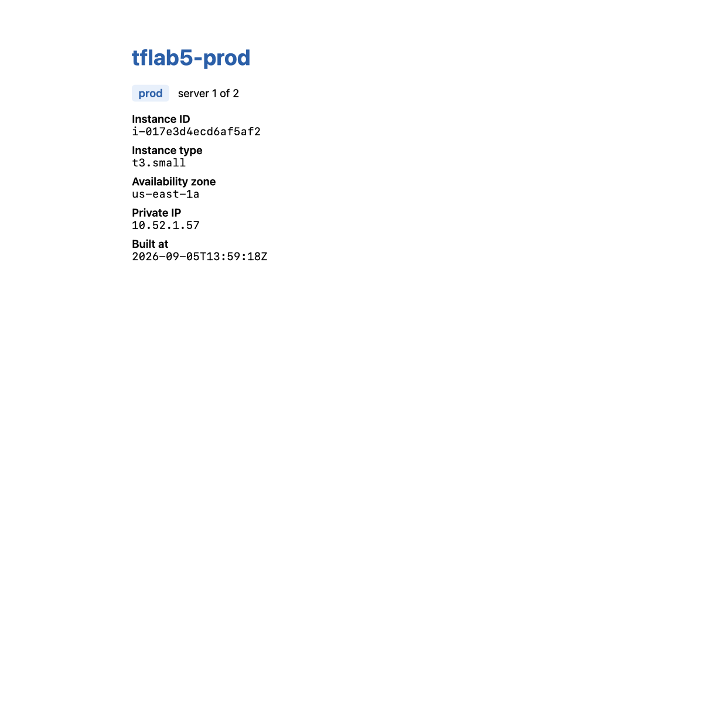

# Lab 5 — Templates, Modules & Workspaces (Reuse Patterns)

**Maps to:** *Templates; Reuse Patterns in Terraform (Workspaces, Outputs, Modules — local and external/GitHub); Nested Directory Modules*
**Duration:** ~90 minutes
**Status:** Tested end-to-end on 2026-09-05 (Terraform v1.15.7, AWS provider v6.63.0,
`terraform-aws-modules/vpc/aws` v5.21.0) against a live AWS account in `us-east-1`. Two complete
environments were deployed, verified over HTTP and destroyed.

Prerequisites: [`00-shared-setup.md`](00-shared-setup.md), Labs 1–4 — **especially
[Lab 4](lab-4-aws-provider-mini-app.md)**, whose mini-app becomes this lab's module.

---

## 1. Lab Overview & Objectives

At the end of Lab 4 you were told to notice a feeling: copy-pasting a `resource` block and changing
one letter. This lab is the cure.

You will package Lab 4's web server into a **reusable local module**, pull in an **external module
from the public registry** for the network, and then deploy **two complete environments — dev and
prod — from exactly the same code**, differing only in the value of `terraform.workspace`.

The measurable end state: three running instances across two isolated VPCs, and not one `.tf` file
that differs between environments.

**Learning objectives — by the end of this lab you will be able to:**

1. Write a module with a deliberate interface — typed variables in, outputs out — and explain why a
   module must never reach outside itself for values.
2. Consume an external module from the Terraform Registry, and read the version constraints it
   imposes on *your* configuration.
3. Use workspaces to deploy the same configuration multiple times with isolated state, and state
   honestly what workspaces do **not** isolate.
4. Choose between workspaces and separate root directories for real environment separation.

> **The most surprising measured result in this lab:** the obvious way to guard against an invalid
> workspace — a `lifecycle { precondition { ... } }` block — **does not work**. Terraform evaluated
> the module arguments first and failed with `Attempt to get attribute from null value`, pointing at
> a line in the VPC module that had nothing to do with the real problem. The fix was to stop being
> clever: a direct map index produces an error naming the actual workspace. §4 Step 3 shows both
> error messages side by side.

---

## 2. Prerequisites & Environment Setup

### 2.1 Software

| Requirement | Tested with |
|---|---|
| Terraform CLI | v1.15.7 |
| AWS provider | v6.63.0 |
| External module | `terraform-aws-modules/vpc/aws` **v5.21.0** (resolved from `~> 5.0`) |
| AWS CLI v2 | 2.35.11 |
| bash | **3.2.57** — the version macOS ships. See the §5 portability note. |

### 2.2 Cost and time

| | |
|---|---|
| Resources created | **27 total**: 13 in dev, 14 in prod |
| Billable | 3 instances — 1 × `t3.micro` (dev) + 2 × `t3.small` (prod) |
| Measured price | dev **$0.0104/hr**; prod **$0.0416/hr** (2 × $0.0208) |
| Both environments together | **$0.052/hr** |
| Measured apply time | ~60s (dev), ~70s (prod) |
| Realistic cost | **under $0.10** if you destroy at the end |
| Hands-on time | ~90 minutes |

> **This is the most expensive lab in the course**, because it is the only one that deliberately
> runs two environments at once. `enable_nat_gateway = false` is set on the VPC module for exactly
> this reason — the module's default would have added two NAT gateways at ~$0.045/hour *each*,
> which is more than every other resource in this course combined.

### 2.3 Setup

```bash
mkdir -p ~/terraform-course/lab-5-modules/modules/web-server
cd ~/terraform-course/lab-5-modules
export AWS_REGION=us-east-1 AWS_DEFAULT_REGION=us-east-1
export TF_PLUGIN_CACHE_DIR="$HOME/.terraform.d/plugin-cache"
```

---

## 3. Architecture


*Vector version: [`lab-5-architecture.svg`](artifacts/lab-5/diagrams/lab-5-architecture.svg)*

```
                    ONE ROOT CONFIGURATION (written once)
   locals.env_settings = { dev = {...}, prod = {...} }
   local.env = local.env_settings[terraform.workspace]   ← selects one row
        │
        ├── module "vpc"  source = terraform-aws-modules/vpc/aws  ~> 5.0   EXTERNAL
        └── module "web"  source = ./modules/web-server                    LOCAL
                                    │
        ┌───────────────────────────┴────────────────────────────┐
        │                                                        │
   workspace: dev                                          workspace: prod
   terraform.tfstate.d/dev/terraform.tfstate                terraform.tfstate.d/prod/terraform.tfstate
   14 objects in state                                      15 objects in state
   t3.micro × 1        10.51.0.0/16                         t3.small × 2      10.52.0.0/16
        │                                                        │
        ▼                                                        ▼
   13 AWS resources                                         14 AWS resources
   vpc-06a24fe4115c508ee                                    vpc-0820337b8977d1356
   tflab5-dev-web-1   10.51.1.224                           tflab5-prod-web-1  10.52.1.57
   http://52.54.184.11                                      tflab5-prod-web-2  10.52.1.150
                                                            http://54.147.98.196
                                                            http://52.91.232.252

   Zero .tf files differ between them. Zero shared AWS resources.
```

**The module boundary is the point.** `modules/web-server/` knows nothing about workspaces,
environments, or which VPC it lives in. It receives a `vpc_id` and a `subnet_id` and returns
`urls` and `instance_ids`. That ignorance is what makes it reusable — a module that reads
`terraform.workspace` internally is not a module, it is a copy of your root config with extra
steps.

---

## 4. Step-by-Step Instructions

### Step 1 — Write the module's interface first

**Why:** A module's variables and outputs are its API, and the API is the part you cannot casually
change later once other configurations depend on it. Design it before the implementation.

```bash
cat > modules/web-server/variables.tf << 'EOF'
# A module's variables are its API. Everything a caller may set lives here,
# with a type, a description, and a default only where a sane one exists.

variable "name" {
  description = "Base name for resources this module creates. Must be unique per caller."
  type        = string
}

variable "subnet_id" {
  description = "Subnet to place the instance in. The caller owns the network."
  type        = string
}

variable "vpc_id" {
  description = "VPC the security group is created in."
  type        = string
}

variable "instance_type" {
  description = "EC2 instance type."
  type        = string
  default     = "t3.micro"
}

variable "instance_count" {
  description = "How many identical web servers to create."
  type        = number
  default     = 1

  validation {
    condition     = var.instance_count >= 1 && var.instance_count <= 5
    error_message = "instance_count must be between 1 and 5 (a lab guardrail, not an AWS limit)."
  }
}

variable "allowed_http_cidr" {
  description = "CIDR permitted to reach port 80."
  type        = string
  default     = "0.0.0.0/0"
}

variable "environment" {
  description = "Environment label, surfaced on the served page and in tags."
  type        = string
}

variable "tags" {
  description = "Additional tags merged onto every resource."
  type        = map(string)
  default     = {}
}
EOF
```

**Which variables have defaults, and which do not, is a design decision.** `name`, `subnet_id`,
`vpc_id` and `environment` have none — there is no sensible default, and a caller who forgets one
should get an error, not a surprise. `instance_type` and `instance_count` have defaults because
"one small server" is a reasonable thing to want.

> **The module does not create a VPC.** It takes one as input. A module that creates its own network
> can only ever be used once per network, and cannot be composed. Push ownership of shared
> infrastructure *up* to the caller.

### Step 2 — Implement the module, then its outputs

```bash
cat > modules/web-server/main.tf << 'EOF'
terraform {
  required_version = ">= 1.5.0"
  required_providers {
    aws = {
      source  = "hashicorp/aws"
      version = "~> 6.0"
    }
  }
}

data "aws_ami" "al2023" {
  most_recent = true
  owners      = ["amazon"]

  filter {
    name   = "name"
    values = ["al2023-ami-2023.*-kernel-6.1-x86_64"]
  }
}

locals {
  module_tags = merge(var.tags, {
    Module      = "web-server"
    Environment = var.environment
  })
}

resource "aws_security_group" "web" {
  name        = "${var.name}-web-sg"
  description = "HTTP in, all out - managed by the web-server module"
  vpc_id      = var.vpc_id

  tags = merge(local.module_tags, { Name = "${var.name}-web-sg" })
}

resource "aws_vpc_security_group_ingress_rule" "http" {
  security_group_id = aws_security_group.web.id
  description       = "HTTP"
  cidr_ipv4         = var.allowed_http_cidr
  from_port         = 80
  to_port           = 80
  ip_protocol       = "tcp"
}

resource "aws_vpc_security_group_egress_rule" "all" {
  security_group_id = aws_security_group.web.id
  description       = "All outbound"
  cidr_ipv4         = "0.0.0.0/0"
  ip_protocol       = "-1"
}

resource "aws_instance" "web" {
  count = var.instance_count

  ami                    = data.aws_ami.al2023.id
  instance_type          = var.instance_type
  subnet_id              = var.subnet_id
  vpc_security_group_ids = [aws_security_group.web.id]

  user_data = templatefile("${path.module}/user-data.sh.tftpl", {
    name        = var.name
    environment = var.environment
    index       = count.index + 1
    total       = var.instance_count
  })

  user_data_replace_on_change = true

  tags = merge(local.module_tags, { Name = "${var.name}-web-${count.index + 1}" })
}
EOF
```

**`${path.module}` is mandatory here, not decorative.** It resolves to the module's own directory.
Write `templatefile("user-data.sh.tftpl", ...)` instead and Terraform looks in the *root* module's
directory, and the module breaks the moment someone calls it from anywhere else.

**`${var.name}` prefixes every resource name** because the caller may instantiate this module more
than once. `aws_security_group.web` with a hardcoded `name = "web-sg"` collides on the second call.

The outputs:

```bash
cat > modules/web-server/outputs.tf << 'EOF'
# A module communicates results ONLY through outputs. Nothing else it creates
# is reachable from the caller.

output "instance_ids" {
  description = "IDs of every instance this module created."
  value       = aws_instance.web[*].id
}

output "public_ips" {
  description = "Public IPv4 addresses of every instance."
  value       = aws_instance.web[*].public_ip
}

output "urls" {
  description = "Ready-to-open URLs, one per instance."
  value       = [for ip in aws_instance.web[*].public_ip : "http://${ip}"]
}

output "security_group_id" {
  description = "The security group the module created."
  value       = aws_security_group.web.id
}

output "instance_count" {
  description = "How many instances the module actually created."
  value       = length(aws_instance.web)
}
EOF
```

**Outputs are the *only* way out of a module.** From the root you can write `module.web.urls`; you
cannot write `module.web.aws_instance.web[0].private_ip`. If a caller needs it, the module must
export it. This is a feature: it is what lets you rewrite a module's internals without breaking
callers.

Two expression forms worth naming:

- `aws_instance.web[*].id` — the **splat** operator. With `count`, `aws_instance.web` is a list;
  the splat maps over it. Returns `[]` when `count = 0`, which is exactly what you want.
- `[for ip in ... : "http://${ip}"]` — a **for expression**, building the URL list. Lab 7 covers
  these properly.

Finally the template. It is the Lab 4 script with two extra inputs so the page announces which
environment it belongs to:

```bash
cat > modules/web-server/user-data.sh.tftpl << 'EOF'
#!/bin/bash
set -euxo pipefail
dnf install -y nginx

TOKEN=$(curl -sX PUT "http://169.254.169.254/latest/api/token" \
  -H "X-aws-ec2-metadata-token-ttl-seconds: 300")
meta() { curl -s -H "X-aws-ec2-metadata-token: $TOKEN" "http://169.254.169.254/latest/meta-data/$1"; }

cat > /usr/share/nginx/html/index.html << HTML
<!doctype html>
<title>${name} — ${environment}</title>
<style>
 body{font-family:system-ui,sans-serif;max-width:40rem;margin:4rem auto;padding:0 1rem}
 h1{color:#2b5fa8} .env{display:inline-block;padding:.2rem .6rem;border-radius:.3rem;
 background:#e8f0fb;color:#2b5fa8;font-weight:600} dt{font-weight:600;margin-top:.6rem}
 dd{margin:0;font-family:ui-monospace,Menlo,monospace}
</style>
<h1>${name}</h1>
<p><span class="env">${environment}</span> &nbsp; server ${index} of ${total}</p>
<dl>
 <dt>Instance ID</dt><dd>$(meta instance-id)</dd>
 <dt>Instance type</dt><dd>$(meta instance-type)</dd>
 <dt>Availability zone</dt><dd>$(meta placement/availability-zone)</dd>
 <dt>Private IP</dt><dd>$(meta local-ipv4)</dd>
 <dt>Built at</dt><dd>$(date -u +%Y-%m-%dT%H:%M:%SZ)</dd>
</dl>
HTML

systemctl enable --now nginx
EOF
```

### Step 3 — The root configuration: workspace-driven settings

**Why:** This is where the two environments are actually distinguished — in one `locals` block,
rather than in two copies of a directory.

```bash
cat > versions.tf << 'EOF'
terraform {
  required_version = ">= 1.5.0"
  required_providers {
    aws = {
      source  = "hashicorp/aws"
      version = "~> 6.0"
    }
  }
}

provider "aws" {
  region = var.aws_region

  default_tags {
    tags = {
      Course    = "intermediate-terraform"
      Lab       = "5"
      ManagedBy = "terraform"
      Workspace = terraform.workspace
    }
  }
}
EOF

cat > variables.tf << 'EOF'
variable "aws_region" {
  description = "Region for all environments."
  type        = string
  default     = "us-east-1"
}

variable "project_name" {
  description = "Project prefix, shared across workspaces."
  type        = string
  default     = "tflab5"
}
EOF

cat > main.tf << 'EOF'
# ---------------------------------------------------------------------------
# Per-workspace settings. ONE definition, selected by terraform.workspace.
# This is what makes dev and prod the same code with different inputs.
# ---------------------------------------------------------------------------
locals {
  env_settings = {
    dev = {
      instance_type  = "t3.micro"
      instance_count = 1
      vpc_cidr       = "10.51.0.0/16"
    }
    prod = {
      instance_type  = "t3.small"
      instance_count = 2
      vpc_cidr       = "10.52.0.0/16"
    }
  }

  # Direct index, NOT lookup(..., null): an unknown workspace must fail here,
  # with a message naming the key, rather than yielding null and failing later
  # somewhere unrelated.
  env = local.env_settings[terraform.workspace]

  name = "${var.project_name}-${terraform.workspace}"
}

# ---------------------------------------------------------------------------
# EXTERNAL module, from the public Terraform Registry (backed by GitHub).
# We did not write this and do not maintain it.
# ---------------------------------------------------------------------------
module "vpc" {
  source  = "terraform-aws-modules/vpc/aws"
  version = "~> 5.0"

  name = "${local.name}-vpc"
  cidr = local.env.vpc_cidr

  azs            = ["${var.aws_region}a"]
  public_subnets = [cidrsubnet(local.env.vpc_cidr, 8, 1)]

  # A NAT gateway costs ~$32/month and this lab does not need one.
  enable_nat_gateway      = false
  map_public_ip_on_launch = true

  tags = { Environment = terraform.workspace }
}

# ---------------------------------------------------------------------------
# LOCAL module, the one we wrote, called with per-workspace values.
# ---------------------------------------------------------------------------
module "web" {
  source = "./modules/web-server"

  name           = local.name
  environment    = terraform.workspace
  vpc_id         = module.vpc.vpc_id
  subnet_id      = module.vpc.public_subnets[0]
  instance_type  = local.env.instance_type
  instance_count = local.env.instance_count

  tags = { Project = var.project_name }
}
EOF

cat > outputs.tf << 'EOF'
output "workspace" {
  description = "Which workspace produced this deployment."
  value       = terraform.workspace
}

output "settings_used" {
  description = "The per-workspace settings that were selected."
  value       = local.env
}

output "vpc_id" {
  description = "VPC created by the EXTERNAL registry module."
  value       = module.vpc.vpc_id
}

output "urls" {
  description = "Every web server URL in this environment."
  value       = module.web.urls
}

output "instance_ids" {
  description = "Every instance ID in this environment."
  value       = module.web.instance_ids
}
EOF
```

#### A measured detour: how *not* to validate the workspace

The first version of this lab tried to catch an unsupported workspace properly, with
`lookup(local.env_settings, terraform.workspace, null)` and a guard resource:

```hcl
resource "terraform_data" "workspace_guard" {
  lifecycle {
    precondition {
      condition     = local.env != null
      error_message = "Workspace '${terraform.workspace}' has no entry in local.env_settings..."
    }
  }
}
```

**It does not work.** Run in the `default` workspace, that carefully-written error message never
appeared. This is what came out instead:

```
Error: Attempt to get attribute from null value

  on main.tf line 49, in module "vpc":
  49:   cidr = local.env.vpc_cidr
    ├────────────────
    │ local.env is null

This value is null, so it does not have any attributes.
```

Terraform evaluated the **module arguments** before the guard resource's precondition, so the run
died on a null-attribute access pointing at the VPC module — a line that has nothing to do with the
actual mistake. Preconditions guard *that resource's* own creation; they are not a general assertion
mechanism that runs first.

Deleting the guard and indexing the map directly produces this instead:

```
Error: Invalid index

  on main.tf line 23, in locals:
  23:   env = local.env_settings[terraform.workspace]
    ├────────────────
    │ local.env_settings is object with 2 attributes
    │ terraform.workspace is "default"

The given key does not identify an element in this collection value.
```

It names the file, the line, the workspace, and the fact that the key is missing. **`lookup()` with
a default is the wrong tool when there is no valid default** — it converts a loud failure into a
quiet `null` that surfaces somewhere else. The shipped configuration uses the direct index.

### Step 4 — `terraform init`, and read what it tells you about the external module

```bash
terraform init
```

**Expected output:**

```
Initializing modules...
- web in modules/web-server
Downloading registry.terraform.io/terraform-aws-modules/vpc/aws 5.21.0 for vpc...
- vpc in .terraform/modules/vpc
Initializing provider plugins found in the configuration...
- terraform.io/builtin/terraform is built in to Terraform
- Finding hashicorp/aws versions matching ">= 5.79.0, ~> 6.0"...
- Installing hashicorp/aws v6.63.0...
- Installed hashicorp/aws v6.63.0 (signed by HashiCorp)

Terraform has been successfully initialized!
```

**Three things to read carefully:**

1. **Local modules are not downloaded.** `- web in modules/web-server` — Terraform just references
   the directory. Edit the module and the change takes effect immediately, with no `init`.
2. **External modules are downloaded and pinned.** `~> 5.0` resolved to **v5.21.0**, copied into
   `.terraform/modules/vpc`. Changing the constraint requires `terraform init -upgrade`.
3. **`>= 5.79.0, ~> 6.0` is a merged constraint.** You wrote `~> 6.0`. The VPC module contributes
   `>= 5.79.0` of its own. Terraform intersects every constraint in the dependency tree. **An
   external module can therefore constrain your provider version** — and if two modules disagree
   irreconcilably, `init` fails and you cannot use them together.

> **You are running someone else's code.** `terraform-aws-modules/vpc/aws` is well maintained and
> widely used, but a registry module is arbitrary code executed with your AWS credentials. Pin the
> version (never a bare `source` with no `version`), read the changelog before bumping, and for
> anything sensitive, vendor it or fork it.

### Step 5 — Create the workspaces and deploy dev

```bash
terraform workspace list
terraform workspace new dev
terraform workspace new prod
terraform workspace list
```

**Expected output:**

```
* default

  default
  dev
* prod
```

The `*` marks the current workspace. `workspace new` both creates and switches.

```bash
terraform workspace select dev
terraform apply -auto-approve
```

**Expected output:**

```
Switched to workspace "dev".
module.web.aws_instance.web[0]: Creating...
module.web.aws_instance.web[0]: Creation complete after 16s [id=i-0838a59d810c6b183]

Apply complete! Resources: 13 added, 0 changed, 0 destroyed.

Outputs:

instance_ids = [
  "i-0838a59d810c6b183",
]
settings_used = {
  "instance_count" = 1
  "instance_type" = "t3.micro"
  "vpc_cidr" = "10.51.0.0/16"
}
urls = [
  "http://52.54.184.11",
]
vpc_id = "vpc-06a24fe4115c508ee"
workspace = "dev"
```

### Step 6 — Deploy prod from the identical code

**Why:** This is the moment the lab either works or does not. **Change no files.** Switch workspace
and apply.

```bash
terraform workspace select prod
terraform apply -auto-approve
```

**Expected output:**

```
Switched to workspace "prod".
module.web.aws_instance.web[0]: Creation complete after 16s [id=i-017e3d4ecd6af5af2]
module.web.aws_instance.web[1]: Creation complete after 16s [id=i-09f7f89362fe712f4]

Apply complete! Resources: 14 added, 0 changed, 0 destroyed.

Outputs:

instance_ids = [
  "i-017e3d4ecd6af5af2",
  "i-09f7f89362fe712f4",
]
settings_used = {
  "instance_count" = 2
  "instance_type" = "t3.small"
  "vpc_cidr" = "10.52.0.0/16"
}
urls = [
  "http://54.147.98.196",
  "http://52.91.232.252",
]
vpc_id = "vpc-0820337b8977d1356"
workspace = "prod"
```

**Two instances instead of one. `t3.small` instead of `t3.micro`. A different VPC CIDR. Zero file
edits.**

### Step 7 — See both environments at once

```bash
find terraform.tfstate.d -name '*.tfstate' | sort

aws ec2 describe-instances \
 --filters Name=tag:Course,Values=intermediate-terraform Name=instance-state-name,Values=running \
 --query 'sort_by(Reservations[].Instances[],&Tags[?Key==`Name`]|[0].Value)[].{Name:Tags[?Key==`Name`]|[0].Value,Workspace:Tags[?Key==`Workspace`]|[0].Value,Type:InstanceType,AZ:Placement.AvailabilityZone,PrivateIP:PrivateIpAddress}' \
 --output table
```

**Expected output:**

```
terraform.tfstate.d/dev/terraform.tfstate
terraform.tfstate.d/prod/terraform.tfstate

-----------------------------------------------------------------------------
|                             DescribeInstances                             |
+------------+---------------------+--------------+-----------+-------------+
|     AZ     |        Name         |  PrivateIP   |   Type    |  Workspace  |
+------------+---------------------+--------------+-----------+-------------+
|  us-east-1a|  tflab5-dev-web-1   |  10.51.1.224 |  t3.micro |  dev        |
|  us-east-1a|  tflab5-prod-web-1  |  10.52.1.57  |  t3.small |  prod       |
|  us-east-1a|  tflab5-prod-web-2  |  10.52.1.150 |  t3.small |  prod       |
+------------+---------------------+--------------+-----------+-------------+
```

**That table is the deliverable of this lab.** Two environments, correct sizes, correct counts,
non-overlapping private IP ranges, distinguished automatically by the `Workspace` tag that
`default_tags` applied from `terraform.workspace`.

Open the pages. They know which environment they are:



```html
<h1>tflab5-prod</h1>
<p><span class="env">prod</span> &nbsp; server 1 of 2</p>
 <dt>Instance ID</dt><dd>i-017e3d4ecd6af5af2</dd>
 <dt>Instance type</dt><dd>t3.small</dd>
```

The dev page ([`lab-5-dev-page.png`](artifacts/lab-5/screenshots/lab-5-dev-page.png)) says
`dev`, `server 1 of 1`, `t3.micro`.

### Step 8 — Where workspaces stop being the right answer

**Why:** Workspaces are frequently recommended for environment separation, and frequently the wrong
tool for it. Knowing the boundary is more valuable than knowing the commands.

| Workspaces isolate | Workspaces do **not** isolate |
|---|---|
| State — separate state file per workspace | **The backend** — one backend, one bucket, one lock table |
| Resource addresses — no collisions between environments | **Credentials** — the same AWS identity for dev and prod |
| Outputs | **The code path** — a bad `apply` in the wrong workspace hits prod |
| | **Permissions** — nothing stops you applying prod from your laptop |

The failure mode is a one-word mistake: you believe you are in `dev`, you are in `prod`, and
`terraform destroy` does not ask which environment you meant. Guard against it:

```bash
terraform workspace show   # make this a habit before every apply
```

**Use workspaces for:** short-lived parallel copies of the same thing — per-developer sandboxes,
per-pull-request preview environments, testing a refactor beside the original.

**Use separate root directories (`environments/dev/`, `environments/prod/`), each with its own
backend and credentials, for:** anything where dev and prod have different blast radii. This is what
most production organisations do, and the module you wrote in Steps 1–2 is reusable across them
unchanged — which is the real payoff of module-based design.

### Step 9 — Do it again yourself, add a third environment, unassisted

**Why:** The claim this lab makes is that adding an environment is now cheap. Test the claim.

**Your task.** Add a **`staging`** environment: 1 × `t3.small`, in `10.53.0.0/16`, deployed and
serving, alongside dev and prod. Then make the module do something it currently cannot: give
`staging` a **restricted `allowed_http_cidr`** — only your own IP may reach it — while dev and prod
stay open.

**You get the acceptance criteria and nothing else:**

- `terraform workspace list` shows four workspaces; three have deployed infrastructure.
- Adding `staging` required edits to **one file only**, and no changes at all under
  `modules/web-server/`.
- `curl` from your machine gets `200` from the staging URL; the same URL from any other network
  gets a timeout.
- `terraform output settings_used` in `staging` reports `t3.small`, count `1`, `10.53.0.0/16`.
- The `dev` and `prod` environments are byte-identical to before — `terraform plan` in each reports
  no changes.
- All three destroy cleanly.

**Done when** you can say how many lines you had to change to add a whole environment, and explain
why `allowed_http_cidr` belonged in `env_settings` rather than as a new module variable — or argue
convincingly that it did not.

No commands are given here. Steps 3–6 have every pattern. The interesting part is that
`allowed_http_cidr` is *already* a module variable with a default, so the module needs no change at
all — noticing that is the exercise.

---

## 5. Validation / Verification

Save as `validate.sh`. Also at [`lab-5-modules/validate.sh`](lab-5-modules/validate.sh).

> **Portability note, learned the hard way:** the first version of this script used bash
> associative arrays (`declare -A`). macOS ships **bash 3.2.57**, where `declare -A` silently
> creates an ordinary array and the script dies with `line 17: dev: unbound variable` under
> `set -u`. The version below uses `case` functions and runs on bash 3.2.

```bash
#!/usr/bin/env bash
# Lab 5 validation. Run from lab-5-modules/. Checks BOTH workspaces.
set -uo pipefail
fail=0
check() { if [ "$2" = "$3" ]; then echo "PASS  $1"; else echo "FAIL  $1 (got '$2', want '$3')"; fail=1; fi }

want_type()  { case "$1" in dev) echo t3.micro;;      prod) echo t3.small;;      esac; }
want_count() { case "$1" in dev) echo 1;;             prod) echo 2;;             esac; }
want_cidr()  { case "$1" in dev) echo 10.51.0.0/16;;  prod) echo 10.52.0.0/16;;  esac; }

ORIG=$(terraform workspace show)
DEV_IDS=""; PROD_IDS=""

check "dev and prod workspaces both exist" \
  "$(terraform workspace list | grep -cE '^\*? *(dev|prod)$')" "2"

check "each workspace has an isolated state file" \
  "$(find terraform.tfstate.d -name '*.tfstate' | wc -l | tr -d ' ')" "2"

for ws in dev prod; do
  terraform workspace select "$ws" >/dev/null 2>&1

  check "[$ws] instance_count from the workspace map" \
    "$(terraform output -json instance_ids | python3 -c 'import json,sys;print(len(json.load(sys.stdin)))')" \
    "$(want_count "$ws")"

  check "[$ws] instance_type from the workspace map" \
    "$(terraform output -json settings_used | python3 -c 'import json,sys;print(json.load(sys.stdin)["instance_type"])')" \
    "$(want_type "$ws")"

  check "[$ws] VPC CIDR from the workspace map" \
    "$(aws ec2 describe-vpcs --vpc-ids "$(terraform output -raw vpc_id)" --query 'Vpcs[0].CidrBlock' --output text)" \
    "$(want_cidr "$ws")"

  for url in $(terraform output -json urls | python3 -c 'import json,sys;[print(u) for u in json.load(sys.stdin)]'); do
    check "[$ws] HTTP 200 from $url" \
      "$(curl -s -o /dev/null -w '%{http_code}' --max-time 15 "$url")" "200"
    check "[$ws] page reports its own environment" \
      "$(curl -sS --max-time 15 "$url" | sed -n 's/.*<span class="env">\([a-z]*\)<\/span>.*/\1/p')" "$ws"
  done

  ids=$(terraform output -json instance_ids | python3 -c 'import json,sys;print(" ".join(sorted(json.load(sys.stdin))))')
  if [ "$ws" = "dev" ]; then DEV_IDS="$ids"; else PROD_IDS="$ids"; fi
done

# THE ONE THE HAPPY PATH MISSES: are the two environments genuinely SEPARATE?
OVERLAP=$(python3 -c "
import sys
d=set('''$DEV_IDS'''.split()); p=set('''$PROD_IDS'''.split())
print(len(d & p))
")
check "dev and prod share ZERO instances" "$OVERLAP" "0"

terraform workspace select "$ORIG" >/dev/null 2>&1
echo
[ $fail -eq 0 ] && echo "Lab 5 validation: ALL CHECKS PASSED" || echo "Lab 5 validation: FAILURES ABOVE"
exit $fail
```

**Actual output — 15 checks, exit code `0`:**

```
PASS  dev and prod workspaces both exist
PASS  each workspace has an isolated state file
PASS  [dev] instance_count from the workspace map
PASS  [dev] instance_type from the workspace map
PASS  [dev] VPC CIDR from the workspace map
PASS  [dev] HTTP 200 from http://52.54.184.11
PASS  [dev] page reports its own environment
PASS  [prod] instance_count from the workspace map
PASS  [prod] instance_type from the workspace map
PASS  [prod] VPC CIDR from the workspace map
PASS  [prod] HTTP 200 from http://54.147.98.196
PASS  [prod] page reports its own environment
PASS  [prod] HTTP 200 from http://52.91.232.252
PASS  [prod] page reports its own environment
PASS  dev and prod share ZERO instances

Lab 5 validation: ALL CHECKS PASSED
```

**The last check is the one the happy path cannot catch.** Every other check would still pass if
both workspaces somehow addressed the *same* instances — which is precisely what happens when
someone parameterises a module but leaves one resource name unqualified. Intersecting the two
instance-ID sets and asserting the result is empty is the only assertion here that tests
*separation* rather than *existence*.

---

## 6. Troubleshooting Tips

All hit for real while building this lab.

**`line 17: dev: unbound variable` from a validation script**

bash 3.2 (macOS default) does not support `declare -A` associative arrays. It creates a normal
array instead, and `set -u` then trips on the string subscript. Use `case` functions, or install a
newer bash — but scripts you hand to a class should assume 3.2.

**`Error: Attempt to get attribute from null value` pointing at a module argument**

A `lookup(..., null)` somewhere upstream returned `null` and the error surfaced at first use, not at
the mistake. See Step 3. Index the map directly so it fails where the problem is.

**`Error: Invalid index ... terraform.workspace is "default"`**

You are in the `default` workspace, which has no settings row. `terraform workspace select dev`.
This is the *good* error — it tells you exactly what is wrong.

**`init` fails resolving provider versions after adding an external module**

External modules contribute their own `required_providers` constraints, and Terraform intersects
them all. This lab's merged constraint was `>= 5.79.0, ~> 6.0`. If a module demands `< 6.0` and you
demand `~> 6.0`, there is no solution and you must upgrade the module, downgrade your constraint, or
drop one of them.

**Editing the module changes nothing**

Check whether you edited `modules/web-server/` (the source) or `.terraform/modules/` (a downloaded
copy of an *external* module). Local modules are referenced in place and need no `init`; external
ones are copies, and edits there are overwritten on the next `init`.

**`terraform destroy` in the wrong workspace**

There is no undo. Run `terraform workspace show` before anything destructive. This is the single
biggest argument against using workspaces for real environment separation — see Step 8.

**Registry module downloads fail behind a corporate proxy**

`terraform init` fetches from `registry.terraform.io` over HTTPS. If it is blocked, either configure
the proxy environment variables, or change `source` to a Git URL your network permits —
`source = "git::https://github.com/terraform-aws-modules/terraform-aws-vpc.git?ref=v5.21.0"` is the
same code, pinned by tag.

---

## 7. Cleanup Steps

**Destroy each workspace separately — `destroy` only ever affects the current one.**

```bash
for ws in dev prod; do
  terraform workspace select "$ws"
  terraform destroy -auto-approve
done
terraform workspace select default
```

**Expected output:**

```
=== destroying dev ===
Destroy complete! Resources: 13 destroyed.
=== destroying prod ===
Destroy complete! Resources: 14 destroyed.
```

Then remove the empty workspaces:

```bash
terraform workspace delete dev
terraform workspace delete prod
terraform workspace list
```

```
Deleted workspace "dev"!
Deleted workspace "prod"!
* default
```

> Terraform refuses to delete a workspace whose state still holds resources — a genuinely useful
> guardrail. If `workspace delete` complains, you have not destroyed everything in it.

Confirm nothing survived — three instances and two VPCs should now be zero:

```bash
aws ec2 describe-instances \
  --filters Name=tag:Course,Values=intermediate-terraform \
            Name=instance-state-name,Values=running,pending,stopped \
  --query 'Reservations[].Instances[].InstanceId' --output text
aws ec2 describe-vpcs --filters Name=tag:Course,Values=intermediate-terraform \
  --query 'Vpcs[].VpcId' --output text
```

**Expected output: nothing from either.**

**Keep these, and here is why:**

| Keep | Why |
|---|---|
| `modules/web-server/` | **The actual deliverable of this lab.** It is reusable, versionable, and independent of everything around it. Lab 8 uses the same shape. |
| `main.tf` | The workspace-settings pattern is the piece most worth copying into real work. |
| `.terraform.lock.hcl` | Records aws v6.63.0 alongside the external module's constraint. |
| `terraform.tfstate.d/` | Now empty of resources; worth looking at once to see the per-workspace layout. |

---

## Optional extensions

1. **Publish the module properly.** Push `modules/web-server/` to its own Git repository, tag it
   `v0.1.0`, and change the root `source` to
   `git::https://github.com/<you>/<repo>.git?ref=v0.1.0`. Now bump the tag and watch
   `terraform init -upgrade` pick it up. This is how module versioning works in practice.

2. **Compare workspaces against directories.** Restructure into `environments/dev/` and
   `environments/prod/`, each a tiny root module calling the same `modules/web-server`. Note what
   gets better (independent backends, credentials, plan safety) and what gets worse (duplicated
   root files). Then decide which you would use at work.

3. **Break the module boundary on purpose.** Add `terraform.workspace` to the module's `main.tf` and
   observe that everything still works — then try to call that module twice from one root, or reuse
   it from a config that does not use workspaces. The failure explains the rule.

4. **Add a `moved` block.** Rename `aws_instance.web` to `aws_instance.server` inside the module and
   watch `plan` propose to destroy and recreate everything. Then add
   `moved { from = aws_instance.web to = aws_instance.server }` and watch the plan go quiet. This is
   how you refactor a module that other people already depend on.

5. **Cost the NAT gateway you avoided.** Set `enable_nat_gateway = true` and run `terraform plan`.
   Count the resources it adds, then price them. This lab's total cost is under ten cents; that one
   flag would have made it the most expensive thing in the course.
