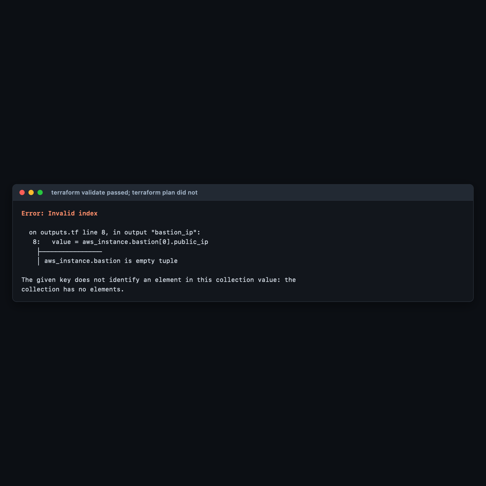
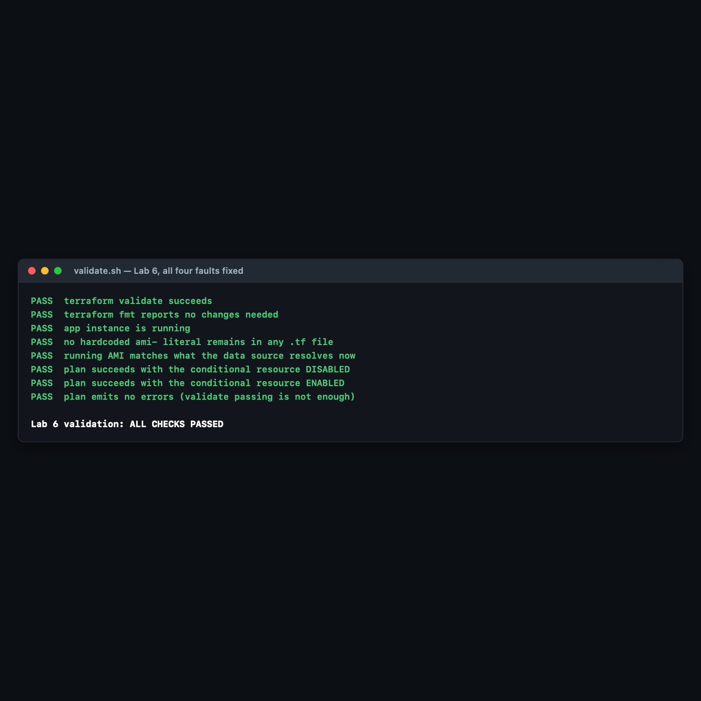

# Lab 6 — Error Handling & Debugging

**Maps to:** *Error Handling and Debugging in Terraform (Terraform vs. Provider errors, Pre-Induced Errors, dealing with conditional resource output)*
**Duration:** ~60 minutes
**Status:** Tested end-to-end on 2026-09-05 (Terraform v1.15.7, AWS provider v6.63.0) against a live
AWS account in `us-east-1`. Every error message below is real output from a real failed run.
**One exception is stated explicitly in §4 Step 6** — the IAM scenario could not be executed on this
account and ships as a reference artifact instead.

Prerequisites: [`00-shared-setup.md`](00-shared-setup.md), Labs 1–5.

---

## 1. Lab Overview & Objectives

You are given a configuration with **four deliberate faults**, and your job is to get from a failing
run to a clean `terraform apply`.

The faults are not random. Each one surfaces at a **different stage** of the Terraform lifecycle,
and that is the actual subject of the lab: *where* an error appears tells you *what kind* of error
it is, and therefore where to look for the fix. A syntax error and a 403 from the AWS API are not
the same species of problem, and treating them the same way is why debugging Terraform feels
arbitrary to people who have not learned this map.

**Learning objectives — by the end of this lab you will be able to:**

1. Classify a Terraform failure by the stage it surfaces at — `init`/`validate`, `plan`, or `apply`
   — and predict where the fix lives from that alone.
2. Distinguish a **Terraform error** (your HCL) from a **provider error** (the AWS API's answer),
   including the HTTP status codes that separate them.
3. Reference a conditional (`count`-based) resource's attributes correctly, and explain why the
   obvious fix passes `terraform validate` and then fails at `plan`.
4. Use `TF_LOG` to read the raw API request and response when the error message alone is not enough.

> **The most surprising measured result in this lab:** `terraform validate` reported
> **`Success! The configuration is valid.`** on a configuration that could not produce a plan.
> `validate` checks syntax and types but **never evaluates variable values**, so an out-of-range
> index like `aws_instance.bastion[0]` — where `count` is `0` — sails straight through it and dies
> at `plan`. A green `validate` in CI is much weaker evidence than most pipelines assume. §4 Step 4
> has both outputs.

---

## 2. Prerequisites & Environment Setup

### 2.1 Software

| Requirement | Tested with |
|---|---|
| Terraform CLI | v1.15.7 |
| AWS provider | v6.63.0 |
| AWS CLI v2 | 2.35.11 |

### 2.2 Cost and time

| | |
|---|---|
| Resources created | 1 × `t3.micro` (plus a second, briefly, when the bastion is enabled) |
| Measured price | **$0.0104/hr** |
| Failed applies cost | **nothing** — a rejected `RunInstances` call creates no instance |
| Realistic cost | **under $0.02** |
| Hands-on time | ~60 minutes |

> **The failing runs in this lab are free.** Every provider error here is a `400` rejection, which
> means AWS never created anything to bill you for. That is worth knowing generally: a failed
> `apply` costs nothing *for the resources that failed*, but resources created **before** the
> failure are real and are billing you. `terraform apply` is not transactional.

### 2.3 Setup

```bash
mkdir -p ~/terraform-course/lab-6-debugging && cd ~/terraform-course/lab-6-debugging
export AWS_REGION=us-east-1 AWS_DEFAULT_REGION=us-east-1
export TF_PLUGIN_CACHE_DIR="$HOME/.terraform.d/plugin-cache"
```

The broken starter is committed at [`lab-6-debugging/broken/`](lab-6-debugging/broken/); the
reference solution is at [`lab-6-debugging/fixed/`](lab-6-debugging/fixed/). **Work in `broken/` and
do not read `fixed/` until you are done** — the whole value of this lab is in the struggle.

---

## 3. Architecture


*Vector version: [`lab-6-architecture.svg`](artifacts/lab-6/diagrams/lab-6-architecture.svg)*

**The debugging map — memorise this table, not the individual messages:**

```
STAGE 1  terraform init / validate        no AWS contact whatsoever
  ├─ ERROR 1  Unclosed configuration block          ← HCL syntax
  └─ ERROR 2  Missing resource instance key         ← count reference
     Fix lives in: your HCL. Nothing else can be wrong.

STAGE 2  terraform plan                    evaluates values; creates nothing
  └─ ERROR 3  Invalid index: ... is empty tuple     ← count is 0
     Fix lives in: your expressions. Note validate PASSED this.

STAGE 3  terraform apply                   the AWS API finally answers
  ├─ ERROR 4a InvalidAMIID.Malformed   (HTTP 400)   bogus AMI id
  ├─ ERROR 4b InvalidAMIID.NotFound    (HTTP 400)   real AMI, wrong region
  ├─ ERROR 4c InvalidParameterValue    (HTTP 400)   t3.enormous
  └─ ERROR 4d UnauthorizedOperation    (HTTP 403)   IAM says no  [see §4 Step 6]
     Fix lives in: 400 → your config.  403 → your IAM policy.

WHEN THE MESSAGE IS NOT ENOUGH
  TF_LOG=DEBUG TF_LOG_PATH=./debug.log terraform apply
  → 368 lines, 56K, containing the literal request and the literal response
```

**The single most useful heuristic in this table:** if `plan` succeeded and `apply` failed, the
problem is not your HCL — it is something only AWS could know. And within those, **400 means you
asked for something impossible; 403 means you asked for something forbidden.** One is fixed in
`.tf`, the other in IAM.

---

## 4. Step-by-Step Instructions

### Step 1 — Meet the broken configuration

**Why:** Read it before running it. Predicting failures is a better exercise than reacting to them.

```bash
cd broken
cat main.tf outputs.tf
```

The starter contains four deliberate faults. See how many you can spot:

```hcl
resource "aws_instance" "app" {
  ami           = "ami-00000000000000000"
  instance_type = "t3.micro"

  tags = {
    Name = "tf-lab6-app"

}

resource "aws_instance" "bastion" {
  count = var.enable_bastion ? 1 : 0
  ...
}
```

```hcl
output "bastion_ip" {
  value = aws_instance.bastion.public_ip
}
```

### Step 2 — ERROR 1: the syntax error, and why it blames the wrong line

```bash
terraform init
```

**Expected output:**

```
Error: Terraform encountered problems during initialisation, including problems
with the configuration, described below.

The Terraform configuration must be valid before initialization so that
Terraform can determine which modules and providers need to be installed.


Error: Unclosed configuration block

  on main.tf line 11, in resource "aws_instance" "app":
  11: resource "aws_instance" "app" {

There is no closing brace for this block before the end of the file. This may
be caused by incorrect brace nesting elsewhere in this file.
```

**Two things to take from this:**

1. **`init` refused to run at all.** Terraform must parse the configuration before it can know which
   providers to download. A syntax error therefore blocks even the plugin download — which surprises
   people who think of `init` as a purely mechanical step.
2. **The reported line is 11, but the missing brace is on line 17.** HCL reports the *outermost
   unclosed block*, because from the parser's point of view the `resource` block on line 11 is the
   one that never ended. **When you get an unclosed-block error, the line number is where the block
   *started*, not where you made the mistake.** Search downward from it.

The fix is one brace:

```hcl
  tags = {
    Name = "tf-lab6-app"
  }
}
```

> **`terraform fmt` finds this class of bug faster than reading.** Run `terraform fmt` on a file with
> mismatched braces and it will either fix the indentation in a way that makes the problem obvious,
> or refuse and tell you where it gave up.

### Step 3 — ERROR 2: referencing a counted resource as if it were one thing

```bash
terraform init
terraform validate
```

**Expected output:**

```
Error: Missing resource instance key

  on outputs.tf line 8, in output "bastion_ip":
   8:   value = aws_instance.bastion.public_ip

Because aws_instance.bastion has "count" set, its attributes must be accessed
on specific instances.

For example, to correlate with indices of a referring resource, use:
    aws_instance.bastion[count.index]
```

This is an excellent error message: it names the file, the line, the cause, and a fix. **Adding
`count` to a resource changes its type** — `aws_instance.bastion` stops being an object and becomes
a *list* of objects. Every reference to it must change accordingly.

### Step 4 — The obvious fix is also wrong, and `validate` will not tell you

**Why:** This is the most valuable step in the lab. The suggested fix in that error message is
correct for a *correlated* resource and wrong for a *conditional* one.

Apply the obvious fix:

```hcl
output "bastion_ip" {
  value = aws_instance.bastion[0].public_ip
}
```

```bash
terraform validate
```

**Expected output:**

```
Success! The configuration is valid.
```

**It is not valid.** Run a plan:

```bash
terraform plan
```

**Expected output:**

```
Error: Invalid index

  on outputs.tf line 8, in output "bastion_ip":
   8:   value = aws_instance.bastion[0].public_ip
    ├────────────────
    │ aws_instance.bastion is empty tuple

The given key does not identify an element in this collection value: the
collection has no elements.
```


`var.enable_bastion` defaults to `false`, so `count = 0`, so the list is empty, so `[0]` does not
exist.

> **Why `validate` passed:** `terraform validate` checks that the configuration is syntactically
> valid and internally consistent — that referenced resources exist, that types line up, that
> arguments are known. It **does not evaluate variable values**, and it makes no API calls. It
> therefore cannot know that `count` will be `0`. This is the gap: **a CI pipeline whose only
> Terraform check is `terraform validate` will happily merge this code.** Run `terraform plan` in
> CI, against real credentials, if you want the stronger guarantee.

**The correct fix uses `one()`:**

```hcl
# CORRECT: one() collapses a 0-or-1 element list to a single value or null.
# Works whether enable_bastion is true or false. try() would also work but
# hides genuine errors; one() only tolerates the empty case.
output "bastion_ip" {
  description = "Bastion public IP, or null when the bastion is disabled."
  value       = one(aws_instance.bastion[*].public_ip)
}
```

| Approach | `count = 0` | `count = 1` | Verdict |
|---|---|---|---|
| `aws_instance.bastion.public_ip` | error at validate | error at validate | always wrong with `count` |
| `aws_instance.bastion[0].public_ip` | **error at plan** | works | the trap |
| `one(aws_instance.bastion[*].public_ip)` | `null` | the IP | **correct** |
| `try(aws_instance.bastion[0].public_ip, null)` | `null` | the IP | works, but swallows unrelated errors too |

`one()` is the purpose-built function: it takes a list of zero or one elements and returns `null` or
that element, and it **errors loudly if the list has more than one** — which is exactly the
behaviour you want from a conditional resource, and exactly what `try()` would hide.

Both directions were verified. With the bastion disabled, the output is simply absent (Terraform
omits `null` outputs):

```
{'app_id': 'i-024337bacac82e17e'}
```

With `-var enable_bastion=true`, the same unchanged expression resolves:

```
aws_instance.bastion[0]: Creation complete after 18s [id=i-0da2afb87947556e2]

Apply complete! Resources: 1 added, 0 changed, 0 destroyed.

Outputs:

app_id = "i-024337bacac82e17e"
bastion_ip = "54.167.20.183"
```

### Step 5 — ERROR 3: provider errors, which only `apply` can find

**Why:** Everything so far was Terraform disagreeing with your HCL. This is AWS disagreeing with
your request, and it is a different debugging problem.

Now that the expressions are fixed, `plan` succeeds:

```
  + app_id     = (known after apply)

Plan: 1 to add, 0 to change, 0 to destroy.
```

**Plan says it will work.** Apply:

```bash
terraform apply -auto-approve
```

**Expected output:**

```
Error: creating EC2 Instance: operation error EC2: RunInstances, https response error
StatusCode: 400, RequestID: 47cc041c-c41f-48e3-ada0-37ab716c8763,
api error InvalidAMIID.Malformed: Invalid id: "ami-00000000000000000" (expecting "ami-...")

  with aws_instance.app,
  on main.tf line 11, in resource "aws_instance" "app":
  11: resource "aws_instance" "app" {
```

**Terraform could not have caught this.** Whether `ami-00000000000000000` is a real image is a fact
about AWS's inventory, not about your configuration. This is the fundamental limit of `plan`:
it validates *structure*, and AWS validates *meaning*.

**Three distinct provider errors, all captured from real runs:**

| What was wrong | Real error | Status |
|---|---|---|
| `ami-00000000000000000` | `InvalidAMIID.Malformed: Invalid id ... (expecting "ami-...")` | 400 |
| A **real** AMI, but from `us-west-2` (`ami-0bea529386a62a2ad`) | `InvalidAMIID.NotFound: The image id '[ami-0bea529386a62a2ad]' does not exist` | 400 |
| `instance_type = "t3.enormous"` | `InvalidParameterValue: Invalid value 't3.enormous' for InstanceType.` | 400 |

The middle one is the realistic failure — it is exactly what happens when someone copies an AMI ID
out of a colleague's config or a blog post written for another region. It is also precisely the
failure the Lab 1 practice task was designed around.

> **An expectation that did not survive testing.** Before running these, the assumption was that a
> *plausible-looking* fake ID (`ami-0123456789abcdef0` — the right length, valid hex) would return
> `InvalidAMIID.NotFound` while only a malformed one returned `Malformed`. It did not: AWS returned
> **`InvalidAMIID.Malformed` for that ID too**. Only a genuinely well-formed AMI ID belonging to
> another region produced `NotFound`. The `Malformed` / `NotFound` boundary is drawn by AWS's own
> validation rules, not by whether an ID *looks* right — do not infer more from these codes than
> they actually distinguish.

**The fix is not to find a correct AMI ID.** It is to stop hardcoding one — the data source is
already in the file:

```hcl
resource "aws_instance" "app" {
  ami           = data.aws_ami.al2023.id
  instance_type = "t3.micro"
```

### Step 6 — ERROR 4: the permission error, and why this lab does not show you real output for it

**Why:** Authorization failures are the fourth class, and they are the ones where the fix is not in
your configuration at all.

**This is the one thing in Lab 6 that was not executed.** Stating why, plainly:

> The AWS account these labs were authored against uses **root user credentials**
> (`arn:aws:iam::<ACCOUNT_ID>:root`). **The root user cannot be denied by an IAM policy attached to
> itself.** Constraining root requires an AWS Organizations Service Control Policy, which would mean
> modifying a live organisation — not an acceptable thing for a lab to do to someone's account.
> Rather than fabricate console output, the scenario ships as a runnable reference artifact:
> [`lab-6-debugging/reference/iam-denied-scenario.md`](lab-6-debugging/reference/iam-denied-scenario.md).

If you are running these labs with a proper IAM user or role — which
[`00-shared-setup.md` §3.2](00-shared-setup.md) recommends — you can execute it yourself in about
five minutes. It attaches a deny policy, asks Terraform for a forbidden instance type, and produces
an `UnauthorizedOperation` error.

**What matters even without running it** is the classification:

| | Malformed input | Denied by policy |
|---|---|---|
| Surfaces at | `apply` | `apply` |
| HTTP status | **400** | **403** |
| Message names | the bad value | the IAM principal and action |
| Fix lives in | your `.tf` files | your IAM policy |

**A 403 means your configuration is probably correct.** That is the single most useful thing to know
about this error class, because the instinct on any failed apply is to start editing HCL — and here
that is guaranteed to waste your time.

### Step 7 — When the message is not enough: `TF_LOG`

**Why:** Occasionally the error is a bare `400` with no useful body, or a provider bug, or a timeout
with no explanation. `TF_LOG` shows you the actual HTTP conversation.

```bash
TF_LOG=DEBUG TF_LOG_PATH=./debug.log terraform apply -auto-approve
wc -l debug.log
```

**Expected output:** roughly **368 lines / 56K** for a *single* failed instance launch.

```bash
grep -n 'InvalidAMIID' debug.log | head -3
```

**Expected output** — the raw XML AWS actually sent back:

```
360:  | <Response><Errors><Error><Code>InvalidAMIID.NotFound</Code><Message>The image id
'[ami-0bea529386a62a2ad]' does not exist</Message></Error></Errors><RequestID>be88e717-...
362: [DEBUG] provider.terraform-provider-aws_v6.63.0_x5: request failed with unretryable error
https response error StatusCode: 400, RequestID: be88e717-...
```

And the request Terraform sent, which is often the more useful half:

```bash
grep -n 'Action=RunInstances' debug.log | head -2
```

```
355: [DEBUG] provider.terraform-provider-aws_v6.63.0_x5: HTTP Request Sent: ...
  | Action=RunInstances&ClientToken=terraform-ufVrjirhXkQd7sOCmBM16D9WgL&CreditSpecification.CpuCredits=unlimited&DisableApiTermination=false&EbsOptimized=f...
```

**Log levels, most to least verbose:** `TRACE` > `DEBUG` > `INFO` > `WARN` > `ERROR`.

| Variable | Effect |
|---|---|
| `TF_LOG=DEBUG` | Terraform core **and** provider logs |
| `TF_LOG_CORE=TRACE` | Terraform core only — for graph and state problems |
| `TF_LOG_PROVIDER=DEBUG` | provider only — for API problems. **Usually what you want.** |
| `TF_LOG_PATH=./debug.log` | write to a file instead of drowning your terminal |

> **`TF_LOG` output can contain credentials and secrets.** It logs request bodies and headers. Never
> paste a raw `TF_LOG` dump into a public issue tracker, a support ticket, or a chat channel without
> reading it first. This is also why `debug.log` belongs in `.gitignore`.

> **Reach for `TF_LOG` last, not first.** 368 lines for one failed API call means a real
> multi-resource failure produces tens of thousands. The error message, the resource address, and
> the line number solve the overwhelming majority of problems on their own.

### Step 8 — The clean apply

With all four faults fixed:

```bash
terraform fmt -recursive
terraform validate
terraform apply -auto-approve
```

**Expected output:**

```
Success! The configuration is valid.

aws_instance.app: Creating...
aws_instance.app: Still creating... [00m10s elapsed]
aws_instance.app: Creation complete after 17s [id=i-024337bacac82e17e]

Apply complete! Resources: 1 added, 0 changed, 0 destroyed.

Outputs:

app_id = "i-024337bacac82e17e"
```

**This is the lab's visible result:** the same directory that could not even `init` now applies
cleanly, and you can name which stage each of the four faults belonged to.

### Step 9 — Do it again yourself, break it in a way nobody told you about, unassisted

**Why:** You have now fixed four faults you were told existed. Real debugging starts from a failure
nobody has classified for you.

**Your task.** Working from the `fixed/` configuration, introduce **one fault of your own** in each
of the three stages — one that fails at `validate`, one that fails at `plan` but passes `validate`,
and one that fails at `apply` but passes `plan`. **None of them may be a fault used in this lab.**
Then hand the directory to a colleague, or come back to it after a break, and fix it.

**You get the acceptance criteria and nothing else:**

- Three faults, in three different `.tf` files, each failing at a *different* stage.
- The `validate`-stage fault is **not** a missing brace and **not** a `count` reference.
- The `plan`-stage fault passes `terraform validate` with `Success!` — verify this before you claim
  it.
- The `apply`-stage fault produces a `4xx` from the AWS API, and is **not** an AMI or instance-type
  problem.
- For each fault, you can state the stage, the error class, and where the fix lives — *before*
  reading your own notes.
- After fixing, `validate.sh` from §5 passes all eight checks.

**Done when** you can explain why your `plan`-stage fault was invisible to `validate`, in terms of
what `validate` is and is not allowed to do.

No commands are given here. Steps 2–7 have the whole map. The hard part is the second fault: most
attempts to break `plan` accidentally break `validate` instead, and noticing *why* is the lesson.

---

## 5. Validation / Verification

Save as `validate.sh`. Also at
[`lab-6-debugging/fixed/validate.sh`](lab-6-debugging/fixed/validate.sh).

```bash
#!/usr/bin/env bash
# Lab 6 validation. Run after you have fixed all four errors and applied.
set -uo pipefail
fail=0
check() { if [ "$2" = "$3" ]; then echo "PASS  $1"; else echo "FAIL  $1 (got '$2', want '$3')"; fail=1; fi }

terraform validate -no-color >/dev/null 2>&1
check "terraform validate succeeds" "$?" "0"

terraform fmt -check -recursive >/dev/null 2>&1
check "terraform fmt reports no changes needed" "$?" "0"

ID=$(terraform output -raw app_id)
check "app instance is running" \
  "$(aws ec2 describe-instances --instance-ids "$ID" --query 'Reservations[0].Instances[0].State.Name' --output text)" \
  "running"

# The regression check for the actual bug: a literal ami- id in any .tf file.
check "no hardcoded ami- literal remains in any .tf file" \
  "$(grep -oE '"ami-[0-9a-f]+"' ./*.tf 2>/dev/null | wc -l | tr -d ' ')" "0"

check "running AMI matches what the data source resolves now" \
  "$(aws ec2 describe-instances --instance-ids "$ID" --query 'Reservations[0].Instances[0].ImageId' --output text)" \
  "$(aws ec2 describe-images --owners amazon \
      --filters 'Name=name,Values=al2023-ami-2023.*-kernel-6.1-x86_64' 'Name=state,Values=available' \
      --query 'sort_by(Images,&CreationDate)[-1].ImageId' --output text)"

terraform plan -no-color -var enable_bastion=false >/dev/null 2>&1
check "plan succeeds with the conditional resource DISABLED" "$?" "0"

terraform plan -no-color -var enable_bastion=true >/dev/null 2>&1
check "plan succeeds with the conditional resource ENABLED" "$?" "0"

# THE ONE THE HAPPY PATH MISSES: `terraform validate` passing does NOT mean a
# plan will succeed. validate never evaluates variable values.
out=$(terraform plan -no-color -var enable_bastion=false 2>&1)
if printf '%s' "$out" | grep -q 'Error:'; then
  echo "FAIL  plan emits no errors (validate passing is not enough)"; fail=1
else
  echo "PASS  plan emits no errors (validate passing is not enough)"
fi

echo
[ $fail -eq 0 ] && echo "Lab 6 validation: ALL CHECKS PASSED" || echo "Lab 6 validation: FAILURES ABOVE"
exit $fail
```

**Actual output, exit code `0`:**

```
PASS  terraform validate succeeds
PASS  terraform fmt reports no changes needed
PASS  app instance is running
PASS  no hardcoded ami- literal remains in any .tf file
PASS  running AMI matches what the data source resolves now
PASS  plan succeeds with the conditional resource DISABLED
PASS  plan succeeds with the conditional resource ENABLED
PASS  plan emits no errors (validate passing is not enough)

Lab 6 validation: ALL CHECKS PASSED
```


**Checks 6, 7 and 8 are the ones that earn their place**, and check 1 is the one that lulls you.
Check 1 (`validate` succeeds) passed on the broken `[0]` version of this configuration too — that is
the whole point of §4 Step 4. Checks 6 and 7 assert that a **plan** succeeds in *both* branches of
the conditional, which is the property `validate` cannot test. Check 4 is a regression guard: it
fails if anyone ever pastes a literal AMI ID back into the config, which is how this lab's most
realistic bug returns.

---

## 6. Troubleshooting Tips

All encountered for real while building this lab.

**`terraform init` fails with a configuration error before downloading anything**

Not a network problem. Terraform must parse your `.tf` files to discover which providers to install,
so any syntax error blocks `init` entirely. Fix the HCL first; the download is not the problem.

**An unclosed-block error points at a line that looks fine**

It points at where the block *opened*, not where the brace is missing. Read downward from that line.
`terraform fmt` will usually make the real location obvious through its indentation.

**`terraform validate` says `Success!` but `plan` fails**

Expected behaviour, not a bug — see §4 Step 4. `validate` does not evaluate variable values and
makes no API calls. If your CI runs only `validate`, it is a much weaker gate than it appears.

**`Invalid index ... is empty tuple`**

A `count`-based conditional resolved to zero instances and something referenced `[0]`. Use
`one(resource[*].attribute)`.

**`plan` succeeds, `apply` fails with a 400**

You asked AWS for something impossible: a nonexistent AMI, an invalid instance type, an unsupported
combination. The fix is in your `.tf`. `plan` cannot catch these because only the AWS API knows.

**`apply` fails with a 403 / `UnauthorizedOperation`**

Your configuration is probably fine and your **permissions** are not. Do not start editing HCL. Read
the ARN in the message, check the IAM policies attached to that principal, and look for an explicit
`Deny`. See [`reference/iam-denied-scenario.md`](lab-6-debugging/reference/iam-denied-scenario.md).

**`TF_LOG` output is unreadably large**

Use `TF_LOG_PROVIDER=DEBUG` instead of `TF_LOG=DEBUG` to drop Terraform's core logs, and always send
it to `TF_LOG_PATH` rather than the terminal. 368 lines came from one failed API call; a real
failure produces far more.

**A partially-failed apply left resources behind**

`terraform apply` is **not** transactional. Resources created before the failure exist, are in
state, and are billing you. Run `terraform state list` after any failed apply, and `terraform
destroy` if you are abandoning the attempt.

---

## 7. Cleanup Steps

```bash
terraform destroy -auto-approve
```

**Expected output:**

```
aws_instance.app: Destruction complete after 22s

Destroy complete! Resources: 1 destroyed.
```

If you enabled the bastion at any point, confirm it went too:

```bash
aws ec2 describe-instances \
  --filters Name=tag:Course,Values=intermediate-terraform \
            Name=instance-state-name,Values=running,pending,stopped \
  --query 'Reservations[].Instances[].InstanceId' --output text
```

**Expected output: nothing at all.**

**Delete `debug.log`.** It contains full API request bodies:

```bash
rm -f debug.log
```

**Keep these, and here is why:**

| Keep | Why |
|---|---|
| `broken/` | Ships in its original four-fault state. Hand it to a colleague; it is a genuinely good exercise. |
| `fixed/` | The reference solution — including the `one()` output, which is the pattern worth stealing. |
| `reference/iam-denied-scenario.md` | The scenario this lab could not execute. Run it yourself in an account with a real IAM identity. |
| `validate.sh` | Check 8 belongs in your CI pipeline. |

---

## Optional extensions

1. **Run the IAM scenario for real.** Follow
   [`reference/iam-denied-scenario.md`](lab-6-debugging/reference/iam-denied-scenario.md) with a
   proper IAM user. Compare the `403` output against the `400`s in Step 5 and confirm the
   status-code heuristic holds in your own account.

2. **Strengthen your CI gate.** Take a pipeline that runs only `terraform validate` and add
   `terraform plan -detailed-exitcode`. Then re-introduce the `[0]` bug and watch which stage
   catches it. This is a ten-minute change that closes a real gap.

3. **Compare `one()` against `try()`.** Replace `one(...)` with
   `try(aws_instance.bastion[0].public_ip, null)`, then introduce a *different* error inside that
   expression — a misspelled attribute, say. `try()` swallows it and returns `null`; `one()` would
   have failed loudly. This is why `try()` is not a general-purpose safety net.

4. **Cause a partial apply.** Write a config with three resources where the second is invalid. Apply
   it, then run `terraform state list`. The first resource exists and is billing you. This is the
   most important operational fact in this lab, and it is worth feeling once.

5. **Read a `TRACE` log.** Run `TF_LOG_CORE=TRACE TF_LOG_PATH=./trace.log terraform plan` on the
   fixed config and search for `walking graph`. You can watch Terraform build and traverse the
   dependency graph that Lab 4 Step 6 only described.
