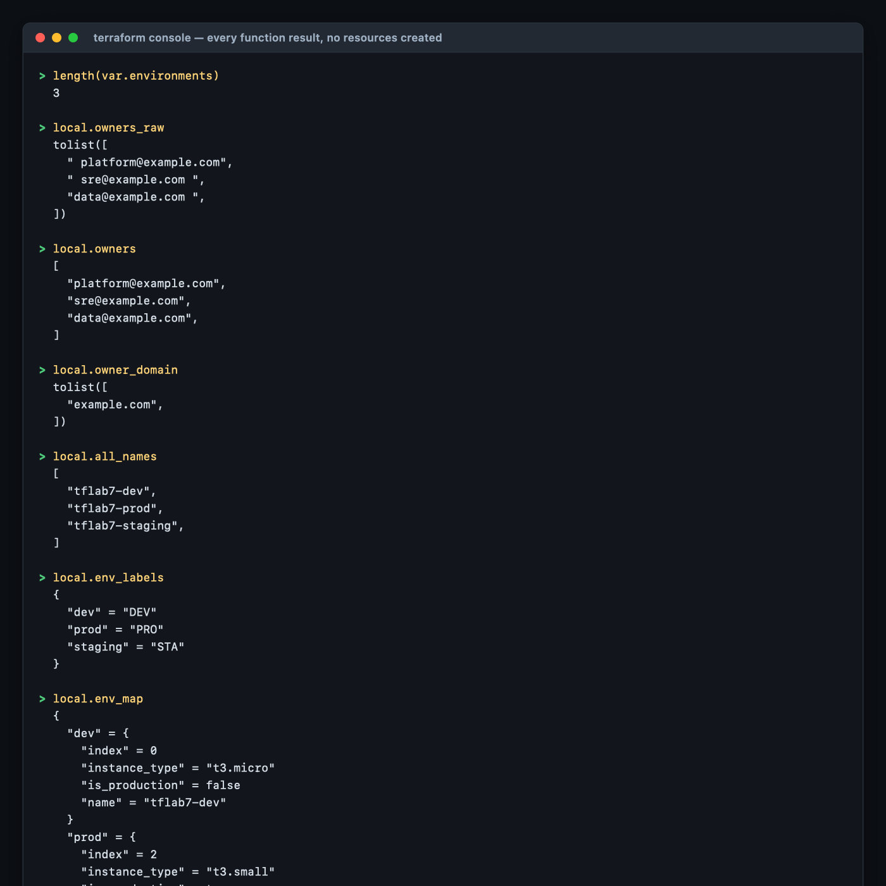
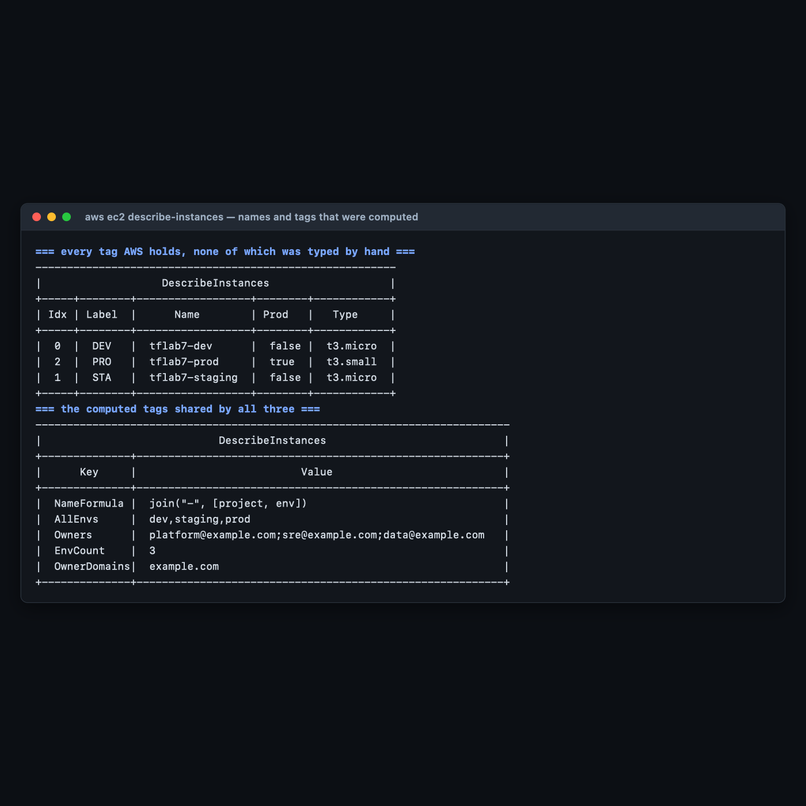

# Lab 7 — Built-in Functions, Interpolation & Data Type Manipulation

**Maps to:** *Built-in Functions and Interpolation; Data Types (Maps, Lists); Variable Manipulation (Length, Count, Join, Split, List/Map Conversion)*
**Duration:** ~60 minutes
**Status:** Tested end-to-end on 2026-09-05 (Terraform v1.15.7, AWS provider v6.63.0) against a live
AWS account in `us-east-1`. Every function result, tag value and plan diff below came from a real
run — including a check that failed against this lab's own configuration.

Prerequisites: [`00-shared-setup.md`](00-shared-setup.md), Labs 1–6.

---

## 1. Lab Overview & Objectives

You are going to write a list of three strings and get three EC2 instances, each with a computed
name, a computed size, and eight computed tags — **without typing a single resource name.**

Then you will change the list and watch the infrastructure follow.

The point is not the functions themselves; they are individually trivial. The point is what becomes
possible when the *shape* of your infrastructure is derived from data rather than transcribed by
hand: adding an environment becomes a one-word edit, and it is impossible for a name and a tag to
disagree because both come from the same expression.

**Learning objectives — by the end of this lab you will be able to:**

1. Use `length`, `join`, `split`, `trimspace`, `lookup`, `contains`, `distinct`, `element`, `upper`
   and `substr` to transform input data into resource configuration.
2. Convert a **list into a map** with a `for` expression, and explain why `for_each` needs one.
3. Explain concretely why `for_each` is safer than `count` when the collection can change in the
   middle — with the plan output that proves it.
4. Use `terraform console` to develop and debug expressions without creating anything.

> **The most surprising measured result in this lab:** the validation suite includes a check that
> no environment name is hardcoded outside `variables.tf`. **It failed against this lab's own
> configuration on the first run.** `locals.tf` contained `is_production = env == "prod"` — a
> hardcoded environment name in the very file arguing against hardcoding. The fix is in §4 Step 3,
> and the failing output is in §5, because a regression check that has never caught anything is
> not evidence of anything.

---

## 2. Prerequisites & Environment Setup

### 2.1 Cost and time

| | |
|---|---|
| Resources created | 3 EC2 instances: 2 × `t3.micro` + 1 × `t3.small` |
| Measured price | **$0.0416/hr** for all three |
| Measured create time | **17 seconds** (all three in parallel) |
| Measured destroy time | **42 seconds** |
| Realistic cost | **under $0.05** |
| Hands-on time | ~60 minutes |

**Much of this lab costs nothing at all.** `terraform console` evaluates every expression in Step 2
without creating a single resource. Do that part first, and only apply once the expressions are
right.

### 2.2 Setup

```bash
mkdir -p ~/terraform-course/lab-7-functions && cd ~/terraform-course/lab-7-functions
export AWS_REGION=us-east-1 AWS_DEFAULT_REGION=us-east-1
export TF_PLUGIN_CACHE_DIR="$HOME/.terraform.d/plugin-cache"
```

---

## 3. Architecture


*Vector version: [`lab-7-architecture.svg`](artifacts/lab-7/diagrams/lab-7-architecture.svg)*

```
  THE ONLY THING A HUMAN EDITS
    environments    = ["dev", "staging", "prod"]
    owner_csv       = " platform@example.com, sre@example.com ,data@example.com "
    size_map        = { prod = "t3.small", staging = "t3.micro" }
    production_envs = ["prod"]
        │
        ▼  locals.tf
  ┌─────────────────────────────────┬──────────────────────────────────────┐
  │ list → map  (the key conversion)│ cleaning + display strings           │
  │ {for env in environments :      │ split(",", owner_csv)  → 3 messy     │
  │    env => {                     │ trimspace(o)           → spaces gone │
  │      join("-",[project,env])    │ element(split("@",o),1)→ example.com │
  │      lookup(size_map,env,dflt)  │ distinct(...)          → 1 domain    │
  │      contains(prod_envs, env)   │ upper(substr(env,0,3)) → DEV/STA/PRO │
  │      index(environments, env)   │ length(environments)   → 3           │
  │ }}                              │                                      │
  └─────────────────────────────────┴──────────────────────────────────────┘
        │
        ▼  for_each = local.env_map
  aws_instance.env["dev"]      tflab7-dev      t3.micro  DEV  idx 0  prod=false
  aws_instance.env["staging"]  tflab7-staging  t3.micro  STA  idx 1  prod=false
  aws_instance.env["prod"]     tflab7-prod     t3.small  PRO  idx 2  prod=true
        shared tags: EnvCount=3  AllEnvs=dev,staging,prod  OwnerDomains=example.com
```

**Why the list must become a map.** `for_each` accepts a map or a set, never a list — and that is a
deliberate design decision, not an inconvenience. A map keys each resource by a *name*, so
`aws_instance.env["prod"]` refers to the same instance forever. A list keys by *position*, so
removing an element shifts everything after it. §4 Step 6 measures exactly what that costs.

---

## 4. Step-by-Step Instructions

### Step 1 — One list, and the messiest input you can imagine

**Why:** Real configuration data arrives badly formatted — from a CI variable, a CSV column, a
ticket. Cleaning it in Terraform, rather than requiring humans to pre-clean it, is what these
functions are for.

```bash
cat > variables.tf << 'EOF'
# THE single source of truth for this lab. Every resource name, every tag and
# the number of instances is derived from this one list. Add an element and
# infrastructure follows; nothing else in the configuration is edited.
variable "environments" {
  description = "Environment names to deploy. Everything else is computed from this."
  type        = list(string)
  default     = ["dev", "staging", "prod"]

  validation {
    condition     = length(var.environments) == length(distinct(var.environments))
    error_message = "environments must not contain duplicates."
  }

  validation {
    condition     = length(var.environments) > 0
    error_message = "environments must contain at least one entry."
  }
}

variable "project" {
  description = "Project slug used as the first element of every generated name."
  type        = string
  default     = "tflab7"
}

variable "aws_region" {
  description = "Region."
  type        = string
  default     = "us-east-1"
}

# A raw, messy string of the kind you get from a CI variable or a CSV column.
variable "owner_csv" {
  description = "Comma-separated owner emails, deliberately messy, to be split and cleaned."
  type        = string
  default     = " platform@example.com, sre@example.com ,data@example.com "
}

# Per-environment sizing, as a map. Demonstrates lookup() with a default.
variable "size_map" {
  description = "Instance type per environment. Environments absent from this map fall back to the default."
  type        = map(string)
  default = {
    prod    = "t3.small"
    staging = "t3.micro"
  }
}

variable "production_envs" {
  description = "Environment names that should be treated as production."
  type        = list(string)
  default     = ["prod"]
}
EOF
```

> **`length(x) == length(distinct(x))` is the idiomatic duplicate check.** There is no
> `has_duplicates()` function; comparing a collection's length to its deduplicated length is how you
> express it. This matters here because a duplicate would collide as a `for_each` key.

> **`size_map` deliberately omits `dev`.** That is not an oversight — Step 3 uses it to demonstrate
> `lookup()` falling back to a default, and §5 asserts both the hit and the miss.

### Step 2 — Develop the expressions in `terraform console` — free, and instant

**Why:** This is the single most underused Terraform command. It evaluates any expression against
your real variables and state without touching AWS. Every function below was worked out here before
a resource block existed.

```bash
terraform init
echo 'length(var.environments)' | terraform console
```

**Every expression this lab uses, with its actual output:**

```
> length(var.environments)
  3

> local.owners_raw
  tolist([
    " platform@example.com",
    " sre@example.com ",
    "data@example.com ",
  ])

> local.owners
  [
    "platform@example.com",
    "sre@example.com",
    "data@example.com",
  ]

> local.owner_domain
  tolist([
    "example.com",
  ])

> local.all_names
  [
    "tflab7-dev",
    "tflab7-prod",
    "tflab7-staging",
  ]

> local.env_labels
  {
    "dev" = "DEV"
    "prod" = "PRO"
    "staging" = "STA"
  }

> local.env_map
  {
    "dev" = {
      "index" = 0
      "instance_type" = "t3.micro"
      "is_production" = false
      "name" = "tflab7-dev"
    }
    "prod" = {
      "index" = 2
      "instance_type" = "t3.small"
      "is_production" = true
      "name" = "tflab7-prod"
    }
    "staging" = {
      "index" = 1
      "instance_type" = "t3.micro"
      "is_production" = false
      "name" = "tflab7-staging"
    }
  }
```


Look carefully at `local.owners_raw`: `split()` preserved every stray space exactly as it appeared
in the source string. `trimspace()` in the next line removes them. **`split()` does not clean
anything** — a very common wrong assumption.

> **Ordering surprise worth internalising.** `local.all_names` came out as
> `["tflab7-dev", "tflab7-prod", "tflab7-staging"]` — **alphabetical**, not the
> `dev, staging, prod` order of the input list. The expression is
> `[for k, v in local.env_map : v.name]`, and **iterating a map always yields keys in lexical
> order**, regardless of how the map was built. If you need input order, iterate the list, not the
> map. Note also that `AllEnvs` in the tags *is* `dev,staging,prod` — because that one joins
> `var.environments` directly.

> **`terraform console` reads state.** After an apply, `aws_instance.env["prod"].public_ip` returns
> the real address. Before one, unknown values show as `(known after apply)`. Both are useful.
> Exit with Ctrl-D.

### Step 3 — Compute everything in `locals.tf`

**Why:** A local is where a transformation gets a name. Inline the same expression at three use
sites and you have three places to fix; name it once and you have one.

```bash
cat > locals.tf << 'EOF'
locals {
  # ---- 1. length() : how many of everything ------------------------------
  env_count = length(var.environments)

  # ---- 2. LIST -> MAP : the single most useful conversion in Terraform ---
  # for_each needs a map (or set); a list gives you index-based addressing,
  # which renumbers everything when an element is removed from the middle.
  # Keying by the environment name makes each resource address stable.
  env_map = { for env in var.environments : env => {
    name          = join("-", [var.project, env])
    instance_type = lookup(var.size_map, env, "t3.micro")
    is_production = contains(var.production_envs, env)
    index         = index(var.environments, env)
  } }

  # ---- 3. split() + trimspace() : cleaning messy input -------------------
  owners_raw   = split(",", var.owner_csv)
  owners       = [for o in local.owners_raw : trimspace(o)]
  owners_tag   = join(";", local.owners)
  owner_domain = distinct([for o in local.owners : element(split("@", o), 1)])

  # ---- 4. upper/title/substr/format : building display strings ----------
  env_labels = { for env in var.environments : env => upper(substr(env, 0, 3)) }

  # ---- 5. MAP -> LIST : the reverse conversion --------------------------
  all_names = [for k, v in local.env_map : v.name]
  sorted    = sort(local.all_names)

  # ---- 6. a computed tag map applied to every instance ------------------
  computed_tags = {
    EnvCount     = tostring(local.env_count)
    AllEnvs      = join(",", var.environments)
    Owners       = local.owners_tag
    OwnerDomains = join(",", local.owner_domain)
    NameFormula  = "join(\"-\", [project, env])"
  }
}
EOF
```

**The function reference, as actually used here:**

| Function | Call in this lab | Result |
|---|---|---|
| `length` | `length(var.environments)` | `3` |
| `join` | `join("-", [var.project, env])` | `"tflab7-dev"` |
| `split` | `split(",", var.owner_csv)` | 3 strings, spaces intact |
| `trimspace` | `trimspace(o)` | `"platform@example.com"` |
| `lookup` | `lookup(var.size_map, env, "t3.micro")` | `t3.small` for prod, default for dev |
| `contains` | `contains(var.production_envs, env)` | `true` for prod |
| `index` | `index(var.environments, env)` | `0`, `1`, `2` |
| `element` | `element(split("@", o), 1)` | `"example.com"` |
| `distinct` | `distinct([...])` | one domain, not three |
| `upper` + `substr` | `upper(substr(env, 0, 3))` | `"DEV"`, `"STA"`, `"PRO"` |
| `tostring` | `tostring(local.env_count)` | `"3"` — **tags must be strings** |
| `sort` | `sort(local.all_names)` | alphabetical |

> **`tostring()` is not optional on tag values.** AWS tags are string-to-string. Passing the number
> `3` gives you an "Inappropriate value for attribute tags" type error. `index` is likewise
> converted at the use site in `main.tf`.

> **`is_production = contains(var.production_envs, env)` — and why it is not `env == "prod"`.** The
> first version of this lab wrote exactly that comparison, and **this lab's own validation caught
> it** (§5). A literal `"prod"` inside `locals.tf` is a hardcoded environment name, which is the
> thing the entire lab argues against: rename the environment and the expression silently stops
> working, with no error. Environment membership is *data*, so it belongs in a variable.

> **`lookup()` here is a legitimate use, unlike Lab 5's.** In [Lab 5](lab-5-modules-workspaces.md) a
> `lookup()` with a `null` default hid a real error. The difference is whether a sensible default
> exists. Here `t3.micro` is genuinely correct for any unlisted environment. There, no default was
> correct. **Use `lookup()` with a default only when the default is a real answer, not a placeholder
> for "I do not know".**

### Step 4 — `for_each` over the computed map

```bash
cat > main.tf << 'EOF'
data "aws_ami" "al2023" {
  most_recent = true
  owners      = ["amazon"]

  filter {
    name   = "name"
    values = ["al2023-ami-2023.*-kernel-6.1-x86_64"]
  }
}

# for_each over the COMPUTED map. Not one resource name is typed by hand.
resource "aws_instance" "env" {
  for_each = local.env_map

  ami           = data.aws_ami.al2023.id
  instance_type = each.value.instance_type

  tags = merge(local.computed_tags, {
    Name       = each.value.name
    Env        = each.key
    EnvLabel   = local.env_labels[each.key]
    EnvIndex   = tostring(each.value.index)
    Production = tostring(each.value.is_production)
  })
}
EOF
```

`each.key` is the map key (`"dev"`); `each.value` is the object you built (`{name, instance_type,
is_production, index}`). Building a **rich object** as the map value, rather than looping several
times over different maps, keeps everything about one environment in one place.

### Step 5 — Apply, and check the tags AWS actually holds

```bash
terraform apply -auto-approve
```

**Expected output:**

```
aws_instance.env["dev"]: Creating...
aws_instance.env["staging"]: Creating...
aws_instance.env["prod"]: Creating...
aws_instance.env["prod"]: Creation complete after 17s [id=i-0e89907c439c9140b]
aws_instance.env["staging"]: Creation complete after 17s [id=i-0b8cd18e3f5ebdc2e]
aws_instance.env["dev"]: Creation complete after 17s [id=i-06195cf290f843f6b]

Apply complete! Resources: 3 added, 0 changed, 0 destroyed.
```

**Look at the resource addresses.** `aws_instance.env["dev"]`, not `aws_instance.env[0]`. That is
the `for_each` payoff, and Step 6 measures why it matters.

```bash
terraform output generated_names
terraform output instance_types
```

```
{
  "dev" = "tflab7-dev"
  "prod" = "tflab7-prod"
  "staging" = "tflab7-staging"
}
{
  "dev" = "t3.micro"
  "prod" = "t3.small"
  "staging" = "t3.micro"
}
```

`prod` got `t3.small` from `size_map`; `dev` is not in that map at all and fell back to the
`lookup()` default.

**Now the part that matters — what AWS actually holds:**

```bash
aws ec2 describe-instances --filters Name=tag:Lab,Values=7 Name=instance-state-name,Values=running \
 --query 'sort_by(Reservations[].Instances[],&Tags[?Key==`Name`]|[0].Value)[].{Name:Tags[?Key==`Name`]|[0].Value,Type:InstanceType,Label:Tags[?Key==`EnvLabel`]|[0].Value,Idx:Tags[?Key==`EnvIndex`]|[0].Value,Prod:Tags[?Key==`Production`]|[0].Value}' \
 --output table
```

**Expected output:**

```
---------------------------------------------------------
|                   DescribeInstances                   |
+-----+--------+------------------+--------+------------+
| Idx | Label  |      Name        | Prod   |   Type     |
+-----+--------+------------------+--------+------------+
|  0  |  DEV   |  tflab7-dev      |  false |  t3.micro  |
|  2  |  PRO   |  tflab7-prod     |  true  |  t3.small  |
|  1  |  STA   |  tflab7-staging  |  false |  t3.micro  |
+-----+--------+------------------+--------+------------+
```

And the shared computed tags:

```
+--------------+----------------------------------------------------------+
|      Key     |                          Value                           |
+--------------+----------------------------------------------------------+
|  NameFormula |  join("-", [project, env])                               |
|  AllEnvs     |  dev,staging,prod                                        |
|  Owners      |  platform@example.com;sre@example.com;data@example.com   |
|  EnvCount    |  3                                                       |
|  OwnerDomains|  example.com                                             |
+--------------+----------------------------------------------------------+
```


**This table is the lab's deliverable.** Every one of those values was computed. `Owners` has no
stray spaces — `trimspace()` did that. `OwnerDomains` is one entry, not three — `distinct()` did
that. `EnvCount` is `3` because `length()` said so. Nobody typed `tflab7-staging` anywhere.

### Step 6 — Change the list, and see why `for_each` beats `count`

**Why:** This is the argument you will need when someone asks why not just use `count`.

```bash
terraform plan -var 'environments=["dev","prod","qa"]'
```

**Expected output** — `staging` removed from the **middle**, `qa` added:

```
  # aws_instance.env["dev"] will be updated in-place
  # aws_instance.env["prod"] will be updated in-place
  # aws_instance.env["qa"] will be created
  # aws_instance.env["staging"] will be destroyed
Plan: 1 to add, 2 to change, 1 to destroy.
```

`dev` and `prod` are **updated in place, not replaced** — their `AllEnvs` and `EnvCount` tags
changed, nothing more. The instances survive.

**Now the same change with `count`.** This was measured with `terraform_data` resources, which cost
nothing and create nothing in AWS:

```hcl
resource "terraform_data" "by_count" {
  count = length(var.environments)
  input = var.environments[count.index]
}

resource "terraform_data" "by_foreach" {
  for_each = toset(var.environments)
  input    = each.key
}
```

After applying with `["dev","staging","prod"]`:

```
terraform_data.by_count[0]
terraform_data.by_count[1]
terraform_data.by_count[2]
terraform_data.by_foreach["dev"]
terraform_data.by_foreach["prod"]
terraform_data.by_foreach["staging"]
```

Then removing `staging` from the middle — `["dev","prod"]`:

```
  # terraform_data.by_count[1] will be updated in-place
  # terraform_data.by_count[2] will be destroyed
  # terraform_data.by_foreach["staging"] will be destroyed
Plan: 0 to add, 1 to change, 2 to destroy.
```

**And here is what `by_count[1]` actually becomes:**

```
  # terraform_data.by_count[1] will be updated in-place
  ~ resource "terraform_data" "by_count" {
        id     = "4a22c2cb-072d-9dbe-cf5c-7cdf9c469e28"
      ~ input  = "staging" -> "prod"
      ~ output = "staging" -> (known after apply)
```

**Read `input = "staging" -> "prod"` carefully.** Slot `[1]` changed identity. `prod` — which you
did not touch — shifted down into the address that used to belong to `staging`. Meanwhile
`for_each` destroyed exactly one thing: `["staging"]`.

`terraform_data` tolerates that in place. **An EC2 instance would not.** `ami` and most identifying
attributes force replacement, so under `count` your production server would be destroyed and
recreated because you deleted a *different* environment from the middle of a list.

| | `count` | `for_each` |
|---|---|---|
| Address | `[0]`, `[1]`, `[2]` — position | `["dev"]`, `["prod"]` — name |
| Remove from the middle | everything after it shifts and rebuilds | only that one is destroyed |
| Accepts | any list, or a number | a map or a set only |
| Right for | genuinely identical, interchangeable copies — a fleet of N | anything with an identity |

**Use `count` for "give me N of these".** [Lab 8](lab-8-loops-backends.md) does exactly that, and it
is the correct choice there. **Use `for_each` for "give me one of these per X".** Getting this
backwards is one of the most expensive routine mistakes in Terraform.

### Step 7 — Do it again yourself, drive the network from data too, unassisted

**Why:** You have computed names and tags. Real infrastructure-as-data goes further: the *shape* of
the network should come from the same list.

**Your task.** Extend this configuration so each environment gets **its own subnet with its own
non-overlapping CIDR**, computed from the environment's position in the list — no CIDR typed by
hand anywhere — inside a single shared VPC. Each instance must launch into its own environment's
subnet.

**You get the acceptance criteria and nothing else:**

- One VPC; one subnet per element of `var.environments`; each instance in the matching subnet,
  confirmed with `aws ec2 describe-instances --query '...SubnetId'`.
- No CIDR literal appears anywhere except the VPC's own base CIDR variable.
- Changing `environments` to a **four**-element list produces four subnets with four distinct,
  non-overlapping CIDRs, with **no edits outside `variables.tf`**.
- Reordering the list — `["prod","dev","staging"]` — produces a plan that changes **no subnet
  CIDRs**. (This is the hard one. Think about what `index()` returns after a reorder.)
- `validate.sh` still passes all ten checks.

**Done when** you can explain why deriving a CIDR from `index()` is a latent bug, and name what you
used instead to get a stable per-environment address.

No commands are given here. Lab 4 Step 3 has `cidrsubnet()`; this lab has the map-building patterns.
The reordering requirement is the real exercise: `index()` is stable only while the list order is,
which makes it exactly the wrong thing to derive a CIDR from — the same positional-identity problem
as `count`, wearing a different hat.

---

## 5. Validation / Verification

Save as `validate.sh`. Also at [`lab-7-functions/validate.sh`](lab-7-functions/validate.sh).

```bash
#!/usr/bin/env bash
# Lab 7 validation. Run from lab-7-functions/ after `terraform apply`.
set -uo pipefail
fail=0
check() { if [ "$2" = "$3" ]; then echo "PASS  $1"; else echo "FAIL  $1 (got '$2', want '$3')"; fail=1; fi }

check "one instance per element of var.environments" \
  "$(terraform state list | grep -c '^aws_instance.env\[')" "3"

for env in dev staging prod; do
  check "[$env] Name tag == join(\"-\", [project, env])" \
    "$(aws ec2 describe-instances --filters Name=tag:Env,Values=$env Name=instance-state-name,Values=running \
        --query "Reservations[0].Instances[0].Tags[?Key=='Name']|[0].Value" --output text)" \
    "tflab7-$env"
done

check "prod got t3.small from size_map" \
  "$(aws ec2 describe-instances --filters Name=tag:Env,Values=prod Name=instance-state-name,Values=running \
      --query 'Reservations[0].Instances[0].InstanceType' --output text)" "t3.small"
check "dev fell back to the lookup() default" \
  "$(aws ec2 describe-instances --filters Name=tag:Env,Values=dev Name=instance-state-name,Values=running \
      --query 'Reservations[0].Instances[0].InstanceType' --output text)" "t3.micro"

OWNERS=$(aws ec2 describe-instances --filters Name=tag:Env,Values=dev Name=instance-state-name,Values=running \
  --query "Reservations[0].Instances[0].Tags[?Key=='Owners']|[0].Value" --output text)
check "trimspace() removed all whitespace from the owner list" "$OWNERS" \
  "platform@example.com;sre@example.com;data@example.com"

check "EnvCount tag equals length(var.environments)" \
  "$(aws ec2 describe-instances --filters Name=tag:Env,Values=dev Name=instance-state-name,Values=running \
      --query "Reservations[0].Instances[0].Tags[?Key=='EnvCount']|[0].Value" --output text)" "3"

# Regression guard for the lab's actual claim.
check "no env name is hardcoded outside variables.tf" \
  "$(grep -E '"(dev|staging|prod)"' main.tf locals.tf outputs.tf 2>/dev/null | wc -l | tr -d ' ')" "0"

# THE ONE THE HAPPY PATH MISSES: keyed or indexed?
IDX=$(terraform state list | grep -c '^aws_instance.env\[[0-9]')
check "resources are keyed by name, not by numeric index" "$IDX" "0"

echo
[ $fail -eq 0 ] && echo "Lab 7 validation: ALL CHECKS PASSED" || echo "Lab 7 validation: FAILURES ABOVE"
exit $fail
```

**Actual output, exit code `0`:**

```
PASS  one instance per element of var.environments
PASS  [dev] Name tag == join("-", [project, env])
PASS  [staging] Name tag == join("-", [project, env])
PASS  [prod] Name tag == join("-", [project, env])
PASS  prod got t3.small from size_map
PASS  dev fell back to the lookup() default
PASS  trimspace() removed all whitespace from the owner list
PASS  EnvCount tag equals length(var.environments)
PASS  no env name is hardcoded outside variables.tf
PASS  resources are keyed by name, not by numeric index

Lab 7 validation: ALL CHECKS PASSED
```

### Check 9 failed against this lab's own configuration

That output is from the *second* run. The first looked like this:

```
PASS  EnvCount tag equals length(var.environments)
FAIL  no env name is hardcoded outside variables.tf (got '1', want '0')
PASS  resources are keyed by name, not by numeric index

Lab 7 validation: FAILURES ABOVE
```

The offending line was in `locals.tf`:

```hcl
    is_production = env == "prod"
```

A hardcoded environment name, in the file whose entire purpose is to stop hardcoding environment
names. It is a completely natural thing to write, every other check passed, and the infrastructure
was correct — `prod` really was tagged `Production=true`. The fix was to make production membership
data (`var.production_envs`) and test it with `contains()`.

**A regression check that has never caught anything is not evidence.** This one caught its author,
which is the only reason it is worth including.

### Why check 10 is the one the happy path cannot see

A `count`-based version of this configuration would produce **byte-identical AWS resources**: same
three instances, same names, same tags, same sizes. Checks 1–9 would all pass. The difference is
invisible in AWS and visible only in the Terraform **state address** — `[0]` versus `["dev"]` — and
it only becomes expensive later, when someone removes an element from the middle of the list. Check
10 tests the property that Step 6 shows the consequences of.

---

## 6. Troubleshooting Tips

All encountered for real while building this lab.

**`Inappropriate value for attribute "tags": element ... must be string`**

A tag value that is a number or a bool. AWS tags are string-to-string. Wrap with `tostring()` —
this lab does it for `EnvCount`, `EnvIndex` and `Production`.

**`The given key does not identify an element in this collection value`**

A `lookup()` without a default, or a direct map index, on a key that is not present. Either add the
key or supply a default — but only if the default is a real answer (see Step 3).

**`Invalid for_each argument ... must be a map, or set of strings`**

You passed a list. Convert with `toset(...)` if the values are the keys, or build a map with a
`for` expression if you need richer values. This lab does the latter.

**Two resources collide on the same `for_each` key**

Duplicate entries in the source list. That is what the `length(x) == length(distinct(x))` validation
in Step 1 is for — without it, the error appears much later and is far less clear.

**Your `for` expression over a map comes out in the wrong order**

Not a bug. **Map iteration is always lexical by key.** `local.all_names` returns
`dev, prod, staging` even though the input list is `dev, staging, prod`. Iterate the list if you
need input order.

**`split()` left whitespace in your values**

`split()` only splits. Chain `trimspace()` over the result:
`[for o in split(",", x) : trimspace(o)]`.

**An expression is wrong and you keep applying to find out**

Stop. `terraform console` evaluates it instantly for free. Every function result in Step 2 was
developed there before any resource existed.

---

## 7. Cleanup Steps

```bash
terraform destroy -auto-approve
```

**Expected output:**

```
aws_instance.env["prod"]: Destruction complete after 42s

Destroy complete! Resources: 3 destroyed.
```

Confirm:

```bash
aws ec2 describe-instances \
  --filters Name=tag:Course,Values=intermediate-terraform \
            Name=instance-state-name,Values=running,pending,stopped \
  --query 'Reservations[].Instances[].InstanceId' --output text
```

**Expected output: nothing at all.**

**Keep these, and here is why:**

| Keep | Why |
|---|---|
| `locals.tf` | The list-to-map `for` expression is the most reusable thing in this course. |
| `validate.sh` | Checks 9 and 10 are worth copying into any config that claims to be data-driven. |
| `variables.tf` | The duplicate-detection validation is a good default for any `for_each` source. |

---

## Optional extensions

1. **Add a fourth environment.** Set `environments = ["dev","staging","prod","qa"]` and apply. Count
   how many files you had to edit. The answer should be one, and the diff should be one word.

2. **Reproduce the `count` disaster with real instances.** Convert `aws_instance.env` to `count`,
   apply, then remove `staging` from the middle and read the plan **without applying it**. Note how
   many instances it proposes to destroy and recreate versus the `for_each` version's one.

3. **Sort by something other than the key.** `local.all_names` comes out alphabetically. Produce the
   same list in the input list's order instead. (`[for env in var.environments :
   local.env_map[env].name]` — and understanding why that works is the point.)

4. **Break the duplicate validation.** Set `environments = ["dev","dev"]` and run `plan`. Then
   remove the validation block and try again — compare how clear the two failures are. That is the
   argument for writing validations.

5. **Explore `terraform console` properly.** With the infrastructure applied, try
   `[for k, v in aws_instance.env : "${k}=${v.private_ip}"]`, then `values(aws_instance.env)[*].id`,
   then `jsonencode(local.env_map)`. The console reads live state, which makes it the fastest way to
   answer "what does this expression actually return".
