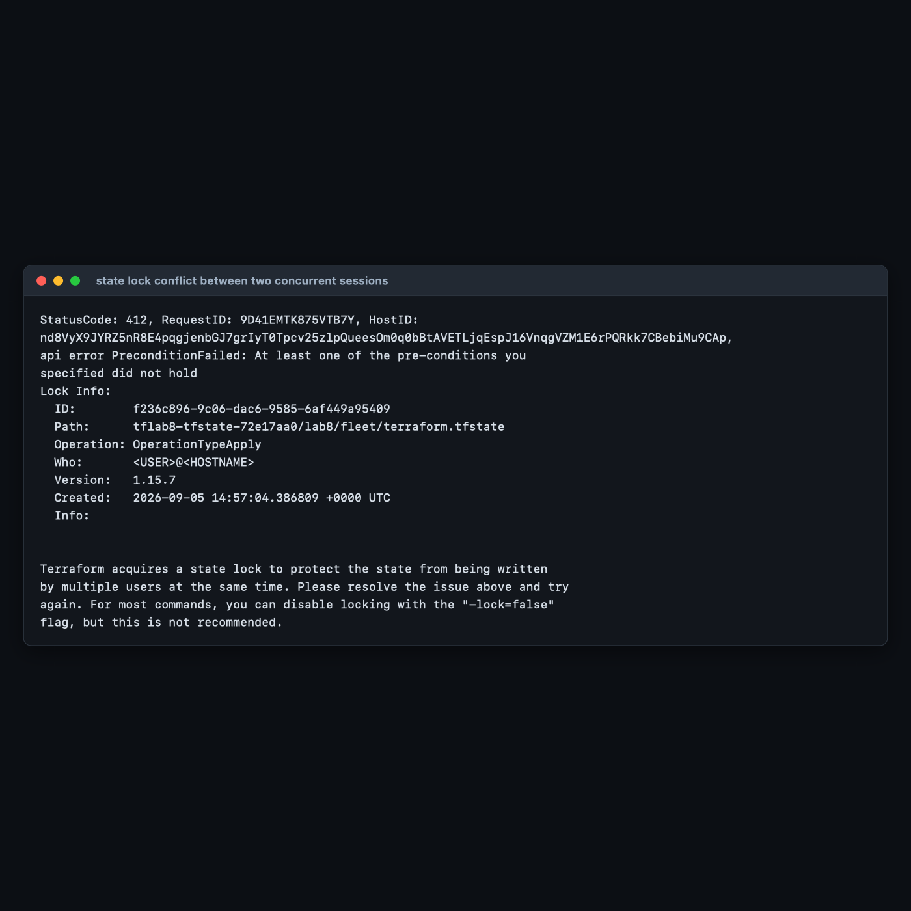
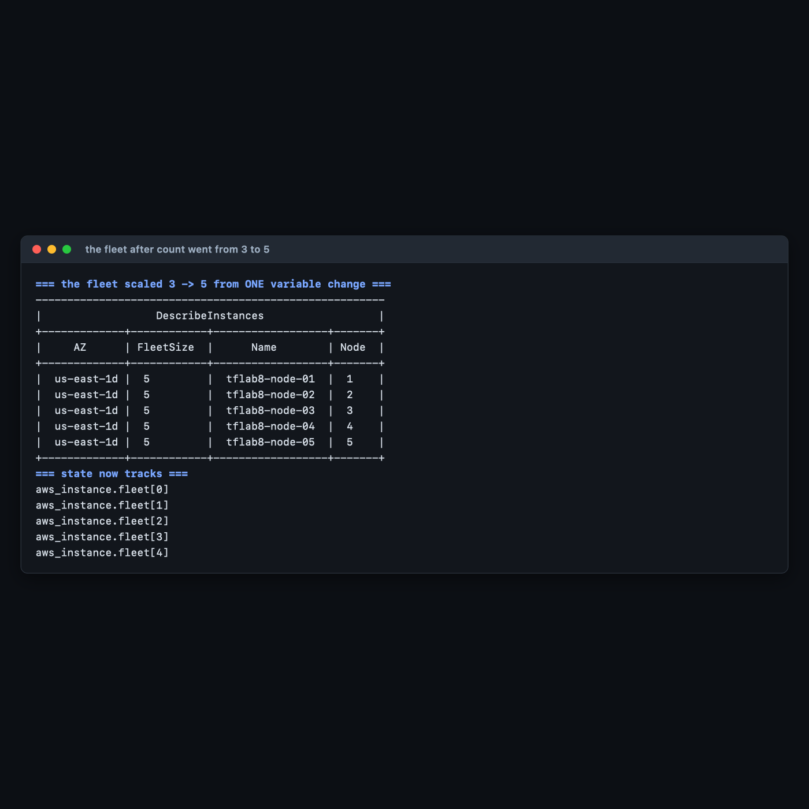

# Lab 8 — Loops, Backends & Scaling EC2 Configuration

**Maps to:** *Creating Loops (via Count); Terraform Backends; Using Terraform to Configure EC2 Instances*
**Duration:** ~75 minutes
**Status:** Tested end-to-end on 2026-09-05 (Terraform v1.15.7, AWS provider v6.63.0) against a live
AWS account in `us-east-1`. State was really migrated to S3, really read back from a second
directory, and a real lock conflict was provoked between two concurrent sessions.

Prerequisites: [`00-shared-setup.md`](00-shared-setup.md), Labs 1–7 — **especially
[Lab 7](lab-7-functions-data-types.md)**, whose `count` versus `for_each` comparison this lab
depends on.

---

## 1. Lab Overview & Objectives

Two things stand between the configurations you have written so far and something a team could
actually operate.

The first is **repetition**: `count` turns one resource block into N identical instances. The second
is much more important: **your state file is on one laptop.** Nobody else can run Terraform. There
is no locking, so two people applying at once silently corrupt each other's work. There is no
history, so a bad write is unrecoverable. This lab fixes that by migrating state to S3 — and then
proves the migration worked by running Terraform from a directory that has never seen this
infrastructure.

**Learning objectives — by the end of this lab you will be able to:**

1. Use `count` to deploy N identical resources, and articulate when `count` is correct and when
   `for_each` is.
2. Build a state backend — S3 with versioning, encryption and public access blocked — and explain
   the chicken-and-egg problem that forces the bootstrap to keep local state.
3. Migrate an existing local state to a remote backend with `terraform init -migrate-state`, and
   verify the migration rather than assuming it.
4. Explain what state locking prevents, recognise a lock conflict, and use `use_lockfile` instead of
   the now-deprecated `dynamodb_table`.

> **The most surprising measured result in this lab:** the course outline specifies a **DynamoDB
> lock table**, and Terraform 1.15.7 emits a **deprecation warning** for it:
> `The parameter "dynamodb_table" is deprecated. Use parameter "use_lockfile" instead.` S3 gained
> native conditional-write locking in Terraform 1.10, and the separate lock table is no longer
> needed. This lab builds the DynamoDB table anyway — because you will meet it in every existing
> codebase — but shows both, and the real warning, in §4 Step 4.

---

## 2. Prerequisites & Environment Setup

### 2.1 Software

| Requirement | Tested with | Note |
|---|---|---|
| Terraform CLI | v1.15.7 | **1.10+ required** for `use_lockfile` |
| AWS provider | v6.63.0 | |
| random provider | v3.6+ | unique bucket suffix |
| AWS CLI v2 | 2.35.11 | used to inspect the bucket directly |

### 2.2 AWS permissions

Beyond EC2 this lab needs `s3:CreateBucket`, `PutBucketVersioning`, `PutEncryptionConfiguration`,
`PutPublicAccessBlock`, `GetObject`, `PutObject`, `DeleteObject`, plus `dynamodb:CreateTable` and
`DeleteTable`.

### 2.3 Cost and time

| | |
|---|---|
| Resources created | 3–5 × `t3.micro`, 1 S3 bucket, 1 DynamoDB table |
| Measured price | **$0.0312/hr** (3 nodes) rising to **$0.052/hr** (5 nodes) |
| S3 | a ~24 KB state file — **fractions of a cent** |
| DynamoDB | `PAY_PER_REQUEST` — **no idle cost**, a handful of requests |
| Measured create time | **18 seconds** for 3 instances in parallel |
| Realistic cost | **under $0.10** |
| Hands-on time | ~75 minutes |

> **`force_destroy = true` is set on the state bucket. That is a lab convenience and nothing else.**
> It lets `terraform destroy` delete a bucket that still contains objects. On a real state bucket it
> is exactly the wrong setting — it removes the last barrier between a careless `destroy` and the
> loss of every state version you have.

### 2.4 Setup

```bash
mkdir -p ~/terraform-course/lab-8-loops-backends/{bootstrap,fleet}
cd ~/terraform-course/lab-8-loops-backends
export AWS_REGION=us-east-1 AWS_DEFAULT_REGION=us-east-1
export TF_PLUGIN_CACHE_DIR="$HOME/.terraform.d/plugin-cache"
```

**Two directories, and the separation matters.** `bootstrap/` creates the backend and keeps its own
state local, forever. `fleet/` is the real configuration whose state moves into that backend.

---

## 3. Architecture


*Vector version: [`lab-8-architecture.svg`](artifacts/lab-8/diagrams/lab-8-architecture.svg)*

```
  bootstrap/            ← state stays LOCAL, forever, on purpose
    aws_s3_bucket + versioning + AES256 + public-access-block
    aws_dynamodb_table (PAY_PER_REQUEST)
    random_id suffix    ← S3 bucket names are globally unique across ALL of AWS
        │
        │ outputs bucket_name
        ▼
  fleet/
    resource "aws_instance" "fleet" { count = var.fleet_size }
      Name = format("tflab8-node-%02d", count.index + 1)
        │
        ├── BEFORE:  ./terraform.tfstate   24,506 bytes, one laptop,
        │                                  no locking, no history
        │
        │   add backend.tf → terraform init -migrate-state
        ▼
        └── AFTER:   s3://tflab8-tfstate-<rand>/lab8/fleet/terraform.tfstate
                     23.9 KiB · AES256 · versioned · not public
                     local file emptied to 0 bytes
                     terraform.tfstate.backup keeps the pre-migration copy
                                    │
              ┌─────────────────────┴──────────────────────┐
              ▼                                            ▼
   A SECOND DIRECTORY                          TWO SESSIONS AT ONCE
   only main.tf, backend.tf, the template      A: apply -var fleet_size=5
   terraform init  → backend configured        B: plan → 412 PreconditionFailed
   terraform state list → fleet[0..2]             Lock Info: OperationTypeApply
   terraform plan  → no changes
```

**The chicken-and-egg problem is the reason for two directories.** A configuration cannot store its
own state in a bucket it is currently creating — on the first `apply` the bucket does not exist yet.
So the bootstrap keeps local state permanently. It is small, it changes almost never, and losing its
state is recoverable by importing two resources. Every other configuration you own uses the backend
it created.

---

## 4. Step-by-Step Instructions

### Step 1 — Build the backend

**Why:** Every setting in this file exists because of a specific failure mode. Read them as a list
of things that have gone wrong for other people.

```bash
cat > bootstrap/main.tf << 'EOF'
terraform {
  required_version = ">= 1.5.0"
  required_providers {
    aws    = { source = "hashicorp/aws", version = "~> 6.0" }
    random = { source = "hashicorp/random", version = "~> 3.6" }
  }
}

provider "aws" {
  region = var.aws_region

  default_tags {
    tags = {
      Course    = "intermediate-terraform"
      Lab       = "8"
      ManagedBy = "terraform"
      Purpose   = "tf-state-backend"
    }
  }
}

variable "aws_region" {
  description = "Region for the state backend."
  type        = string
  default     = "us-east-1"
}

# S3 bucket names are GLOBALLY unique across every AWS account on earth.
# A fixed name in a lab guarantees a collision with the previous student.
resource "random_id" "suffix" {
  byte_length = 4
}

locals {
  bucket_name = "tflab8-tfstate-${random_id.suffix.hex}"
  table_name  = "tflab8-tfstate-locks"
}

resource "aws_s3_bucket" "state" {
  bucket = local.bucket_name

  # A lab convenience ONLY. Never set this on a real state bucket.
  force_destroy = true

  tags = { Name = local.bucket_name }
}

# Versioning is the difference between "someone corrupted state" being an
# inconvenience and being an outage. Turn it on before storing anything.
resource "aws_s3_bucket_versioning" "state" {
  bucket = aws_s3_bucket.state.id
  versioning_configuration {
    status = "Enabled"
  }
}

resource "aws_s3_bucket_server_side_encryption_configuration" "state" {
  bucket = aws_s3_bucket.state.id
  rule {
    apply_server_side_encryption_by_default {
      sse_algorithm = "AES256"
    }
  }
}

# State files contain every attribute of every resource in plaintext.
resource "aws_s3_bucket_public_access_block" "state" {
  bucket                  = aws_s3_bucket.state.id
  block_public_acls       = true
  block_public_policy     = true
  ignore_public_acls      = true
  restrict_public_buckets = true
}

# The classic lock table. Terraform 1.10+ can lock using S3 alone
# (use_lockfile = true) -- this lab demonstrates both, see Step 4.
resource "aws_dynamodb_table" "locks" {
  name         = local.table_name
  billing_mode = "PAY_PER_REQUEST" # no idle cost
  hash_key     = "LockID"

  attribute {
    name = "LockID"
    type = "S"
  }

  tags = { Name = local.table_name }
}

output "bucket_name" {
  value = aws_s3_bucket.state.id
}

output "table_name" {
  value = aws_dynamodb_table.locks.name
}
EOF

cd bootstrap
terraform init
terraform apply -auto-approve
```

**Expected output:**

```
bucket_name = "tflab8-tfstate-72e17aa0"
table_name = "tflab8-tfstate-locks"
```

**Your bucket name will differ** — that is `random_id` doing its job. S3 bucket names are unique
across every AWS account in the world, so `tflab8-tfstate` alone would fail for the second person to
run this lab.

| Setting | The failure it prevents |
|---|---|
| `versioning` | A corrupted or truncated state write becomes recoverable. Without it, unrecoverable. |
| `encryption` | State holds every attribute of every resource in plaintext, including secrets. |
| `public_access_block` | A public state file is a complete map of your infrastructure. |
| `PAY_PER_REQUEST` on DynamoDB | Provisioned capacity bills 24/7 for a table used seconds per day. |
| `random_id` suffix | Global bucket-name collisions. |

> **`terraform destroy` in `bootstrap/` deletes the bucket your other state lives in.** Destroy the
> `fleet/` configuration first, always. §7 does them in that order for exactly this reason.

### Step 2 — The loop: N instances from one block

**Why:** `count` is the simplest form of iteration in Terraform, and for genuinely interchangeable
resources it is also the correct one.

```bash
cd ../fleet
```

The relevant part of `fleet/main.tf`:

```hcl
variable "fleet_size" {
  description = "How many identical web servers to run. This is the loop."
  type        = number
  default     = 3

  validation {
    condition     = var.fleet_size >= 0 && var.fleet_size <= 6
    error_message = "fleet_size must be between 0 and 6 (a lab cost guardrail)."
  }
}

resource "aws_instance" "fleet" {
  count = var.fleet_size

  ami           = data.aws_ami.al2023.id
  instance_type = var.instance_type

  # count.index is 0-based; humans count from 1.
  user_data = templatefile("${path.module}/user-data.sh.tftpl", {
    node_number = count.index + 1
    fleet_size  = var.fleet_size
  })

  user_data_replace_on_change = true

  tags = {
    Name       = format("tflab8-node-%02d", count.index + 1)
    NodeNumber = tostring(count.index + 1)
    FleetSize  = tostring(var.fleet_size)
  }
}
```

The full file is at [`lab-8-loops-backends/fleet/main.tf`](lab-8-loops-backends/fleet/main.tf).

**`count = 0` is legal and useful.** It creates nothing, and every reference to
`aws_instance.fleet[*]` yields an empty list rather than an error. That is how a resource is made
genuinely optional — and it is the mechanism behind the `var.enabled ? 1 : 0` pattern from
[Lab 6](lab-6-error-handling-debugging.md).

**`format("tflab8-node-%02d", count.index + 1)`** zero-pads: `node-01`, not `node-1`. This matters
more than it looks — with ten or more nodes, unpadded names sort as `node-1, node-10, node-2`
everywhere, in every console and every log aggregator, forever.

```bash
terraform init
terraform apply -auto-approve
```

**Expected output:**

```
aws_instance.fleet[0]: Creation complete after 18s [id=i-0371d174875c797e6]
aws_instance.fleet[2]: Creation complete after 18s [id=i-001e19979937a6e38]
aws_instance.fleet[1]: Creation complete after 18s [id=i-0d74a00cc058dccc9]

Apply complete! Resources: 3 added, 0 changed, 0 destroyed.
```

All three in **18 seconds**, in parallel — and note they completed out of order, because nothing
makes `[1]` depend on `[0]`.

```bash
terraform output node_names
ls -la terraform.tfstate
```

```
[
  "tflab8-node-01",
  "tflab8-node-02",
  "tflab8-node-03",
]

24506 terraform.tfstate
```

**That 24 KB file on your laptop is the problem this lab exists to solve.** It is the only record
that these three instances belong to this configuration. Lose it and Terraform will happily create
three more.

> **`count` versus `for_each`, decided properly.** [Lab 7](lab-7-functions-data-types.md) measured
> what happens when you remove an element from the middle of a `count` collection: the survivors get
> renumbered and rebuilt. **That is not a risk here**, because these nodes are genuinely
> interchangeable — `node-02` has no identity worth preserving, and scaling from 5 to 3 destroying
> `[3]` and `[4]` is exactly right. **Use `count` for "N of the same thing"; use `for_each` for "one
> per named thing".**

### Step 3 — Migrate the state to S3

**Why:** This is the step that turns a personal script into shared infrastructure.

```bash
BUCKET=$(cd ../bootstrap && terraform output -raw bucket_name)
sed "s/<YOUR_BUCKET>/$BUCKET/" backend.tf.example > backend.tf
cat backend.tf
```

Then:

```bash
terraform init -migrate-state
```

Terraform detects that state exists locally and a backend has appeared, and asks:

```
Do you want to copy existing state to the new backend?
  Pre-existing state was found while migrating the previous "local" backend to the
  newly configured "s3" backend. No existing state was found in the newly
  configured "s3" backend. Do you want to copy this state to the new "s3" backend?

  Enter "yes" to copy and "no" to start with an empty state.
```

**Answer `yes`.** Answering `no` starts with empty state, and Terraform will then propose to create
three *more* instances alongside the three you already have.

> The authoring run used `-force-copy`, which answers `yes` automatically. That flag is right for
> scripted runs and wrong at a terminal, where the prompt is a useful last chance to think.

**Expected output:**

```
Initializing the backend...
Releasing state lock. This may take a few moments...

Successfully configured the backend "s3"! Terraform will automatically
use this backend unless the backend configuration changes.

Terraform has been successfully initialized!
```

### Step 4 — `dynamodb_table` versus `use_lockfile`

**Why:** The course outline asks for a DynamoDB lock table, and Terraform 1.15 tells you not to use
one. Both facts matter.

With `dynamodb_table = "tflab8-tfstate-locks"` in the backend block, the real `init` output ends
with:

```
Warning: Deprecated Parameter

  on backend.tf line 7, in terraform:
   7:     dynamodb_table = "tflab8-tfstate-locks"

The parameter "dynamodb_table" is deprecated. Use parameter "use_lockfile"
instead.
```

**The history, briefly.** S3 had no compare-and-swap, so Terraform used a DynamoDB item as a mutex —
hence every S3-backend tutorial written before 2025 pairing a bucket with a lock table. In 2024 S3
gained conditional writes, and Terraform 1.10 added `use_lockfile = true`, which stores a small
`.tflock` object beside the state and relies on S3 itself to arbitrate. One less resource, one less
IAM policy, one less thing to forget.

| | `dynamodb_table` | `use_lockfile = true` |
|---|---|---|
| Terraform version | any | **1.10+** |
| Extra resources | a DynamoDB table | none |
| Status in 1.15.7 | **deprecated, warns** | current |
| Lock mechanism | DynamoDB conditional put | S3 conditional write |

Switch to the modern form:

```hcl
terraform {
  backend "s3" {
    bucket = "tflab8-tfstate-72e17aa0"
    key    = "lab8/fleet/terraform.tfstate"
    region = "us-east-1"

    encrypt      = true
    use_lockfile = true
  }
}
```

```bash
terraform init -reconfigure
```

The warning is gone. **You will still meet `dynamodb_table` constantly** in existing code and in
every tutorial written before Terraform 1.10 — which is why this lab built the table and shows you
both.

> **Backend configuration cannot use variables.** `bucket`, `key` and `region` must be literals —
> the backend is initialised before variables are evaluated. That is why the bucket name is
> `sed`-substituted into the file rather than passed as `var.bucket`. For per-environment backends,
> use partial configuration: omit the values and pass them with
> `terraform init -backend-config=prod.hcl`.

### Step 5 — Verify the migration rather than believing it

**Why:** "Successfully configured the backend" means the configuration parsed. It does not prove
your state is in S3 and no longer being read from disk.

```bash
BUCKET=$(cd ../bootstrap && terraform output -raw bucket_name)

aws s3 ls "s3://$BUCKET/lab8/fleet/" --human-readable
aws s3api head-object --bucket "$BUCKET" --key lab8/fleet/terraform.tfstate \
  --query '{Encryption:ServerSideEncryption,Size:ContentLength}' --output json
ls -la terraform.tfstate*
```

**Expected output:**

```
2026-09-05 20:24:46   23.9 KiB terraform.tfstate

{
    "Encryption": "AES256",
    "Size": 24506
}

0      terraform.tfstate
24506  terraform.tfstate.backup
```

**Read those three results together:**

- The state object is **in S3**, at the key you chose, and **encrypted at rest**.
- The local `terraform.tfstate` is now **0 bytes**. Terraform emptied it rather than deleting it.
- `terraform.tfstate.backup` still holds the full **24,506-byte** pre-migration copy. Keep it until
  you are confident, then delete it — it is a complete plaintext copy of your infrastructure.

### Step 6 — The proof: a session that has never seen this infrastructure

**Why:** This is what "shared state" actually means, and it is the only convincing test.

```bash
mkdir -p /tmp/colleague && cd /tmp/colleague
cp ~/terraform-course/lab-8-loops-backends/fleet/{main.tf,backend.tf,user-data.sh.tftpl} .
ls -la
```

**Expected output** — only the files a colleague would get from git. No state, no `.terraform/`:

```
305   backend.tf
2612  main.tf
830   user-data.sh.tftpl
```

```bash
terraform init
terraform state list
terraform plan
```

**Expected output:**

```
Initializing the backend...
Successfully configured the backend "s3"!
Terraform has been successfully initialized!

data.aws_ami.al2023
aws_instance.fleet[0]
aws_instance.fleet[1]
aws_instance.fleet[2]

Terraform has compared your real infrastructure against your configuration
and found no differences, so no changes are needed.
Releasing state lock. This may take a few moments...
```

**A directory that has never run `apply` knows about all three instances and proposes no changes.**
That is the whole point of a remote backend, demonstrated in three commands. Note also the closing
`Releasing state lock` — even a read-only `plan` takes and releases the lock.

### Step 7 — Provoke a lock conflict on purpose

**Why:** Locking is invisible until it saves you. Watch it work once so you recognise the error.

From the colleague directory, start a change that holds the lock for ~20 seconds:

```bash
cd /tmp/colleague
terraform apply -auto-approve -var fleet_size=5 &
sleep 4
```

Immediately, from the original directory:

```bash
cd ~/terraform-course/lab-8-loops-backends/fleet
terraform plan -lock-timeout=0s
```

**Expected output:**

```
StatusCode: 412, RequestID: 9D41EMTK875VTB7Y, HostID: ...
api error PreconditionFailed: At least one of the pre-conditions you
specified did not hold

Lock Info:
  ID:        f236c896-9c06-dac6-9585-6af449a95409
  Path:      tflab8-tfstate-72e17aa0/lab8/fleet/terraform.tfstate
  Operation: OperationTypeApply
  Who:       <USER>@<HOSTNAME>
  Version:   1.15.7
  Created:   2026-09-05 14:57:04.386809 +0000 UTC


Terraform acquires a state lock to protect the state from being written
by multiple users at the same time. Please resolve the issue above and try
again. For most commands, you can disable locking with the "-lock=false"
flag, but this is not recommended.
```


**Read the details.** `StatusCode: 412 PreconditionFailed` is S3's conditional-write rejection —
that is `use_lockfile` working, not a bug. The `Lock Info` block names **who** holds it, **which
operation**, and **when it started**. Without this, both sessions would have written state and one
would have silently won.

> **`-lock=false` exists and is almost always the wrong answer.** The lab used
> `-lock-timeout=0s` to fail immediately rather than wait, which is a different thing: it still
> respects the lock. The legitimate use for `force-unlock` is a lock left behind by a crashed run —
> and you must be certain no other apply is in flight, because breaking a live lock is how state
> gets corrupted.

Meanwhile the first session finished, and the fleet scaled:

```bash
aws ec2 describe-instances --filters Name=tag:Lab,Values=8 Name=instance-state-name,Values=running \
 --query 'sort_by(Reservations[].Instances[],&Tags[?Key==`Name`]|[0].Value)[].{Name:Tags[?Key==`Name`]|[0].Value,Node:Tags[?Key==`NodeNumber`]|[0].Value,FleetSize:Tags[?Key==`FleetSize`]|[0].Value,AZ:Placement.AvailabilityZone}' \
 --output table
```

```
-------------------------------------------------------
|                  DescribeInstances                  |
+-------------+------------+------------------+-------+
|     AZ      | FleetSize  |      Name        | Node  |
+-------------+------------+------------------+-------+
|  us-east-1d |  5         |  tflab8-node-01  |  1    |
|  us-east-1d |  5         |  tflab8-node-02  |  2    |
|  us-east-1d |  5         |  tflab8-node-03  |  3    |
|  us-east-1d |  5         |  tflab8-node-04  |  4    |
|  us-east-1d |  5         |  tflab8-node-05  |  5    |
+-------------+------------+------------------+-------+
```


**Five nodes, from changing one number.** Note the `FleetSize` tag on nodes 1–3 also updated to `5` —
those instances were modified in place, not replaced.

### Step 8 — Do it again yourself, split the state, unassisted

**Why:** One backend and one key is where every team starts and nowhere any team stays. The next
real problem is that a single state file makes every `apply` a whole-estate operation.

**Your task.** Split the `fleet` configuration into **two independently-applied configurations
sharing one bucket**: a `network/` config that owns a VPC and subnet, and a `fleet/` config that
places the instances into that subnet — **without** the fleet config owning or being able to destroy
the network. The fleet must discover the subnet at plan time, not have it pasted in.

**You get the acceptance criteria and nothing else:**

- Two state keys in the same bucket, e.g. `lab8/network/terraform.tfstate` and
  `lab8/fleet/terraform.tfstate`, both visible with `aws s3 ls --recursive`.
- `terraform destroy` in `fleet/` removes the instances and leaves the VPC untouched.
- No `subnet-` or `vpc-` literal appears in `fleet/`'s configuration.
- `terraform plan` in `fleet/` after changing something in `network/` picks up the change with no
  edits to `fleet/`.
- Both configurations still lock independently — an apply in one does not block the other.

**Done when** you can explain which mechanism you used to read one configuration's outputs from
another, and name one significant drawback of it. (There is more than one valid answer, and the
drawback is the interesting half.)

No commands are given here. Steps 3–6 have the backend mechanics. The part that transfers is
realising that *two configurations sharing a bucket but not a key* is the unit of blast-radius
control — the thing [Lab 5](lab-5-modules-workspaces.md) §4 Step 8 said workspaces do not give you.

---

## 5. Validation / Verification

Save as `validate.sh` in `fleet/`. Also at
[`lab-8-loops-backends/fleet/validate.sh`](lab-8-loops-backends/fleet/validate.sh).

```bash
#!/usr/bin/env bash
# Lab 8 validation. Run from lab-8-loops-backends/fleet/ after migrating to S3.
set -uo pipefail
fail=0
check() { if [ "$2" = "$3" ]; then echo "PASS  $1"; else echo "FAIL  $1 (got '$2', want '$3')"; fail=1; fi }

BUCKET=$(grep -E '^\s*bucket' backend.tf | head -1 | cut -d'"' -f2)
KEY=$(grep -E '^\s*key' backend.tf | head -1 | cut -d'"' -f2)
N=$(terraform output -raw fleet_size)

check "state holds fleet_size instances" \
  "$(terraform state list | grep -c '^aws_instance.fleet\[')" "$N"

check "AWS reports $N running fleet instances" \
  "$(aws ec2 describe-instances --filters Name=tag:Lab,Values=8 Name=instance-state-name,Values=running \
      --query 'length(Reservations[].Instances[])' --output text)" "$N"

check "format() produced zero-padded names" \
  "$(terraform output -json node_names | python3 -c 'import json,sys;print(json.load(sys.stdin)[0])')" \
  "tflab8-node-01"

check "state object exists in S3" \
  "$(aws s3api head-object --bucket "$BUCKET" --key "$KEY" --query 'ContentLength' --output text >/dev/null 2>&1; echo $?)" "0"

check "S3 state object is encrypted" \
  "$(aws s3api head-object --bucket "$BUCKET" --key "$KEY" --query 'ServerSideEncryption' --output text)" "AES256"

check "bucket versioning is enabled" \
  "$(aws s3api get-bucket-versioning --bucket "$BUCKET" --query 'Status' --output text)" "Enabled"

check "bucket blocks all public access" \
  "$(aws s3api get-public-access-block --bucket "$BUCKET" \
      --query 'PublicAccessBlockConfiguration.[BlockPublicAcls,BlockPublicPolicy,IgnorePublicAcls,RestrictPublicBuckets]' \
      --output text | tr -d ' \t')" "TrueTrueTrueTrue"

# THE ONE THE HAPPY PATH MISSES: is Terraform actually READING from S3, or is
# there still a populated local state file it could silently fall back to?
LOCAL_RESOURCES=$(python3 -c "
import json,os
p='terraform.tfstate'
if not os.path.exists(p) or os.path.getsize(p)==0: print(0)
else:
    try: print(len(json.load(open(p)).get('resources',[])))
    except Exception: print(0)
")
check "local state file holds ZERO resources after migration" "$LOCAL_RESOURCES" "0"

REMOTE_RESOURCES=$(aws s3 cp "s3://$BUCKET/$KEY" - 2>/dev/null | python3 -c "
import json,sys
try: print(len(json.load(sys.stdin).get('resources',[])))
except Exception: print(-1)
")
if [ "$REMOTE_RESOURCES" -gt 0 ]; then
  echo "PASS  remote state in S3 holds $REMOTE_RESOURCES resource blocks"
else
  echo "FAIL  remote state in S3 holds no resources (got '$REMOTE_RESOURCES')"; fail=1
fi

echo
[ $fail -eq 0 ] && echo "Lab 8 validation: ALL CHECKS PASSED" || echo "Lab 8 validation: FAILURES ABOVE"
exit $fail
```

**Actual output, exit code `0`:**

```
PASS  state holds fleet_size instances
PASS  AWS reports 5 running fleet instances
PASS  format() produced zero-padded names
PASS  state object exists in S3
PASS  S3 state object is encrypted
PASS  bucket versioning is enabled
PASS  bucket blocks all public access
PASS  local state file holds ZERO resources after migration
PASS  remote state in S3 holds 2 resource blocks
```

> `2 resource blocks` is correct, not a bug: state stores one entry per *resource block*, and the
> `aws_instance.fleet` entry contains all five instances. The two are the AMI data source and the
> fleet.

### Why check 8 is the one that matters

Checks 4–7 all confirm that **an object exists in S3 with the right properties**. None of them
proves Terraform is *reading* it. You can have a perfectly configured, encrypted, versioned state
object in S3 and still be running against a stale local file — that is what happens when someone
copies state up with `aws s3 cp` instead of running `init -migrate-state`, and it is a genuinely
common mistake during a migration.

Check 8 asserts the local file holds **zero** resources, and check 9 asserts the remote one holds
some. Together they establish a single source of truth, which is the actual goal of the migration.
Step 6's fresh-directory test is the same assertion made a different way, and is the one to run when
you want to convince someone else.

---

## 6. Troubleshooting Tips

All hit for real while building this lab.

**`Warning: Deprecated Parameter ... "dynamodb_table" is deprecated`**

Expected on Terraform 1.10+. Replace `dynamodb_table` with `use_lockfile = true` and run
`terraform init -reconfigure`. You can then delete the DynamoDB table entirely.

**`BucketAlreadyExists` / `BucketAlreadyOwnedByYou`**

S3 bucket names are globally unique across all AWS accounts. That is what the `random_id` suffix is
for. If you removed it, put it back.

**`terraform init` proposes to start with empty state**

You answered `no` to the migration prompt, or ran plain `init` rather than `init -migrate-state`.
Stop before applying — Terraform will otherwise create a second, duplicate set of resources. Re-run
`terraform init -migrate-state` and answer `yes`.

**`Error acquiring the state lock` when nobody else is running Terraform**

A previous run crashed or was Ctrl-C'd while holding the lock. Confirm nothing is actually in flight,
then `terraform force-unlock <LOCK_ID>` using the ID from the error. Never do this on a hunch — a
broken live lock is how state gets corrupted.

**Backend block rejects `var.something`**

Backend configuration is read before variables are evaluated, so it must contain literals. Use
`sed` to generate the file, or partial configuration with
`terraform init -backend-config=env.hcl`.

**`terraform destroy` in `bootstrap/` fails with `BucketNotEmpty`**

The fleet's state file is still in the bucket. Destroy `fleet/` first. `force_destroy = true`
handles it in this lab, but a real state bucket will — correctly — refuse.

**Everything looks migrated but `plan` proposes to create resources that exist**

Terraform is reading a different state than you think. Run the check-8 test: is the local
`terraform.tfstate` empty? Does `terraform state list` in a fresh directory show your resources?

---

## 7. Cleanup Steps

**Order matters. The fleet's state lives in the bootstrap's bucket, so the fleet goes first.**

```bash
cd ~/terraform-course/lab-8-loops-backends/fleet
terraform destroy -auto-approve
```

```
Releasing state lock. This may take a few moments...

Destroy complete! Resources: 5 destroyed.
```

```bash
cd ../bootstrap
terraform destroy -auto-approve
```

```
random_id.suffix: Destruction complete after 0s
aws_dynamodb_table.locks: Destruction complete after 9s

Destroy complete! Resources: 6 destroyed.
```

Confirm everything is gone — instances, bucket and table:

```bash
aws ec2 describe-instances --filters Name=tag:Course,Values=intermediate-terraform \
  Name=instance-state-name,Values=running,pending,stopped \
  --query 'Reservations[].Instances[].InstanceId' --output text
aws s3 ls | grep tflab8 || echo "no tflab8 buckets"
aws dynamodb list-tables --query 'TableNames[?contains(@,`tflab8`)]' --output text
```

**Expected output:** nothing, `no tflab8 buckets`, nothing.

Also remove the local copies of state — they are plaintext infrastructure records:

```bash
rm -f terraform.tfstate.backup
rm -rf /tmp/colleague
```

**Keep these, and here is why:**

| Keep | Why |
|---|---|
| `bootstrap/main.tf` | This is a genuinely reusable artifact. Almost every real Terraform project needs exactly this file once. |
| `fleet/backend.tf.example` | The backend block with `use_lockfile`, ready to copy. The shipped copy has a `<YOUR_BUCKET>` placeholder because the authoring bucket has been destroyed. |
| `validate.sh` | Check 8 is worth running after any state migration you ever perform. |

---

## Optional extensions

1. **Recover from a corrupted state.** With the fleet applied, overwrite the S3 state object with
   garbage, watch Terraform fail, then recover using
   `aws s3api list-object-versions` and restore the previous version. This is the reason versioning
   is in Step 1, and doing it once removes most of the fear around remote state.

2. **Drop DynamoDB entirely.** Remove `aws_dynamodb_table` from the bootstrap, keep
   `use_lockfile = true`, and confirm locking still works by repeating Step 7. One fewer resource,
   one fewer IAM permission, identical protection.

3. **Use partial backend configuration.** Remove `bucket` and `key` from `backend.tf`, put them in
   `dev.hcl` and `prod.hcl`, and switch with
   `terraform init -reconfigure -backend-config=prod.hcl`. This is how one configuration serves
   several environments with genuinely separate state — the alternative to workspaces that
   [Lab 5](lab-5-modules-workspaces.md) §4 Step 8 recommends.

4. **Scale to zero.** Apply with `-var fleet_size=0`. Everything is destroyed, the configuration
   stays valid, and `terraform output node_names` returns `[]` rather than erroring. This is the
   cheapest way to pause an environment overnight.

5. **Time the parallelism.** Apply with `fleet_size=6`, then again with
   `-parallelism=1`. The default is 10 concurrent operations; forcing serial execution shows you
   exactly what that buys, and is a useful flag when an API starts rate-limiting you.
