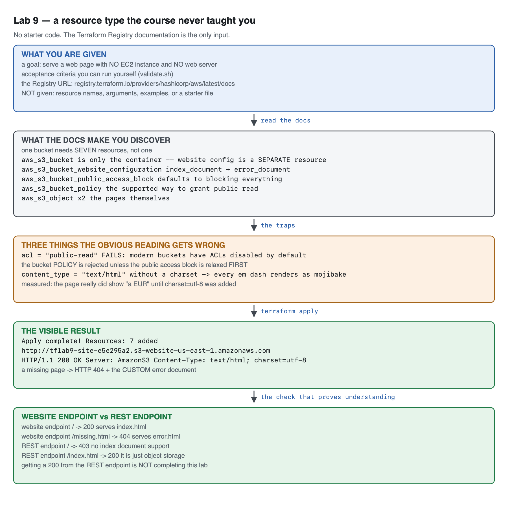
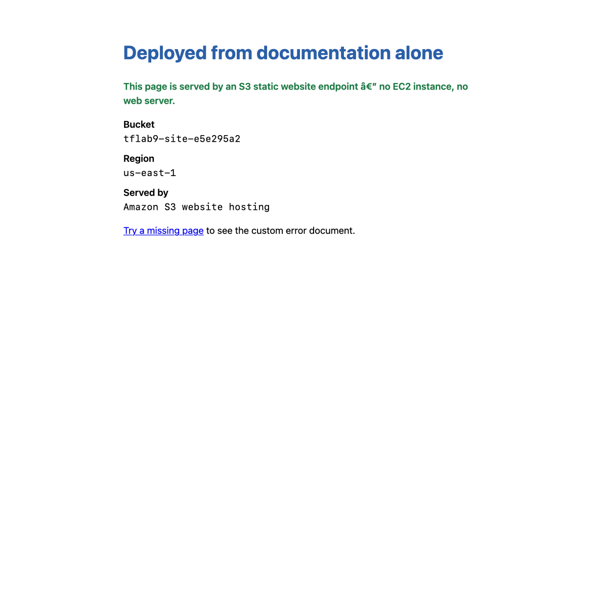

# Lab 9 (Capstone) — Documentation Deep-Dive Challenge

**Maps to:** *Terraform Documentation Deep-Dive; Mastery*
**Duration:** ~60 minutes
**Status:** The reference solution was built and tested end-to-end on 2026-09-05 (Terraform v1.15.7,
AWS provider v6.63.0) against a live AWS account in `us-east-1`. Every status code, header and error
below came from that run — **including a bug the author shipped and had to fix**, described in §4
Step 5.

Prerequisites: [`00-shared-setup.md`](00-shared-setup.md) and Labs 1–8.

---

## 1. Lab Overview & Objectives

Every lab so far handed you the code. That is the wrong way round for the work you will actually
do, where the resource type you need is one nobody has written a tutorial for, and the only
authority is the provider documentation.

**This lab gives you no starter code.** You get a goal, a set of acceptance criteria you can run
yourself, and a link to the Terraform Registry. You will deploy a resource type this course has
deliberately never touched.

**Learning objectives — by the end of this lab you will be able to:**

1. Navigate the Terraform Registry provider documentation and find the resources for a feature you
   have never used.
2. Recognise that one AWS *feature* is often several Terraform *resources*, and work out which ones
   and in what order.
3. Diagnose failures caused by AWS defaults that the documentation's examples silently assume.
4. Deploy, verify and destroy an unfamiliar resource type without a worked example.

> **The most surprising measured result in this lab:** the reference solution — written by someone
> who has done this before, from the same documentation you are about to read — **shipped with a
> bug.** The page rendered `â€"` where an em dash should have been, in a real browser, because
> `content_type = "text/html"` omits the charset. It passed every check that existed at the time.
> §4 Step 5 has the before-and-after headers. The lesson is not "read more carefully"; it is
> **look at the thing you built**, because a 200 does not mean correct.

---

## 2. Prerequisites & Environment Setup

### 2.1 Cost and time

| | |
|---|---|
| Resources created | 7, and **not one of them is an EC2 instance** |
| Measured price | **fractions of a cent** — a few KB in S3 and a handful of requests |
| Measured apply time | **~10 seconds** |
| Measured destroy time | **~5 seconds** |
| Hands-on time | ~60 minutes, most of it reading documentation |

**This is by far the cheapest lab in the course**, which is deliberate: an open-ended challenge
should not punish experimentation. Try things.

### 2.2 The only reference you are allowed

- **The Terraform Registry AWS provider docs:**
  `https://registry.terraform.io/providers/hashicorp/aws/latest/docs`
- **`terraform console`**, for trying expressions.
- The AWS service documentation, if you want it.

**Not permitted, and this matters:** blog posts, `lab-9-capstone/reference-solution/`, or an AI
assistant writing the configuration for you. The skill being built here is reading a specification
and turning it into working infrastructure. Outsourcing that is outsourcing the lab.

### 2.3 Setup

```bash
mkdir -p ~/terraform-course/lab-9-capstone && cd ~/terraform-course/lab-9-capstone
export AWS_REGION=us-east-1 AWS_DEFAULT_REGION=us-east-1
export TF_PLUGIN_CACHE_DIR="$HOME/.terraform.d/plugin-cache"
```

---

## 3. Architecture

**Read this section after your first attempt, not before.** It describes the shape of the answer,
and finding that shape yourself is the exercise.



*Vector version: [`lab-9-architecture.svg`](artifacts/lab-9/diagrams/lab-9-architecture.svg)*

<details>
<summary><strong>Spoiler — the resource graph of the reference solution. Do not open until you have attempted the challenge.</strong></summary>

```
  aws_s3_bucket.site                          the container, and ONLY the container
        │
        ├── aws_s3_bucket_public_access_block.site
        │       all four flags = false   ← the bucket's DEFAULT is to block everything
        │            │
        │            ▼  depends_on
        ├── aws_s3_bucket_policy.site
        │       s3:GetObject to Principal "*"   ← the SUPPORTED way to make it public
        │
        ├── aws_s3_bucket_website_configuration.site
        │       index_document { suffix = "index.html" }
        │       error_document { key    = "error.html" }
        │       → publishes the *website endpoint*, distinct from the REST endpoint
        │
        ├── aws_s3_object.index    content_type = "text/html; charset=utf-8"
        └── aws_s3_object.error    content_type = "text/html; charset=utf-8"

  plus random_id.suffix, because S3 bucket names are globally unique.

  RESULT: http://tflab9-site-<rand>.s3-website-us-east-1.amazonaws.com
          HTTP/1.1 200 OK · Server: AmazonS3 · Content-Type: text/html; charset=utf-8
```

**Seven resources for what AWS presents as one checkbox.** That gap — between a feature in a console
and the resources in a provider — is the single most useful thing this lab teaches.

</details>

---

## 4. Step-by-Step Instructions

### Step 1 — The challenge

**Why:** Everything up to now has been guided. This is the transfer test.

> **Your task.** Using Terraform and the AWS provider documentation only, deploy a **publicly
> reachable web page that is served without any EC2 instance and without any web server process.**
>
> The page must be produced by Terraform — not uploaded by hand, not copied from a bucket you made
> in the console.

That is the whole brief. The rest of this section is about *how to read documentation*, not about
the answer.

### Step 2 — How to read a provider's documentation

**Why:** Registry docs have a consistent structure, and knowing it turns an hour of hunting into
five minutes.

Open `https://registry.terraform.io/providers/hashicorp/aws/latest/docs` and use the **left sidebar
search**. The AWS provider has well over a thousand resources; browsing is hopeless, searching is
instant.

| What you want | Where it is |
|---|---|
| Does this resource exist? | sidebar search, by AWS service name |
| What arguments does it take? | **Argument Reference** — required arguments are marked |
| What can I reference elsewhere? | **Attribute Reference** — this is what `resource.name.thing` can be |
| A working starting point | **Example Usage** at the top |
| How do I adopt an existing one? | **Import** at the bottom — also tells you the ID format |

**Three habits that separate fast from slow:**

1. **Search for the AWS feature name, then read the resource *list*, not the first hit.** Searching
   "s3 bucket" returns two dozen resources. That list is the answer to "which pieces exist" —
   scanning it is faster than reading any one page.
2. **Assume one feature is several resources.** The AWS provider has spent years splitting monolithic
   resources into focused ones. Anything you remember as an argument may now be its own resource,
   and old tutorials will lie to you about this.
3. **Read Attribute Reference before you need it.** It tells you what a resource *exports* — and
   frequently the attribute you need is on a different resource than you assumed.

> **Version-specific documentation matters.** The Registry defaults to `latest`. If you are pinned
> to an older provider, use the version selector — arguments genuinely appear, deprecate and vanish
> between majors. Lab 4 §4 Step 3 showed a resource-level `region` attribute that exists in v6 and
> not in v5.

### Step 3 — The acceptance criteria

**Why:** An open-ended challenge needs an objective gate, or "it worked" becomes a matter of
opinion.

Save this as `validate.sh` and run it when you think you are done. It is also at
[`lab-9-capstone/reference-solution/validate.sh`](lab-9-capstone/reference-solution/validate.sh) —
the script is not a spoiler, it is the specification.

Your configuration must expose two outputs for the script to work: **`website_endpoint`** and
**`bucket_name`**.

**You must satisfy all ten checks:**

1. `HTTP 200` at the site root.
2. The `Server` response header is `AmazonS3`.
3. `Content-Type` includes an explicit charset.
4. A missing page returns a real `404` status.
5. A missing page serves **your** error document, not the generic one.
6. **Zero `aws_instance` resources** in state.
7. A bucket policy exists.
8. **No `aws_s3_bucket_acl` resource** is used.
9. The REST endpoint's root returns `403` — proving it is not the same thing as the website endpoint.
10. The REST endpoint serves an explicit object with `200`.

Checks 9 and 10 are the ones that distinguish understanding from a lucky result. Read Step 6 before
you argue with them.

### Step 4 — Attempt it. Come back when you have a 200, or when you are stuck.

**Why:** The struggle is the lab.

If you have been stuck for more than about fifteen minutes, here are hints in increasing order of
specificity. Take the smallest one that unblocks you.

<details>
<summary>Hint 1 — the shape of the problem</summary>

You are looking for something S3 does. Search the sidebar for `s3_bucket` and read the *list* of
resources rather than opening the first one. Note how many there are.
</details>

<details>
<summary>Hint 2 — the bucket is not enough</summary>

`aws_s3_bucket` creates storage. It does not, on its own, serve anything, and it does not make
anything public. Both of those are separate resources. Find them.
</details>

<details>
<summary>Hint 3 — you have a bucket and a website config, and you get 403</summary>

Correct so far. A new S3 bucket blocks public access by default, at two independent levels. You must
relax the block **and** grant read access, in that order. The ordering is a real dependency, not a
style preference.
</details>

<details>
<summary>Hint 4 — the tutorial you found says <code>acl = "public-read"</code></summary>

That tutorial predates a change in S3's defaults. Buckets are now created with ACLs **disabled**
(`BucketOwnerEnforced`), so ACL-based approaches fail. There is a different, supported mechanism for
granting public read. Check 8 in the acceptance criteria rules out the wrong one explicitly.
</details>

### Step 5 — After you have it working: look at it

**Why:** Because the reference solution passed its own checks and was still wrong, and the only
thing that revealed it was opening the page in a browser.

The first working version of the reference solution set:

```hcl
content_type = "text/html"   # without this S3 serves it as a download
```

That comment is true, and the setting is still wrong. Here is what the browser received:

```
Content-Type: text/html
```

and here is what it rendered:

```
This page is served by an S3 static website endpoint â€" no EC2 instance, no web server.
```

**`â€"` is an em dash that was written as UTF-8 and read as latin-1.** With no charset in the
`Content-Type` header, the browser guessed, and guessed wrong. Every check that existed at that
point passed. `curl` showed the correct character, because `curl` prints bytes and your terminal is
already UTF-8 — so even a careful CLI check missed it.

The fix:

```hcl
  # "text/html" alone is NOT enough: without an explicit charset the browser
  # falls back to latin-1 and every non-ASCII character is mojibake.
  content_type = "text/html; charset=utf-8"
```

**Measured, before and after:**

```
=== BEFORE ===
Content-Type: text/html
endpoint — no EC2 in          ← curl looked fine; the BROWSER did not

=== AFTER ===
Content-Type: text/html; charset=utf-8
endpoint — no EC2 in
```

Check 3 in the acceptance criteria exists because of this bug. **A regression test is what a bug
leaves behind when you fix it properly.**



### Step 6 — The distinction most people miss: two endpoints, not one

**Why:** This is the difference between "I made a bucket public" and "I configured static website
hosting", and it is the single most common misunderstanding about S3 websites.

Every S3 bucket has a **REST endpoint**. A bucket with website hosting configured *also* gets a
**website endpoint**. They are different hostnames with different behaviour:

```bash
WEB=$(terraform output -raw website_endpoint)
REST=$(terraform output -raw rest_endpoint)

curl -s -o /dev/null -w 'website root:        HTTP %{http_code}\n' "$WEB"
curl -s -o /dev/null -w 'website /missing:    HTTP %{http_code}\n' "$WEB/does-not-exist.html"
curl -s -o /dev/null -w 'REST root:           HTTP %{http_code}\n' "$REST"
curl -s -o /dev/null -w 'REST /index.html:    HTTP %{http_code}\n' "$REST/index.html"
```

**Measured output:**

```
website root:        HTTP 200
website /missing:    HTTP 404
REST root:           HTTP 403
REST /index.html:    HTTP 200
```

| | Website endpoint | REST endpoint |
|---|---|---|
| Hostname | `<bucket>.s3-website-<region>.amazonaws.com` | `<bucket>.s3.<region>.amazonaws.com` |
| Root request | serves your **index document** | `403` — there is no "index" concept |
| Missing key | your **custom error document**, `404` | an S3 XML error |
| Protocol | **HTTP only** — no TLS | HTTPS |
| It is | a web server | an object storage API |

**Getting `200` from `<bucket>.s3.<region>.amazonaws.com/index.html` is not completing this lab.**
That is object storage returning a file you asked for by name. The website endpoint is a different
feature, and the index-document and error-document behaviour is what you were asked to build.

> **The website endpoint is HTTP-only.** There is no way to put TLS on it directly. Production static
> sites put CloudFront in front, which terminates HTTPS and lets you keep the bucket entirely
> private via Origin Access Control. That is the natural next step, and it is the first optional
> extension.

### Step 7 — Do it again yourself, a second unfamiliar resource type, unassisted

**Why:** You have now read the documentation for one unfamiliar service with a lab telling you when
you were done. The real version has no acceptance criteria written for you.

**Your task.** Pick a resource type this course has never mentioned and deploy something working
with it — **and write your own acceptance criteria first.** Suggestions, roughly in order of
difficulty:

- An **SNS topic** with an email subscription that delivers a real message.
- A **CloudWatch alarm** on an EC2 metric that actually enters `ALARM` state.
- An **Application Load Balancer** in front of two instances (mind the cost — an ALB is
  ~$0.0225/hour plus LCUs, far more than anything else in this course, so destroy it promptly).
- A **Lambda function** with a function URL that returns a response.

**You get the acceptance criteria and nothing else — because you are writing them:**

- Before you write any HCL, write a `validate.sh` with **at least five** objective checks, including
  **one that a superficially-working solution would fail**. That last one is the hard part and the
  whole point.
- The configuration deploys from empty with a single `terraform apply`.
- Your validation passes, and you can explain what each check rules out.
- `terraform destroy` removes everything, and the tag-based backstop query from
  [`00-shared-setup.md` §6](00-shared-setup.md) returns nothing.
- You can state one thing the provider documentation did **not** tell you, that you found out by
  running it.

**Done when** you can name the check you wrote that a superficially-working solution would fail, and
explain what class of mistake it catches. If every check you wrote passes on the first attempt, they
were probably too weak — check 3 of this lab only exists because the author's first attempt was
wrong in a way `curl` could not see.

---

## 5. Validation / Verification

```bash
#!/usr/bin/env bash
# Lab 9 capstone validation. These are the ACCEPTANCE CRITERIA -- participants
# get this script, not the solution.
set -uo pipefail
fail=0
check() { if [ "$2" = "$3" ]; then echo "PASS  $1"; else echo "FAIL  $1 (got '$2', want '$3')"; fail=1; fi }

URL=$(terraform output -raw website_endpoint)
BUCKET=$(terraform output -raw bucket_name)

check "HTTP 200 at the website root" \
  "$(curl -s -o /dev/null -w '%{http_code}' --max-time 15 "$URL")" "200"

check "served by AmazonS3" \
  "$(curl -sI --max-time 15 "$URL" | awk -F': ' 'tolower($1)=="server"{gsub(/\r/,"",$2); print $2}')" "AmazonS3"

# Without a charset every non-ASCII character is mojibake -- see Step 5.
check "Content-Type declares a charset" \
  "$(curl -sI --max-time 15 "$URL" | awk -F': ' 'tolower($1)=="content-type"{gsub(/\r/,"",$2); print tolower($2)}')" \
  "text/html; charset=utf-8"

check "missing page returns 404" \
  "$(curl -s -o /dev/null -w '%{http_code}' --max-time 15 "$URL/no-such-page.html")" "404"
check "missing page serves the CUSTOM error document" \
  "$(curl -sS --max-time 15 "$URL/no-such-page.html" | grep -c 'Served by the S3 website endpoint')" "1"

check "zero EC2 instances in this configuration" \
  "$(terraform state list | grep -c '^aws_instance' || true)" "0"

check "a bucket policy exists" \
  "$(aws s3api get-bucket-policy --bucket "$BUCKET" --query 'Policy' --output text >/dev/null 2>&1; echo $?)" "0"
check "no aws_s3_bucket_acl resource is used" \
  "$(terraform state list | grep -c 'aws_s3_bucket_acl' || true)" "0"

# THE ONES THE HAPPY PATH MISSES: is this the WEBSITE endpoint, or just an
# object fetched over the REST endpoint? Both return 200 for /index.html.
REST="https://$BUCKET.s3.us-east-1.amazonaws.com"
check "REST endpoint root does NOT serve the index (proving these differ)" \
  "$(curl -s -o /dev/null -w '%{http_code}' --max-time 15 "$REST")" "403"
check "REST endpoint DOES serve an explicit object" \
  "$(curl -s -o /dev/null -w '%{http_code}' --max-time 15 "$REST/index.html")" "200"

echo
[ $fail -eq 0 ] && echo "Lab 9 validation: ALL CHECKS PASSED" || echo "Lab 9 validation: FAILURES ABOVE"
exit $fail
```

**Actual output against the reference solution, exit code `0`:**

```
PASS  HTTP 200 at the website root
PASS  served by AmazonS3
PASS  Content-Type declares a charset
PASS  missing page returns 404
PASS  missing page serves the CUSTOM error document
PASS  zero EC2 instances in this configuration
PASS  a bucket policy exists
PASS  no aws_s3_bucket_acl resource is used
PASS  REST endpoint root does NOT serve the index (proving these differ)
PASS  REST endpoint DOES serve an explicit object

Lab 9 validation: ALL CHECKS PASSED
```

### Why checks 9 and 10 are the ones that matter

Checks 1–8 can all be satisfied by a bucket that is merely public. **Checks 9 and 10 together
establish that the *website* feature is configured**, by asserting a *difference in behaviour*
between the two endpoints: the REST endpoint must return `403` at its root while still serving
`/index.html` with `200`.

A solution that made a bucket public and linked directly to `.../index.html` would pass checks 1, 2,
6, 7 and 8, and fail 9 — which is the correct outcome, because it did not build what was asked for.

Check 3 is the other one worth defending: it exists because the reference solution failed it, in a
browser, while passing everything else.

---

## 6. Troubleshooting Tips

All hit for real while building the reference solution.

**`403 Forbidden` from the website endpoint**

The most common failure, and it has two independent causes that must *both* be fixed: the bucket's
public access block still blocks public policies, **and/or** there is no bucket policy granting
`s3:GetObject`. Relaxing the block alone grants nothing; adding the policy alone is rejected.

**`AccessDenied` when applying the bucket policy**

Ordering. The public access block must be relaxed before the policy is accepted. Terraform infers
most dependencies from references, but here there is no reference between the two resources — so an
explicit `depends_on` is required. This is one of the few places `depends_on` is genuinely correct.

**`AccessControlListNotSupported` from `acl = "public-read"`**

Modern S3 buckets are created with ACLs disabled (`ObjectOwnership = BucketOwnerEnforced`). Every
tutorial older than that change tells you to use an ACL, and every one of them now fails. Use a
bucket policy.

**The browser downloads the page instead of displaying it**

No `content_type` on the object. S3 defaults to `binary/octet-stream`, and browsers download that.

**The page displays but non-ASCII characters are mangled**

`content_type = "text/html"` with no charset — see Step 5. Use `"text/html; charset=utf-8"`. Note
that `curl` will *not* show you this problem.

**A missing page shows a generic S3 XML error rather than your error page**

Either `error_document` is not set in the website configuration, or the error object was never
uploaded, or you are hitting the **REST** endpoint, which has no concept of an error document.

**`BucketAlreadyExists`**

S3 bucket names are globally unique across every AWS account. Add a `random_id` suffix.

**`terraform destroy` fails with `BucketNotEmpty`**

Terraform manages the two objects it created, but not anything else in the bucket.
`force_destroy = true` handles it — appropriate for a lab, and something to think hard about
anywhere else.

---

## 7. Cleanup Steps

```bash
terraform destroy -auto-approve
```

**Expected output:**

```
random_id.suffix: Destruction complete after 0s

Destroy complete! Resources: 7 destroyed.
```

Confirm the bucket is gone:

```bash
aws s3 ls | grep tflab9 || echo "no tflab9 buckets"
```

**Expected output:** `no tflab9 buckets`

### Then run the course-wide sweep

This is the last lab. Confirm the whole course left nothing behind:

```bash
aws ec2 describe-instances --filters Name=tag:Course,Values=intermediate-terraform \
  Name=instance-state-name,Values=running,pending,stopped \
  --query 'Reservations[].Instances[].InstanceId' --output text
aws ec2 describe-vpcs --filters Name=tag:Course,Values=intermediate-terraform \
  --query 'Vpcs[].VpcId' --output text
aws s3 ls | grep tflab || echo "no tflab buckets"
aws dynamodb list-tables --query 'TableNames[?contains(@,`tflab`)]' --output text
```

**Expected output after the authoring run — nothing from any of them except the S3 line:**

```
no tflab buckets
```

**Keep these, and here is why:**

| Keep | Why |
|---|---|
| Your own solution | It is the proof you can work from documentation. Keep it next to the reference and compare. |
| `validate.sh` | The endpoint-difference checks generalise: assert a *behavioural* difference, not just a status code. |
| `reference-solution/` | One tested answer, with its comments explaining the three traps. **Not the only correct answer.** |

---

## Optional extensions

1. **Put CloudFront in front of it.** The website endpoint is HTTP-only. Add an
   `aws_cloudfront_distribution` with Origin Access Control, make the bucket private again, and
   serve the same content over HTTPS. This is the real-world architecture, it is entirely
   documentation-driven, and it is a genuinely harder version of this lab.

2. **Add a redirect rule.** `aws_s3_bucket_website_configuration` supports `routing_rule` blocks.
   Make `/old-page.html` redirect to `/`, and verify with `curl -I` that you get a `301` and a
   `Location` header.

3. **Version the site.** Enable bucket versioning, change `index.html`, apply, then retrieve the
   previous version with `aws s3api list-object-versions`. The same mechanism that protects state in
   [Lab 8](lab-8-loops-backends.md) gives you content rollback here.

4. **Serve a real directory.** Replace the two inline `aws_s3_object` resources with a `for_each`
   over `fileset(path.module, "site/**")`, uploading a whole directory and setting `content_type`
   per file extension with a lookup map. This combines [Lab 7](lab-7-functions-data-types.md)'s
   functions with this lab's resources, and it is how you would actually deploy a site.

5. **Write the module.** Package this as a reusable module with the interface discipline from
   [Lab 5](lab-5-modules-workspaces.md) — typed variables in, `website_endpoint` out — and call it
   twice from one root to deploy two sites. If Labs 5 and 9 both landed, this should take about
   fifteen minutes.
